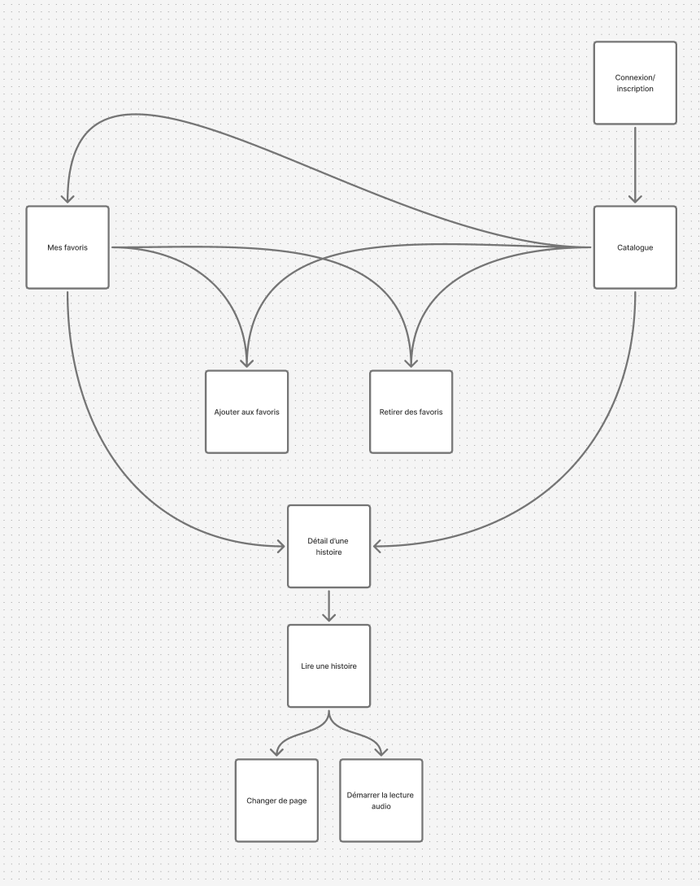
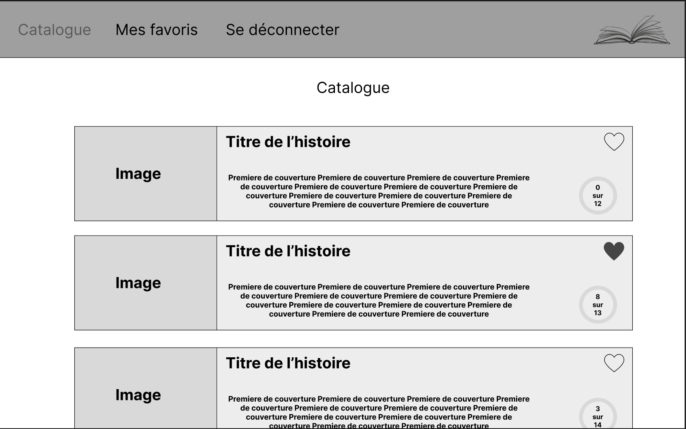
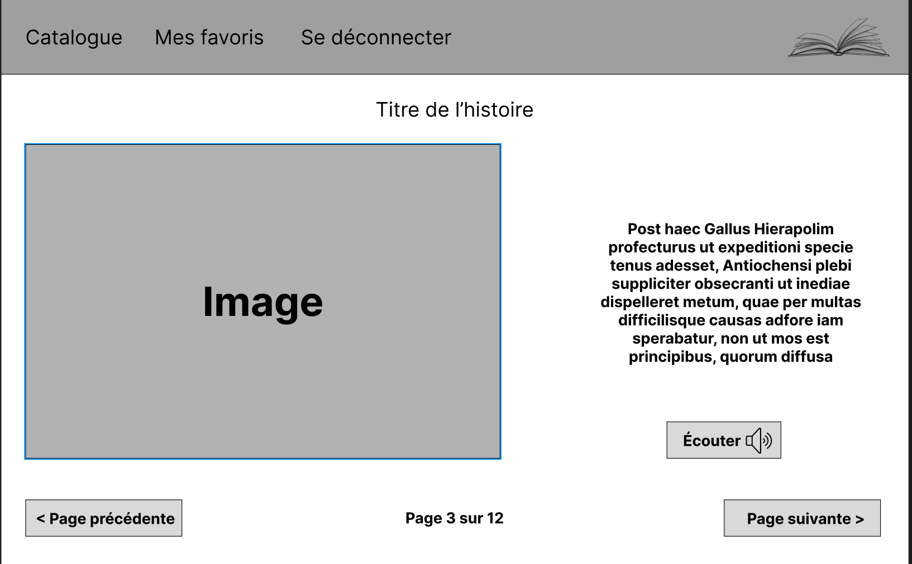
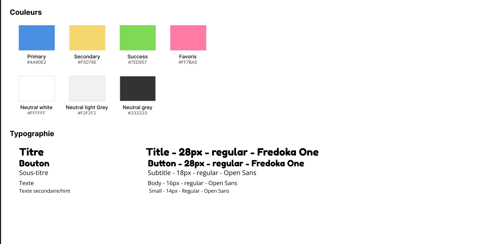
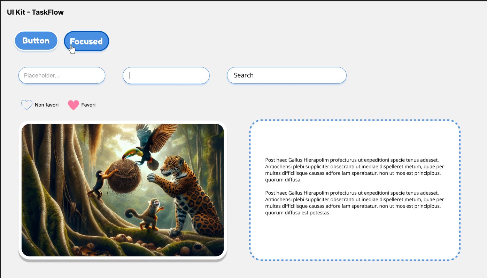
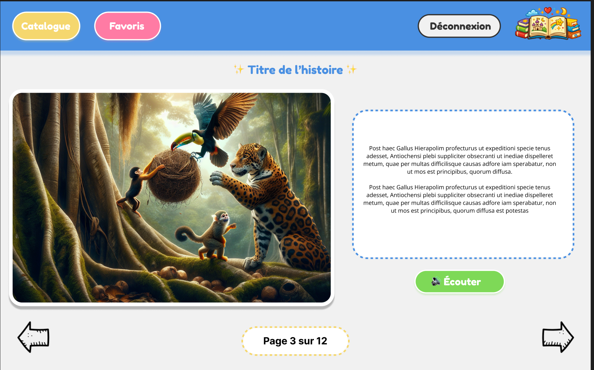
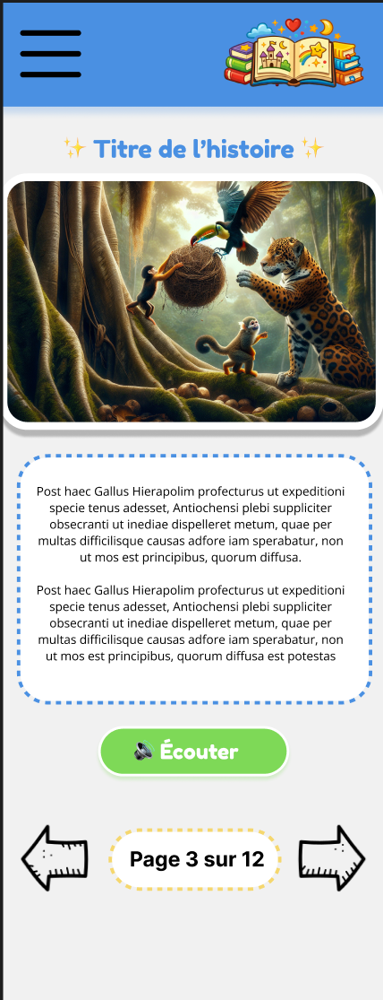

\newpage

## 1. Zoning / Sitemap

### 1.1 Structure générale de l’application

L’application est organisée autour des écrans principaux suivants :

- Page d’accueil (Catalogue)
- Page de lecture d’une histoire
- Page des favoris
- Page de connexion / inscription
- Page profil utilisateur
- Interface d’administration (gestion des histoires)

### 1.2 Sitemap simplifié

Connexion  
→ Catalogue  
→ Détail d’une histoire  
→ Lecture page par page  

Depuis le catalogue :
- Accès aux favoris
- Accès au profil
- Ajouter aux favoris
- Déconnexion

Depuis une histoire :
- Retour au catalogue
- Accés aux favoris
- Navigation page précédente / suivante
- Lecture audio

La page de favoris sera similaire au catalogue, la différence sera les histoires présentes, dans la page favoris nous n'aurons que les histoires déja ajoutées aux favoris.

À noter: Le schéma inclue une intéraction ajouter aux favoris depuis la page "Mes favoris" qui correspond au cas où l'utilisateur supprime par erreur un favori, il peut le remettre ene favori tant que la page n'est pas rechargée.

---

\newpage

## 2. Zoning des écrans principaux

### 2.1 Structure
Structure en trois zones principales :

**Header**
- Logo illustré
- Boutons présents pour la navigation entre les pages

**Titre**
- Titre de la page (catalogue, favoris) ou de l'histoire (Le petit prince)

**Contenu principal**
- Contenu de la page (le catalogue, la page d'histoire)

Ce zoning permet une séparation claire entre contenu visuel et contenu textuel, il permet de normaliser l'affichage entre les pages et de comprendre rapidement sur quelle page nous sommes (plus particulierement pour différencier catalogue et favoris).

### 2.1.1 Sur desktop

### 2.1.2 Sur mobile

---

\newpage

## 3. Wireframes (Maquettes basse fidélité)

Les wireframes ont été réalisés afin de définir l’organisation fonctionnelle avant toute réflexion graphique.

Objectifs :
- Définir la hiérarchie des informations
- Positionner les éléments interactifs
- Valider la structure des éléments

### 3.1 Wireframe catalogue

### 3.1.1 Catalogue desktop 

Choix réalisés :
- Carte large cliquable
- Favori positionné en haut à droite
- Progression visible immédiatement (Rond plus ou moins rempli en fonction de la progression)
- Séparation claire image / texte

### 3.1.2 Catalogue mobile

Choix réalisés :
- Carte large cliquable
- Favori positionné en haut à droite
- Progression visible immédiatement
- Séparation claire image / texte

### 3.2 Wireframe lecture

### 3.2.1 Lecture desktop 

Choix réalisés :
- Mise en page deux colonnes : image à gauche, texte à droite
- Bouton "Écouter" positionné centré sous le texte pour une lecture naturelle
- Navigation bas de page avec indication de progression (Page X sur Y)
- Séparation claire image / texte

### 3.2.2 Lecture mobile

Choix réalisés :
- Mise en page colonne unique : image en haut, texte en dessous
- Menu hamburger en haut à gauche pour accéder à la navigation
- Bouton "Écouter" centré sous le texte
- Navigation compacte avec chevrons (< >) et indication de progression

---

## 4. Charte graphique

### 4.1 Couleurs

| Usage | Couleur | Code |
|-------|----------|------|
| Primary | Bleu principal | #4A90E2 |
| Secondary | Jaune doux | #F5D76E |
| Success (lecture audio) | Vert | #7ED957 |
| Favoris | Rose | #FF7BA5 |
| Blanc neutre | Blanc | #FFFFFF |
| Gris clair | Light Grey | #F2F2F2 |
| Gris foncé | Dark Grey | #333333 |

#### Justification 

- Le **bleu principal** inspire la confiance et la sécurité (important pour un public parental).
- Le **jaune secondaire** apporte une touche chaleureuse et enfantine.
- Le **vert** est associé à l’action positive (écouter).
- Le **rose** identifie visuellement les favoris.
- Les tons neutres assurent une bonne lisibilité.

L’ensemble crée une ambiance :
**Ludique, rassurante, douce et adaptée au jeune public.**

### 4.2 Typographie

**Titres et boutons :**
- Police : Fredoka One
- Taille : 28px
- Style : Regular

**Sous-titres :**
- Police : Open Sans
- Taille : 18px

**Texte courant :**
- Police : Open Sans
- Taille : 16px

**Texte secondaire :**
- Police : Open Sans
- Taille : 14px

#### Justification

Fredoka One apporte :
- Un aspect arrondi
- Une dimension enfantine
- Une bonne lisibilité sur écran

Open Sans garantit :
- Lisibilité optimale
- Neutralité
- Confort de lecture sur paragraphes longs

### 4.3 Composants principaux

Tout est volontairement trés arrondi pour adoucir les pages. 
Tous les composants respectent :
- Border-radius : 32px
- Ombres légères (shadow douce) de la couleur de l'élément (si c'est un bouton bleu l'ombre est bleue pour faire un effet néon)
- Effet hover sur desktop
- Effet pressed sur mobile
- États visuels : normal / hover / actif / focus

À noter: 
- Les couleurs bleu (primary) pourront etre modifiée, on a ici les composants dans la couleur principale mais pour une application à thème enfantin on aura plusieurs couleurs en rapport avec la variante.
- Un composant barre de recherche est présent mais ne l'est pas sur les maquettes, il s'agit d'une potentielle amélioration dans le catalogue envisagée.

---

\newpage

## 5. Maquettes graphiques haute fidélité

### 5.1 Version Desktop – Lecture d’histoire

Caractéristiques :
- Layout 2 colonnes
- Illustration immersive
- Texte encadré (bordure pointillée douce)
- Bouton “Écouter” mis en valeur
- Indicateur de progression visible
- Flèches de navigation larges et accessibles

Cette version met l’accent sur :
- L’immersion visuelle
- La clarté de lecture
- La simplicité d’interaction

### 5.2 Version Mobile – Lecture d’histoire

Caractéristiques :
- Layout vertical
- Illustration mise en avant en haut
- Bloc texte arrondi et centré
- Bouton “Écouter” large et accessible
- Navigation simplifiée
- Indicateur de progression centré

Cette version privilégie :
- L’usage à une main
- Des zones tactiles larges
- Une lecture confortable sur petit écran

### 5.3 Responsivité

Le passage Desktop → Mobile implique :

- Passage d’un layout horizontal à vertical
- Suppression des éléments secondaires
- Augmentation des zones cliquables
- Navigation simplifiée

L’application est conçue selon une approche **Desktop paysage**, puis adaptée au mobile vertical.

À noter: Sur tablette en paysage on utilisera la version desktop adaptée pour garder le texte lisible

---

## 6. Considérations UX

### 6.1 Simplicité d’usage

L’interface respecte plusieurs principes :

- Peu d’actions simultanées à l’écran
- Boutons larges et explicites
- Icônes universelles (cœur, flèches)

### 6.2 Adaptation au jeune public

- Couleurs douces
- Formes arrondies
- Espacements généreux
- Texte centré et lisible
- Normalisation des pages

### 6.3 Accessibilité

- Contraste suffisant entre texte et fond
- Boutons bien identifiables
- Structure claire et répétitive
- Indicateur de progression visuel

### 6.4 Parcours utilisateur fluide

Parcours type :

Connexion  
→ Catalogue  
→ Choix d’une histoire  
→ Lecture page par page  
→ Reprise automatique au dernier point  

Aucun écran inutile ou complexe n’est introduit.

### 6.5 Feedback utilisateur

- Animation légère lors de l’ajout en favori
- Changement visuel du bouton audio lors de la lecture
- Indication claire de la page en cours
- Conservation automatique de la progression

---

## 7. Conclusion du jalon 2

À l’issue de ce jalon :

- L’architecture visuelle est définie
- La navigation est validée
- La charte graphique est formalisée
- Les maquettes haute fidélité illustrent le rendu final
- Les choix UX sont argumentés

Tous les éléments nécessaires au démarrage du développement front-end sont désormais clarifiés.
Les choix seront validés avant développement afin de limiter les retours arrière et garantir une cohérence entre conception graphique et implémentation technique.