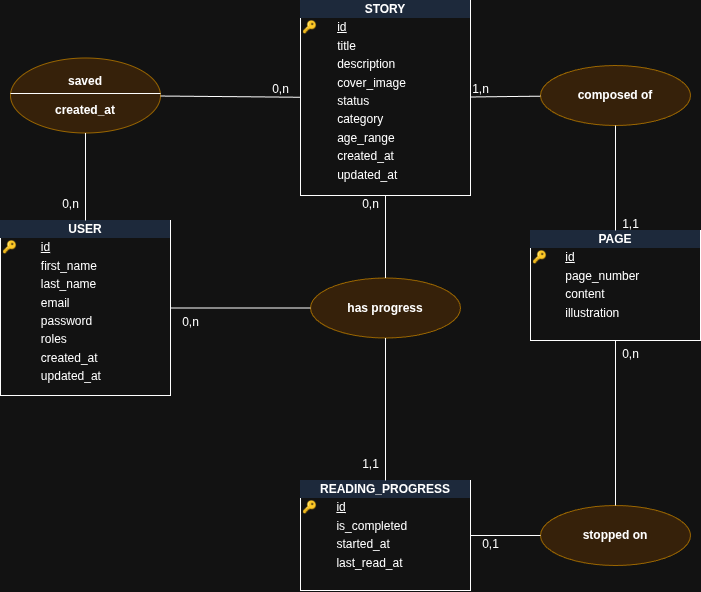

\newpage
 
## 1. Introduction à la démarche MERISE
 
Pour modéliser la base de données de ce projet, nous suivons la méthode **MERISE**, qui structure la conception en trois niveaux progressifs : le **Modèle Conceptuel de Données (MCD)**, le **Modèle Logique de Données (MLD)**, puis le **Modèle Physique de Données (MPD)**.
 
Cette progression du conceptuel vers le physique permet d'abord de formaliser les besoins métiers sans se préoccuper de l'implémentation technique, puis d'affiner progressivement jusqu'à obtenir un schéma directement exploitable par le SGBD cible — ici **MySQL**.
 
Le modèle a été conçu en cohérence avec le cahier des charges fonctionnel établi au Jalon 1, en prenant en compte l'ensemble des fonctionnalités identifiées : gestion des utilisateurs, catalogue d'histoires, lecture paginée, favoris, historique de lecture, et administration des contenus.
 
---
 
\newpage

## 2. Dictionnaire des données
 
Le dictionnaire des données recense l'ensemble des entités identifiées et leurs attributs. Il sert de référence commune pour s'assurer que chaque donnée a une signification claire et une place logique dans le modèle.
 
### Entité : User
 
Représente un parent créant un compte sur la plateforme. C'est l'acteur principal du système.
 
| Attribut | Description | Type générique |
|---|---|---|
| id | Identifiant unique de l'utilisateur | Entier, auto-incrémenté |
| first_name | Prénom | Chaîne de caractères |
| last_name | Nom de famille | Chaîne de caractères |
| email | Adresse email (identifiant de connexion) | Chaîne de caractères, unique |
| password | Mot de passe haché | Chaîne de caractères |
| roles | Rôle(s) dans l'application (USER ou ADMIN) | Tableau JSON (convention Symfony) |
| created_at | Date et heure de création du compte | Date/heure |
| updated_at | Date de la dernière mise à jour du profil | Date/heure |
 
### Entité : Story
 
Représente une histoire disponible dans le catalogue. Une histoire est composée d'une ou plusieurs pages.
 
| Attribut | Description | Type générique |
|---|---|---|
| id | Identifiant unique de l'histoire | Entier, auto-incrémenté |
| title | Titre de l'histoire | Chaîne de caractères |
| description | Résumé ou accroche de l'histoire | Texte long |
| cover_image | Chemin ou URL de l'image de couverture | Chaîne de caractères |
| status | État de publication (brouillon, publié, archivé) | Énumération |
| category | Thème de l'histoire (aventure, animaux, famille…) | Énumération |
| age_range | Tranche d'âge cible indicative (ex : 3-5 ans) | Chaîne de caractères |
| created_at | Date d'ajout de l'histoire | Date/heure |
| updated_at | Date de la dernière modification | Date/heure |
 
### Entité : Page
 
Représente une page d'une histoire. Chaque page contient un paragraphe de texte et une illustration.
 
| Attribut | Description | Type générique |
|---|---|---|
| id | Identifiant unique de la page | Entier, auto-incrémenté |
| page_number | Position de la page dans l'histoire (1, 2, 3…) | Entier |
| content | Contenu textuel de la page | Texte long |
| illustration | Chemin ou URL de l'illustration de la page | Chaîne de caractères |
| story_id | Référence à l'histoire parente | Entier (clé étrangère) |
 
### Entité : Favorite *(table d'association)*
 
Représente l'ajout d'une histoire aux favoris par un utilisateur. C'est une association entre User et Story.
 
| Attribut | Description | Type générique |
|---|---|---|
| user_id | Référence à l'utilisateur | Entier (clé étrangère) |
| story_id | Référence à l'histoire mise en favori | Entier (clé étrangère) |
| created_at | Date à laquelle l'histoire a été ajoutée aux favoris | Date/heure |
 
### Entité : ReadingProgress
 
Enregistre l'avancement d'un utilisateur dans une histoire. Permet la reprise de lecture au dernier point d'arrêt et la constitution de l'historique.
 
| Attribut | Description | Type générique |
|---|---|---|
| id | Identifiant unique de l'entrée de progression | Entier, auto-incrémenté |
| user_id | Référence à l'utilisateur | Entier (clé étrangère) |
| story_id | Référence à l'histoire concernée | Entier (clé étrangère) |
| current_page_id | Dernière page lue (reprise de lecture) | Entier (clé étrangère, nullable) |
| is_completed | Indique si l'histoire a été lue jusqu'à la fin | Booléen |
| started_at | Date de démarrage de la lecture | Date/heure |
| last_read_at | Date de la dernière activité sur cette histoire | Date/heure |
 
---
 
\newpage
 
## 3. Modèle Conceptuel de Données (MCD)
 
Le MCD représente les entités métiers du domaine et les associations qui les relient, indépendamment de tout choix d'implémentation technique.
 

 
---
 
\newpage
 
## 4. Modèle Logique de Données (MLD)
 
Le MLD traduit le MCD en modèle relationnel. Chaque entité devient une table, et l'association N,N entre User et Story est matérialisée par une table de liaison.
 
```
USER (id PK, first_name, last_name, email UNIQUE, password, roles,
      created_at, updated_at)
 
STORY (id PK, title, description, cover_image, status, category,
       age_range, created_at, updated_at)
 
PAGE (id PK, page_number, content, illustration,
      story_id FK -> STORY)
 
FAVORITE (user_id FK -> USER, story_id FK -> STORY, created_at)
  -- Cle primaire composee : (user_id, story_id)
 
READING_PROGRESS (id PK, user_id FK -> USER, story_id FK -> STORY,
                  current_page_id FK -> PAGE (nullable),
                  is_completed, started_at, last_read_at)
  -- Contrainte d'unicite : (user_id, story_id)
```
 

 
### Notes sur les transformations
 
**Association N,N Favorite** — L'association entre User et Story étant de cardinalité N,N, elle est transformée en table de liaison **FAVORITE**. Sa clé primaire est composée des deux clés étrangères, ce qui garantit l'unicité et interdit les doublons.
 
**Unicité de ReadingProgress** — Un utilisateur ne peut avoir qu'une seule entrée de progression par histoire. Cette contrainte d'unicité composite sur `(user_id, story_id)` est distincte de la clé primaire technique `id`, conservée pour simplifier les références depuis l'ORM.
 
**Clé étrangère nullable dans ReadingProgress** — `current_page_id` peut être NULL en tout début de lecture, avant que l'utilisateur n'ait validé la première page.
 
**Catégorie en ENUM dans Story** — La catégorie étant une liste fermée de valeurs stables, elle est portée directement par la table `story` sous forme d'énumération, sans table dédiée. Ce choix simplifie le modèle tout en garantissant l'intégrité des valeurs côté base de données.
 
---
 
\newpage
 
## 5. Modèle Physique de Données (MPD)
 
Le MPD décrit le schéma tel qu'il sera créé dans **MySQL** (moteur InnoDB). Les types SQL sont définis en tenant compte des contraintes de taille, des index nécessaires et des bonnes pratiques de performance.
 
```sql
CREATE TABLE user (
    id          INT          NOT NULL AUTO_INCREMENT,
    first_name  VARCHAR(100) NOT NULL,
    last_name   VARCHAR(100) NOT NULL,
    email       VARCHAR(255) NOT NULL,
    password    VARCHAR(255) NOT NULL,
    roles       JSON         NOT NULL,
    created_at  DATETIME     NOT NULL DEFAULT CURRENT_TIMESTAMP,
    updated_at  DATETIME     NOT NULL DEFAULT CURRENT_TIMESTAMP 
            ON UPDATE CURRENT_TIMESTAMP,
    PRIMARY KEY (id),
    UNIQUE KEY uq_user_email (email)
)  DEFAULT CHARSET=utf8mb4 COLLATE=utf8mb4_unicode_ci;
 
CREATE TABLE story (
    id          INT          NOT NULL AUTO_INCREMENT,
    title       VARCHAR(255) NOT NULL,
    description TEXT,
    cover_image VARCHAR(500),
    status      ENUM('DRAFT', 'PUBLISHED', 'ARCHIVED') NOT NULL DEFAULT 'DRAFT',
    category    ENUM
        ('ADVENTURE', 'ANIMALS', 'FAMILY', 'FANTASY', 'NATURE', 'OTHER') 
            NOT NULL DEFAULT 'OTHER',
    age_range   VARCHAR(50),
    created_at  DATETIME NOT NULL DEFAULT CURRENT_TIMESTAMP,
    updated_at  DATETIME NOT NULL DEFAULT CURRENT_TIMESTAMP 
            ON UPDATE CURRENT_TIMESTAMP,
    PRIMARY KEY (id),
    INDEX idx_story_status (status),
    INDEX idx_story_category (category)
)  DEFAULT CHARSET=utf8mb4 COLLATE=utf8mb4_unicode_ci;
 
CREATE TABLE page (
    id           INT  NOT NULL AUTO_INCREMENT,
    page_number  INT  NOT NULL,
    content      TEXT NOT NULL,
    illustration VARCHAR(500),
    story_id     INT  NOT NULL,
    PRIMARY KEY (id),
    UNIQUE KEY uq_page_number (story_id, page_number),
    CONSTRAINT fk_page_story FOREIGN KEY (story_id) REFERENCES story(id) 
            ON DELETE CASCADE
)  DEFAULT CHARSET=utf8mb4 COLLATE=utf8mb4_unicode_ci;
 
CREATE TABLE favorite (
    user_id    INT      NOT NULL,
    story_id   INT      NOT NULL,
    created_at DATETIME NOT NULL DEFAULT CURRENT_TIMESTAMP,
    PRIMARY KEY (user_id, story_id),
    CONSTRAINT fk_favorite_user  FOREIGN KEY (user_id)  REFERENCES user(id)  
            ON DELETE CASCADE,
    CONSTRAINT fk_favorite_story FOREIGN KEY (story_id) REFERENCES story(id) 
            ON DELETE CASCADE
)  DEFAULT CHARSET=utf8mb4 COLLATE=utf8mb4_unicode_ci;
 
CREATE TABLE reading_progress (
    id               INT        NOT NULL AUTO_INCREMENT,
    user_id          INT        NOT NULL,
    story_id         INT        NOT NULL,
    current_page_id  INT        DEFAULT NULL,
    is_completed     TINYINT(1) NOT NULL DEFAULT 0,
    started_at       DATETIME   NOT NULL DEFAULT CURRENT_TIMESTAMP,
    last_read_at     DATETIME   NOT NULL DEFAULT CURRENT_TIMESTAMP 
            ON UPDATE CURRENT_TIMESTAMP,
    PRIMARY KEY (id),
    UNIQUE KEY uq_reading_progress (user_id, story_id),
    CONSTRAINT fk_rp_user FOREIGN KEY (user_id) REFERENCES user(id)  
            ON DELETE CASCADE,
    CONSTRAINT fk_rp_story= FOREIGN KEY (story_id) REFERENCES story(id) 
            ON DELETE CASCADE,
    CONSTRAINT fk_rp_current_page FOREIGN KEY (current_page_id) REFERENCES page(id)  
            ON DELETE SET NULL
)  DEFAULT CHARSET=utf8mb4 COLLATE=utf8mb4_unicode_ci;
```
 
### Choix techniques notables
 
**ON DELETE CASCADE** — Appliqué sur les relations de dépendance forte : supprimer une histoire supprime automatiquement ses pages, ses favoris et les progressions associées, simplifiant la gestion de la cohérence côté applicatif.
 
**ON DELETE SET NULL sur current_page_id** — Si une page est supprimée lors d'une restructuration de l'histoire, la progression de l'utilisateur n'est pas perdue mais son pointeur de page est remis à NULL. L'application ramènera alors l'utilisateur au début de l'histoire.
 
**Index sur story.status et story.category** — Les requêtes les plus fréquentes sur le catalogue filtrent sur ces deux colonnes. Des index simples améliorent significativement les performances de ces cas d'usage.
 
**ENUM pour status et category** — Ce type SQL garantit que seules les valeurs autorisées peuvent être insérées, sans nécessiter de table de référence supplémentaire pour des listes aussi stables. Les valeurs sont en anglais, cohérentes avec le reste du code.
 
**Colonne roles en JSON** — Symfony Security utilise par convention un tableau JSON pour stocker les rôles. Adopter ce format dès le MPD facilite l'intégration avec le composant Security sans mapping supplémentaire.
 
---
 
\newpage

## 6. Justifications et vérification du modèle
 
### Adéquation aux besoins fonctionnels
 
**Catalogue et filtrage** — La table `story` contient l'ensemble des métadonnées nécessaires à l'affichage du catalogue (titre, couverture, statut). Le champ `category` permet de filtrer les histoires par thème sans jointure supplémentaire, conformément à la fonctionnalité 2 du cahier des charges.
 
**Lecture paginée** — Chaque page d'une histoire est enregistrée dans la table `page` avec son `page_number`. L'application récupère les pages dans l'ordre pour implémenter la navigation suivant/précédent et calculer la progression (`page_number / COUNT(*)`). Cela répond directement à la fonctionnalité 3.
 
**Reprise de lecture** — La table `reading_progress` enregistre la dernière page consultée (`current_page_id`) par combinaison utilisateur–histoire. Au chargement d'une histoire déjà commencée, l'application retrouve immédiatement le point de reprise. La contrainte d'unicité sur `(user_id, story_id)` garantit qu'il n'existe jamais deux entrées en conflit.
 
**Favoris** — La table `favorite` matérialise la relation N,N entre utilisateurs et histoires. La colonne `created_at` permet d'afficher les favoris triés par date d'ajout si nécessaire.
 
**Administration** — Le champ `status` sur `story` permet à l'administrateur de gérer le cycle de vie d'un contenu (DRAFT → PUBLISHED → ARCHIVED) sans jamais supprimer physiquement les données.
 
### Normalisation
 
Le modèle respecte la **troisième forme normale (3NF)** :
 
- Chaque attribut est atomique (1NF).
- Tous les attributs dépendent de la clé primaire entière et non d'une partie de celle-ci (2NF).
- Aucun attribut non-clé ne dépend d'un autre attribut non-clé (3NF).
 
Le choix de porter la catégorie en ENUM directement dans `story` constitue une légère dénormalisation volontaire, justifiée par la stabilité de cette liste. Si les catégories devaient évoluer fréquemment ou nécessiter des attributs propres, une table dédiée serait préférable.
 
### Cas particulier : la synthèse vocale
 
La fonctionnalité de lecture audio (fonctionnalité 6) repose sur une API externe de Text-to-Speech. Le contenu à vocaliser est le champ `content` de la table `page`. Aucune donnée audio n'est stockée en base : la synthèse est générée à la volée par l'API externe. Ce choix évite de surcharger la base avec des données binaires volumineuses.
 
---
 
## 7. Conclusion du jalon 3
 
À l'issue de ce jalon :
 
- Le dictionnaire des données est formalisé pour les 5 entités du projet
- Le MCD représente les associations et cardinalités entre entités
- Le MLD traduit le modèle conceptuel en schéma relationnel
- Le MPD fournit le script SQL prêt à être utilisé avec Symfony/Doctrine
- Les choix de modélisation sont argumentés et cohérents avec les besoins fonctionnels
 
La base de données constitue le socle du développement back-end qui débutera au Jalon 4. Les entités Doctrine seront générées à partir de ce modèle via les migrations.