## Avant-propos

Ce dossier présente le travail de conception et de développement que j'ai mené pendant
ma formation de concepteur développeur d'applications à l'IPSSI Bordeaux, en alternance
chez LICENCESINFO.

Il s'organise autour d'un projet principal, **Storybook Kids**, une application web de
lecture d'histoires illustrées pour enfants que j'ai conçue et développée seul, du cahier
des charges à la mise en service, sur six jalons mensuels. C'est le fil rouge du document :
chaque étape de la démarche y est traitée dans l'ordre où je l'ai réellement parcourue,
depuis l'expression du besoin jusqu'aux tests et au déploiement.

Deux autres projets apparaissent dans un chapitre dédié, en fin de dossier :
**HyperSearchX** et **GoStoriesAI**, développés chez LICENCESINFO. Ils ne se substituent
pas au projet principal ; ils montrent comment les mêmes compétences se transposent dans
un contexte d'entreprise, avec des contraintes de production, des utilisateurs réels et
des décisions à défendre devant un dirigeant.

**Dépôt Git du projet principal** : <https://github.com/FortAxel/ipssi_project>

**Tag de release** : `v1.0.0` (branche `main`).

---

\newpage

## 1. Personal introduction and project overview

### Personal introduction

My name is Axel Fortunato, I am twenty years old and I live in France.
I am currently completing a bachelor's degree in application design and
development at IPSSI Bordeaux, which I follow as an apprentice at LICENCESINFO, a software
company based in Paris.

I did not start my studies here. After a general baccalaureate with a specialisation in
mathematics and computer science, I spent two years at the IUT of Gradignan, where I validated
four semesters of a computer science degree. Then I chose to move to a work-study programme,
because I wanted to spend more time building real products and less time writing exercises.
That decision turned out to be the right one. Over the past year I have designed and built two
applications for my company: a Shopify search application, now running in production for
merchants, and an iOS reading application whose server is deployed and whose mobile app has
been submitted to the App Store. In both cases I had to defend my technical choices in front
of someone who pays for them.

I work mainly with TypeScript and Node.js, PHP and Symfony, React, and more recently Swift
for iOS development. I am comfortable designing a relational database, building an API and
taking it all the way to a running server. What I enjoy most is the software architecture,
to have to plan for all the application’s needs so that everything works and that everything
fits together correctly in order to prevent bugs and problems during development.

My goal after this diploma is to continue with a master's degree in software development,
still as an apprentice, and to keep working on products that are actually released.

\newpage

### Project overview

**Storybook Kids** is a web application that lets a parent read illustrated stories with a
child, one page at a time.

The problem it addresses is simple. Reading plays a central role in how children develop
their imagination, their vocabulary and their ability to concentrate, but most digital
media aimed at young audiences are either too complex to be used without help, or too
loosely structured to hold a child's attention. Existing platforms also tend to be built
for the child alone, which leaves the parent with no control over what is being read.

The application therefore targets the parent first. The parent creates an account, browses
a catalogue of illustrated stories, and reads them with the child page by page, each page
holding a short paragraph of around thirty words next to its illustration. The application
remembers where the reading stopped, so that a story started in the evening can be resumed
the following day without searching for the right page. Parents can mark stories as
favourites, consult their reading history, and have any page read aloud through an external
text-to-speech service. A separate administration area allows the publication and
moderation of the catalogue.

Technically, the project is built as a REST API written in PHP 8.4 with Symfony 7, backed
by a MySQL database accessed through Doctrine, and a single-page application written in
React 19 and TypeScript. Authentication relies on signed JSON Web Tokens. The whole stack, comprising web server, application and database, is described in Docker Compose, so the application can
be started on any machine with a single command. A continuous integration pipeline hosted
on GitHub Actions runs the linters, the PHP unit and API tests, the front-end tests and the
production build on every push.

The project was carried out alone over six months, from January to June 2026, following six
monthly milestones that each produced a deliverable: functional specification, methodology
and interface design, database modelling, technical design, beta version, and final release.

---

\newpage

## 2. Compétences mises en œuvre

Le tableau ci-dessous recense les compétences du référentiel du titre, la réalisation qui
les met en œuvre et le chapitre du dossier où elle est décrite. Sauf mention contraire, la
réalisation citée concerne Storybook Kids.

### Activité-type 1 : développer une application sécurisée

+--------------------------------+------------------------------------------------------+------------+
| Compétence                     | Réalisation                                          | Chapitre   |
+================================+======================================================+============+
| Installer et configurer son    | Stack Docker Compose (nginx, PHP, MySQL), dépôt Git, | 5, 14      |
| environnement de travail       | pipeline d'intégration continue                      |            |
+--------------------------------+------------------------------------------------------+------------+
| Développer des interfaces      | Application React 19 et TypeScript : catalogue,      | 6, 12      |
| utilisateur                    | lecteur page à page, profil, administration          |            |
+--------------------------------+------------------------------------------------------+------------+
| Développer des composants      | Services Symfony : progression de lecture, favoris,  | 8, 9, 12   |
| métier                         | gestion du catalogue, appel au service de synthèse   |            |
|                                | vocale                                               |            |
+--------------------------------+------------------------------------------------------+------------+
| Contribuer à la gestion d'un   | Kanban GitHub Projects, six jalons mensuels, suivi   | 5          |
| projet informatique            | du planning réel contre le prévisionnel              |            |
+--------------------------------+------------------------------------------------------+------------+

### Activité-type 2 : concevoir et développer une application sécurisée organisée en couches

+--------------------------------+------------------------------------------------------+------------+
| Compétence                     | Réalisation                                          | Chapitre   |
+================================+======================================================+============+
| Analyser les besoins et        | Cahier des charges fonctionnel, zoning, wireframes,  | 4, 6       |
| maquetter une application      | charte graphique, maquettes haute fidélité           |            |
+--------------------------------+------------------------------------------------------+------------+
| Définir l'architecture         | Architecture trois tiers, séparation contrôleur,     | 8, 9       |
| logicielle d'une application   | service et dépôt, diagrammes UML                     |            |
+--------------------------------+------------------------------------------------------+------------+
| Concevoir et mettre en place   | Démarche MERISE complète : dictionnaire, MCD, MLD,   | 7          |
| une base de données            | MPD, migrations Doctrine                             |            |
| relationnelle                  |                                                      |            |
+--------------------------------+------------------------------------------------------+------------+
| Développer des composants      | Dépôts Doctrine, requêtes paramétrées, index         | 7, 12, 18  |
| d'accès aux données SQL et     | Elasticsearch sur HyperSearchX                       |            |
| NoSQL                          |                                                      |            |
+--------------------------------+------------------------------------------------------+------------+

\besoindeplace{210pt}

### Activité-type 3 : préparer le déploiement d'une application sécurisée

+--------------------------------+------------------------------------------------------+------------+
| Compétence                     | Réalisation                                          | Chapitre   |
+================================+======================================================+============+
| Préparer et exécuter les plans | Tests unitaires PHPUnit, tests d'API, tests front    | 11, 13     |
| de tests d'une application     | Vitest, jeu d'essai documenté                        |            |
+--------------------------------+------------------------------------------------------+------------+
| Préparer et documenter le      | Procédure de déploiement reproductible, variables    | 14         |
| déploiement d'une application  | d'environnement, guide d'installation                |            |
+--------------------------------+------------------------------------------------------+------------+
| Contribuer à la mise en        | Intégration continue GitHub Actions,                 | 5, 14, 18  |
| production dans une démarche   | containerisation, stratégie de mise à jour, mise en  |            |
| DevOps                         | production réelle sur serveur pour les projets       |            |
|                                | d'entreprise                                         |            |
+--------------------------------+------------------------------------------------------+------------+

---

\newpage

## 3. Contexte : l'entreprise et le cadre de formation

### L'entreprise d'accueil : LICENCESINFO

LICENCESINFO est une société créée en avril 2021 par David Abitbol. C'est une SASU, société par actions simplifiée unipersonnelle, qui intervient dans le numérique, plus
précisément sur trois axes : l'e-commerce, l'affiliation et l'édition logicielle.
L'activité a d'abord fonctionné trois ans sous le régime de la micro-entreprise avant
d'adopter sa structure actuelle.

La société compte deux salariés à temps plein, le fondateur et son épouse, et fait appel à
des développeurs indépendants selon les besoins. L'organisation est directe et orientée
projet : il n'y a pas de hiérarchie formelle, les décisions se prennent en commun en
fonction des chantiers en cours. Une partie du développement est traditionnellement
externalisée à des prestataires, aussi bien pour la maintenance applicative que pour la
correction d'anomalies et certaines évolutions d'interface.

Son produit principal est une application en mode SaaS destinée à la vente et au
déploiement automatisé de produits numériques : génération des factures, envoi des liens de
téléchargement, gestion des commandes et du support client. Ses clients sont des
plateformes de vente en ligne qui s'appuient sur cet outil pour distribuer des livres
numériques, des logiciels, des jeux, des licences ou des cartes cadeaux, sur les marchés
français et américain. C'est un marché concurrentiel et morcelé, sur lequel la stratégie de
l'entreprise repose sur deux piliers : maintenir un produit fiable et à jour
technologiquement, et fidéliser les clients par un support réactif.

La société est domiciliée à Paris, mais son président travaille depuis le bassin
d'Arcachon. Je travaille pour ma part depuis mon domicile.
La communication se fait principalement par téléphone et par visioconférence, ce qui permet de
trancher rapidement.

### Ma position dans l'entreprise

Mon périmètre d'intervention se situe **en dehors des produits historiques de
LICENCESINFO**. Les deux projets sur lesquels j'ai travaillé, HyperSearchX et GoStoriesAI, visent des clientèles entièrement nouvelles, sans lien avec les utilisateurs actuels de
l'entreprise. Il s'agit dans les deux cas de produits à part entière, conçus pour des
usages et des marchés distincts. Ce positionnement traduit la volonté de l'entreprise
d'explorer de nouveaux axes de développement en complément de son activité principale.

Concrètement, j'ai assuré seul toute la partie technique de ces deux produits. Le fondateur
apporte le besoin, la connaissance du marché et l'expérience métier. Je propose l'analyse et
les solutions techniques, qu'il valide ou recadre. Cette configuration m'a obligé très tôt à
justifier mes choix en termes de coût, de délai et de risque, et pas seulement en termes
techniques. Il m'a par ailleurs proposé de solliciter les développeurs indépendants avec
lesquels il travaille habituellement en cas de blocage, ce qui a constitué un filet de
sécurité rassurant même si je n'ai pas eu besoin d'y recourir.

Ce périmètre a dépassé la conception et le développement au sens strict. Livrer ces produits
supposait de savoir administrer un serveur, mettre en place un serveur web en façade, gérer
un nom de domaine et ses enregistrements DNS, obtenir et renouveler des certificats,
superviser des processus en production.

Mon contrat d'alternance couvre la période du **28 juillet 2025 au 31 octobre 2026**.

### Le cadre de formation : l'IPSSI

En parallèle, l'IPSSI Bordeaux encadre le projet fil rouge qui constitue le cœur de ce
dossier. J'ai mené Storybook Kids seul, sur six jalons mensuels donnant chacun lieu à un
livrable évalué.

| Jalon | Livrable attendu                                     |
| ----- | ---------------------------------------------------- |
| 1     | Cahier des charges fonctionnel                       |
| 2     | Méthodologie de travail et conception des interfaces |
| 3     | Modélisation de la base de données                   |
| 4     | Conception technique de l'application                |
| 5     | Version bêta fonctionnelle                           |
| 6     | Version finale déployée et rapport de projet         |

Ce découpage a servi de colonne vertébrale au projet. Chaque jalon devait être livré avant
de pouvoir attaquer le suivant, ce qui interdisait de repousser la conception pour se jeter
sur le code. Il structure d'ailleurs le présent document, dont les chapitres reprennent
largement cette progression.

Cette double appartenance a un effet direct sur ce dossier : le projet scolaire m'a permis
de dérouler la démarche complète de conception, avec le temps de formaliser chaque étape,
là où les projets d'entreprise m'ont confronté à des contraintes de production que la
formation ne peut pas simuler.

---

\newpage

## 4. Cahier des charges

### Contexte métier

Le projet s'inscrit dans le domaine des applications numériques destinées au jeune public, plus précisément dans le secteur de la lecture et du divertissement éducatif pour enfants. La lecture d'histoires joue un rôle fondamental dans le développement de l'imaginaire, du langage et de la concentration chez les enfants. Toutefois, les supports numériques existants sont souvent peu adaptés à un usage encadré, trop complexes ou insuffisamment structurés pour répondre aux besoins spécifiques de ce public.

L'application proposée vise à répondre à ce constat en offrant une plateforme dédiée à la lecture d'histoires pour enfants, reposant sur des contenus narratifs illustrés. Chaque histoire est structurée en pages successives, chaque page correspondant à un paragraphe court accompagné d'une illustration. Cette structuration permet une lecture dynamique, adaptée aux capacités d'attention des enfants.

L'application est conçue pour accompagner l'enfant dans son évolution et son autonomie progressive face à la lecture. **Trois modes d'utilisation complémentaires** sont prévus :

1. **Pour les plus jeunes** : les parents lisent les histoires à l'enfant, l'application servant de support visuel avec son texte et ses illustrations.
2. **En phase d'apprentissage** : l'enfant peut s'appuyer sur la synthèse vocale pour écouter les histoires de façon plus autonome.
3. **Pour les lecteurs confirmés** : l'enfant lit seul les histoires, l'application servant alors d'outil d'entraînement à la lecture.

+----------------------------+------------------------------------+------------------------------------+
| Profil                     | Rôle                               | Usage principal                    |
+============================+====================================+====================================+
| **Parent (compte           | Crée le compte, s'authentifie,     | Utilisateur principal au sens      |
| utilisateur)**             | configure l'usage (favoris,        | compte et données personnelles     |
|                            | historique).                       | (RGPD).                            |
+----------------------------+------------------------------------+------------------------------------+
| **Enfant**                 | Bénéficiaire des histoires, sans   | Usage principal des écrans de      |
|                            | compte obligatoire.                | lecture (navigation, audio,        |
|                            |                                    | lecture silencieuse).              |
+----------------------------+------------------------------------+------------------------------------+
| **Administrateur**         | Gestion et modération des          | Interface d'administration         |
|                            | contenus.                          | réservée.                          |
+----------------------------+------------------------------------+------------------------------------+

Ce projet fil rouge est réalisé dans le cadre du titre professionnel **Concepteur Développeur d'Applications (CDA)**. Le commanditaire pédagogique est l'organisme de formation ; le cahier des charges correspond à un besoin métier fictif à visée pédagogique.

### Objectifs du projet

L'objectif principal est de concevoir et développer une application web permettant la consultation d'histoires pour enfants dans un cadre sécurisé et structuré.

Les objectifs fonctionnels principaux :

- Compte utilisateur sécurisé (inscription, authentification, profil).
- Catalogue d'histoires illustrées, structurées en pages.
- Lecture page par page (texte + illustration, navigation, progression).
- Modes de consultation adaptés au niveau de l'enfant (parent, audio, lecture seule).
- Favoris et historique de lecture.
- Interface d'administration pour la gestion des contenus.
- Synthèse vocale via un service externe.

### Périmètre fonctionnel

| ID  | Thème                           | Priorité |
| --- | ------------------------------- | -------- |
| F1  | Gestion des utilisateurs        | **P1**   |
| F2  | Catalogue d'histoires           | **P1**   |
| F3  | Lecture page par page           | **P1**   |
| F4  | Favoris et suivi de progression | **P2**   |
| F5  | Interface d'administration      | **P1**   |
| F6  | Lecture audio (TTS)             | **P2**   |

**F1** : création de compte, authentification, déconnexion, gestion du profil, rôles USER/ADMIN.

**F2** : liste des histoires, détail (titre, description, couverture), filtrage et recherche selon des critères simples.

**F3** : lecture page par page, texte + illustration, navigation, indicateur de progression.

**F4** : favoris (toggle), reprise au dernier point d'arrêt, historique des lectures.

**F5** : CRUD histoires et pages, cohérence et qualité des contenus.

**F6** : lecture audio via service de synthèse vocale externe (page ou histoire).

**Hors périmètre** : génération automatique d'histoires par intelligence artificielle.

### Exigences techniques

Architecture **API REST** Symfony + **SPA React/TypeScript**, MySQL, Doctrine, Docker, Git, GitHub Actions, tests automatisés, bonnes pratiques OWASP.

**Choix d'architecture retenu** : séparation front/back pour une interface réactive (SPA), transitions fluides en lecture, évolutivité vers une app mobile consommant la même API.

| Composant            | Technologie retenue                           |
| -------------------- | --------------------------------------------- |
| Back-end             | Symfony 7.2, PHP 8.4                          |
| Front-end            | React 19, TypeScript, Vite                    |
| Base de données      | MySQL 8, Doctrine ORM                         |
| Conteneurisation     | Docker Compose                                |
| CI                   | GitHub Actions                                |
| TTS                  | Microsoft Edge TTS (+ secours Web Speech API) |
| Tests front          | Vitest                                        |
| Authentification API | JWT stateless (Lexik)                         |

### Contraintes et enjeux

**Contraintes temporelles** : projet sur six mois (janvier–juin 2026), six jalons mensuels, réalisé en alternance avec priorisation MVP (P1 puis P2). Vingt pour cent du temps mensuel réservé aux imprévus.

**Contraintes réglementaires (RGPD)** : transparence, consultation/modification/suppression des données, mots de passe hachés, politique de confidentialité accessible, pas de collecte de données enfant sans cadre parental.

**Risques et atténuation** : priorisation MVP, tests réguliers, API TTS documentée, périmètre maîtrisé.

### Réalisation par rapport au CDCF initial

| Critère CDCF           | Statut final | Remarque                                     |
| ---------------------- | ------------ | -------------------------------------------- |
| F1–F3, F5 (P1)         | Livré        | MVP + enrichissements profil (jalon 6)       |
| F4, F6 (P2)            | Livré        | Favoris, historique, Edge TTS                |
| Recherche / filtres F2 | Livré        | UI + API                                     |
| RGPD (§5 CDCF)         | Livré        | Politique, rectification, suppression compte |
| TTS externe            | Livré        | Edge TTS, API externe gratuite               |
| Tests front            | Livré        | Vitest                                       |
| Docker déployable      | Livré        | Stack unifiée jalon 6                        |
| CI automatisée         | Livré        | GitHub Actions (lint, tests, build)          |
| Déploiement continu    | Manuel       | Procédure `docker compose` documentée        |

### Critères de succès

**Fonctionnels** : fonctionnalités P1 et P2 implémentées ; modes lecture parent, enfant et audio opérationnels ; interface intuitive pour parents et enfants.

**Techniques** : application stable, OWASP de base, containerisée, CI fonctionnelle, responsive desktop/mobile.

**Qualité** : code structuré (`docs/code-standard.md`), documentation technique à jour.

### Évolution du périmètre (bêta -> livraison finale)

Au **jalon 5 (mai 2026)**, l’application était en version bêta : MVP (F1–F3, F5), TTS Edge, favoris et progression livrés ; profil en consultation seule, pas de RGPD, recherche/filtres API sans UI, tests API limités au health check.

Au **jalon 6 (juin 2026)**, les compléments suivants ont été intégrés :

| Domaine      | Ajout final                                       |
| ------------ | ------------------------------------------------- |
| F1 Profil    | `PATCH /api/me`, `DELETE /api/me`, modales profil |
| F2 Catalogue | Recherche textuelle et filtres catégorie (UI)     |
| RGPD         | Page `/privacy`                                   |
| Tests API    | Auth, compte, favoris, progression                |
| Docker       | Stack unifiée SPA + API + MySQL + phpMyAdmin      |

| ID    | Statut final |
| ----- | ------------ |
| F1–F6 | Livré        |
| RGPD  | Livré        |

Cinq histoires en français sont chargées via fixtures Doctrine au premier démarrage Docker si la base est vide.

Le besoin étant formalisé et le périmètre arrêté, restait à décider comment mener ce travail
sur six mois en travaillant seul. C'est l'objet du chapitre suivant.

---

\newpage

## 5. Méthodologie et organisation

### Méthode de gestion de projet

J'ai choisi une **approche Kanban simplifiée** pour ce projet solo.

**Justification** :

- **Flexibilité** : Pas besoin de sprints rigides en travaillant seul
- **Adaptabilité** : Ajustement continu des priorités
- **Visibilité** : Vue claire de l'avancement
- **Cohérence** : Les 6 jalons sont des points de validation naturels

**Organisation** : tâches de 2–4 heures, max 3 tâches simultanées, revue hebdomadaire (dimanche), auto-revue du code avant merge.

Conformément aux bonnes pratiques, le code source, les commits Git et les issues sont en **anglais** ; les documents projet et l'interface utilisateur sont en **français**.

### Jalons et calendrier prévisionnel

| Jalon | Mois | Date  | Livrable                |
| ----- | ---- | ----- | ----------------------- |
| 1     | Jan  | 31/01 | CDCF                    |
| 2     | Fév  | 28/02 | Méthodologie + UI/UX    |
| 3     | Mar  | 31/03 | Modélisation BDD        |
| 4     | Avr  | 30/04 | Conception + début dev  |
| 5     | Mai  | 30/05 | Bêta + tests + sécurité |
| 6     | Juin | 30/06 | Version finale          |

**Planning détaillé (extrait)** :

- **Février** : setup Git, planification CI ; conception UI/UX complète
- **Mars** : dictionnaire, MCD, MLD, MPD, scripts SQL
- **Avril** : UML, architecture, dev backend (Symfony, Docker, auth, CRUD)
- **Mai** : API (lecture, favoris, TTS), frontend React, tests, sécurité, CI
- **Juin** : finalisations, déploiement Docker, documentation, présentation

### Planning réel vs prévisionnel

Les jalons 1 à 4 ont suivi le calendrier prévisionnel (conception puis démarrage du développement backend en avril). Le jalon 5 a livré la bêta (front React, API, TTS, favoris). Le jalon 6 a concentré le durcissement RGPD, l’extension des tests API, la stack Docker unifiée (SPA buildée dans nginx) et la documentation de déploiement.

+----------------------+----------------------------+------------------------------------------------+
| Phase                | Prévision (jalon 2)        | Réalisation                                    |
+======================+============================+================================================+
| CI GitHub Actions    | Avril-mai (lint, PHPUnit,  | Pipeline opérationnelle en mai : lint PHP,     |
|                      | build Docker)              | PHPUnit (SQLite), ESLint, Vitest, build Vite,  |
|                      |                            | **sans** build Docker en CI                    |
+----------------------+----------------------------+------------------------------------------------+
| Docker opérationnel  | Mi-avril                   | Environnement de développement dès avril,      |
|                      |                            | **stack de production unifiée** (SPA et API)   |
|                      |                            | finalisée en juin                              |
+----------------------+----------------------------+------------------------------------------------+
| Déploiement          | Automatisation juin        | Procédure **manuelle** reproductible (`docker  |
|                      |                            | compose up -d --build`)                        |
+----------------------+----------------------------+------------------------------------------------+
| RGPD / profil        | Non planifié en détail au  | Livré en juin (`/privacy`, `PATCH/DELETE       |
|                      | jalon 2                    | /api/me`)                                      |
+----------------------+----------------------------+------------------------------------------------+

La réserve de 20 % du temps mensuel a permis d’absorber ces ajustements sans décaler la livraison finale.

### Retour d'expérience sur la méthode de projet

L’approche **Kanban simplifiée** s’est avérée adaptée au projet solo : les six jalons mensuels ont servi de points de validation naturels, le board GitHub Projects a maintenu la visibilité sur les priorités, et la limite de trois tâches simultanées a évité la dispersion. La revue hebdomadaire (dimanche) a permis d’ajuster le planning sans formalisme excessif. En solo, l’absence de pull requests a été compensée par une auto-revue systématique avant chaque merge.

### Outils de suivi

**GitHub Projects (Kanban)**, six colonnes :

| Colonne       | Signification         |
| ------------- | --------------------- |
| Backlog       | Tâches en attente     |
| To Do         | À faire cette semaine |
| In Progress   | En cours (max 3)      |
| Done          | Terminé               |
| Bugs          | Anomalies à corriger  |
| Documentation | Rédaction             |

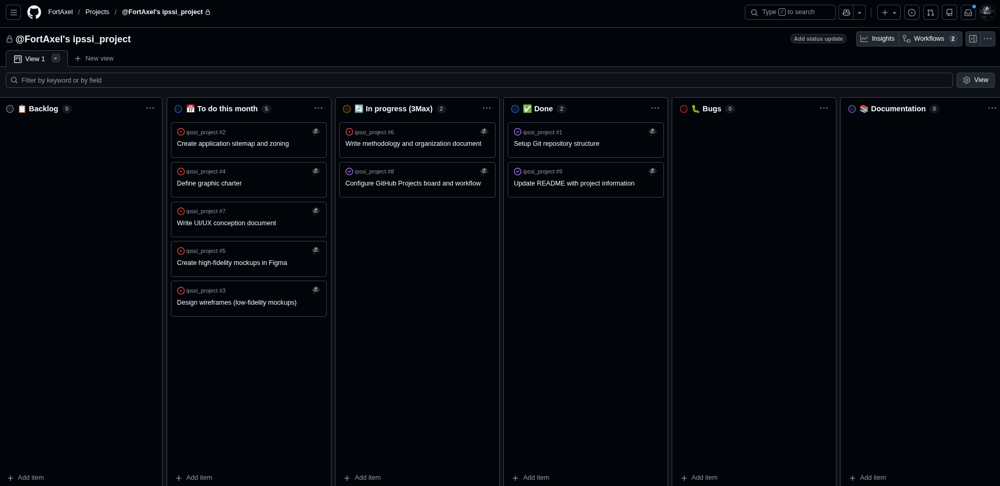{ width=78% }

Chaque issue porte une description structurée, des étiquettes et un rattachement à son jalon,
matérialisé par un _milestone_ GitHub, un par jalon, de 1 à 6. Le tableau est mis à jour
quotidiennement, revu chaque dimanche, et fait l'objet d'un bilan à chaque fin de jalon.

### Gestion du code source (Git)

- **Plateforme** : GitHub, <https://github.com/FortAxel/ipssi_project>
- **Branches** : `main` (stable), `develop` (intégration)
- **Commits** : format `<type>: <description>` en anglais (`feat`, `fix`, `docs`, `test`, `refactor`)
- **Revue** : auto-revue systématique avant merge (projet solo, pas de pull request obligatoire)

**Workflow type** :

```bash
git checkout develop
git checkout -b feature/story-catalog
# développement + commits
git checkout develop && git merge feature/story-catalog
git push origin develop
```

### Intégration continue et déploiement

**Intégration continue (CI)** : **GitHub Actions** (`.github/workflows/ci.yml`).

À chaque push ou pull request sur `develop`, `main` ou `dev/beta_usable` :

1. **Backend** : PHP 8.4, PHP-CS-Fixer, PHPUnit (SQLite, clés JWT test)
2. **Frontend** : Node 20, ESLint, Vitest, build production Vite

La CI valide le code et les tests automatisés ; le **build et le lancement Docker** restent une étape manuelle (`docker compose up -d --build`), reproductible sur poste ou serveur.

**Déploiement** : procédure **manuelle** depuis le dépôt Git et les fichiers Docker du projet, en clonant le dépôt, en configurant `.env`, en lançant `docker compose up -d --build` puis en vérifiant `/api/health`.

**Stratégie de release** : tag Git `v1.0.0` sur `main` après validation CI et merge depuis `develop`.

Avec une méthode de travail posée et un outillage en place, j'ai pu m'attaquer à la première
question de conception : à quoi devait ressembler cette application pour un parent qui lit
avec son enfant.

---

\newpage

## 6. Conception UI/UX

### Sitemap et structure

L'application est organisée autour de six écrans : le catalogue, qui sert de page d'accueil,
la lecture d'une histoire, les favoris, la connexion et l'inscription, le profil utilisateur
et l'interface d'administration.

Le plan de navigation dressé au jalon 2, reproduit en **annexe E**, place la connexion comme
point d'entrée obligatoire, puis fait du catalogue le pivot depuis lequel on rejoint tous les
autres écrans. Il prévoyait en outre un écran intermédiaire, « Détail d'une histoire », entre
le catalogue et la lecture.

**Écart avec l'implémentation finale** : l'écran intermédiaire de détail n'a pas été développé. Depuis le catalogue ou la page Favoris, **un clic sur une carte ouvre directement la lecture**, à la dernière page mémorisée ou à la page 1. Le titre, la couverture et la progression restent visibles sur la carte : l'écran intermédiaire n'apportait donc aucune information, et le supprimer retire une étape à un public jeune. Le parcours final se réduit à connexion, catalogue, lecture page par page.

Depuis le catalogue on accède aux favoris, au profil et à la déconnexion ; depuis la lecture, au retour catalogue, à la navigation et à la lecture audio. La page **Favoris** reprend la même grille que le catalogue, restreinte aux histoires marquées.

### Zoning et wireframes

Les écrans sont bâtis sur trois zones : **en-tête** (logo, navigation), **titre**, **contenu principal**. Cette trame sépare le visuel du texte, normalise l'affichage d'une page à l'autre et permet d'identifier d'un coup d'œil l'écran courant, catalogue ou favoris.

Les wireframes ont servi à fixer la hiérarchie des informations et la place des éléments interactifs avant toute mise en couleur. Le catalogue retient une carte large cliquable, le favori en haut à droite et la progression sous forme d'anneau ; la lecture adopte deux colonnes sur ordinateur, image à gauche et texte à droite, avec le bouton « Écouter » centré sous le texte et l'indicateur « page X sur Y » en bas. Sur mobile, la grille se resserre et la lecture passe en colonne unique avec un menu escamotable.

Les zonings et wireframes, sur ordinateur et sur mobile, figurent en **annexe E**.

### Charte graphique

{ width=62% }

| Usage                   | Couleur        | Code    |
| ----------------------- | -------------- | ------- |
| Primary                 | Bleu principal | #4A90E2 |
| Secondary               | Jaune doux     | #F5D76E |
| Success (lecture audio) | Vert           | #7ED957 |
| Favoris                 | Rose           | #FF7BA5 |
| Blanc neutre            | Blanc          | #FFFFFF |
| Gris clair              | Light Grey     | #F2F2F2 |
| Gris foncé              | Dark Grey      | #333333 |

**Typographie** : Fredoka One en 28 pixels pour les titres et les boutons, Open Sans en 16 pixels pour le texte courant et en 18 pixels pour les sous-titres.

**Composants** : angles arrondis à 32 pixels, ombres légères, états normal, survol, actif et focus. La bibliothèque de composants figure en annexe E. L'ensemble crée une ambiance ludique et douce, adaptée au jeune public.

### Maquettes haute fidélité

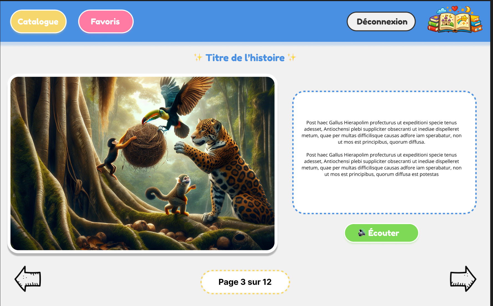{ width=58% }
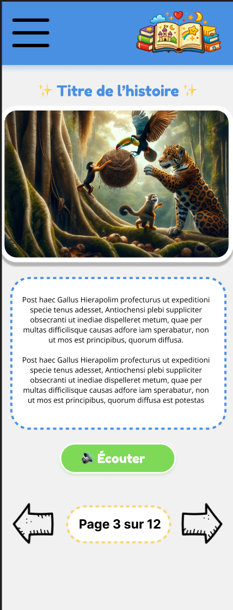{ width=27% }

Le catalogue et les favoris reprennent la structure des wireframes et la charte graphique : le rendu final applique simplement cette charte au wireframe : grille de cartes, couverture, anneau de progression, cœur. La responsivité fait passer d'une disposition paysage sur ordinateur à une colonne verticale sur mobile, avec des zones tactiles larges ; sur tablette en paysage, c'est la version ordinateur qui s'applique.

### Considérations UX

Les **trois modes de lecture** du CDCF (parent, audio, enfant seul) sont supportés par une **même interface de page** : bouton TTS, zones tactiles larges, hiérarchie visuelle adaptée.

Principes appliqués :

- Peu d'actions simultanées à l'écran, boutons larges et explicites
- Couleurs douces, formes arrondies, espacements généreux
- Contraste suffisant, structure claire et répétitive
- Feedback : animation favori, changement visuel bouton audio, conservation automatique de la progression

Parcours type : Connexion -> Catalogue -> Clic sur une histoire -> Lecture -> Reprise automatique au dernier point.

### Captures d'écran de l'application finale

Les captures ci-dessous montrent le rendu réel. Les écrans ajoutés au jalon 6, à savoir la recherche, les filtres, le profil modifiable et la page de confidentialité, reprennent la charte définie au jalon 2.

**Catalogue** : recherche textuelle, filtres par catégorie, cartes avec anneau de progression.

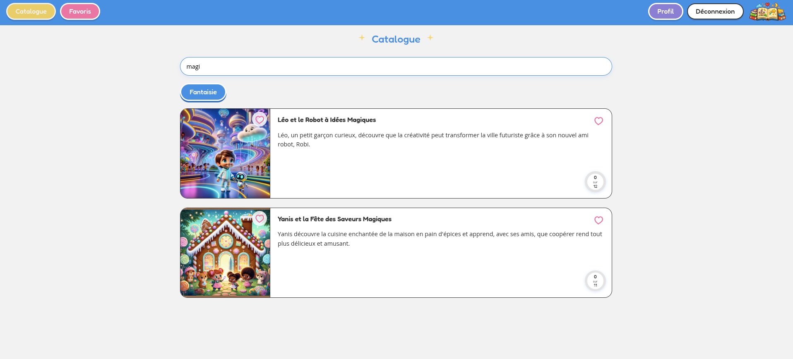{ width=64% }

**Lecture** : illustration et texte, navigation page à page, bouton « Écouter », indicateur de position.

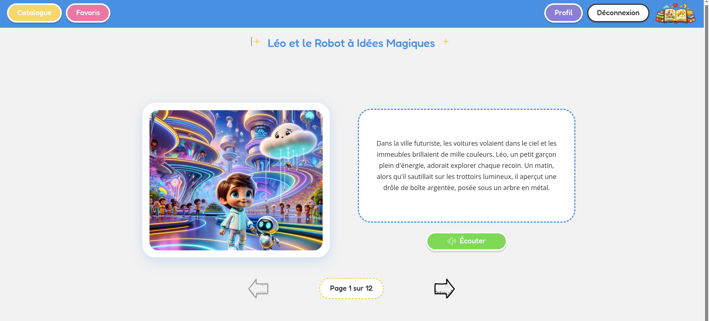{ width=64% }

**Profil** : onglets profil et historique, modification de l'adresse et du mot de passe.

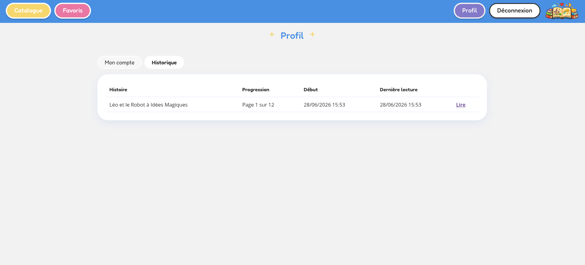{ width=64% }

**Confidentialité et vue mobile** : la page `/privacy`, accessible depuis le menu, et la grille du catalogue adaptée au petit écran.

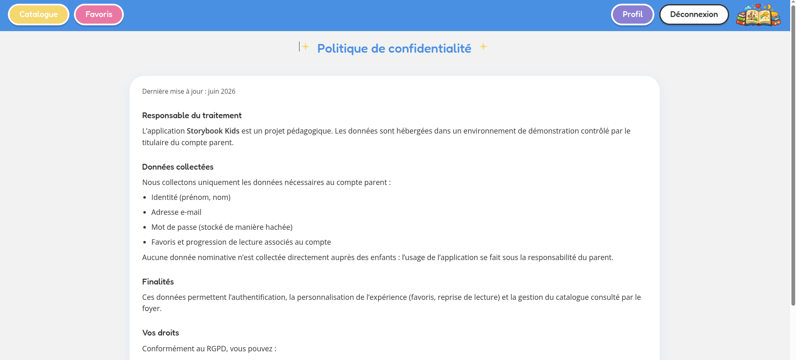{ width=55% }
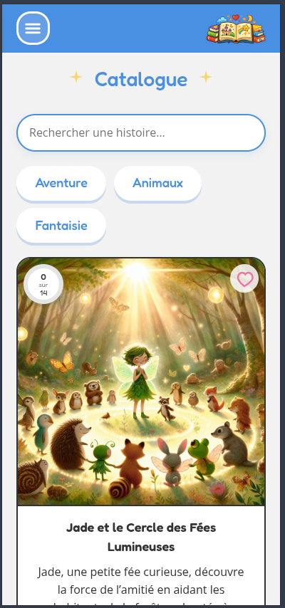{ width=24% }

Les écrans dessinés, il fallait déterminer quelles données leur donner à afficher, et sous
quelle forme les conserver. Je suis donc passé à la modélisation de la base.

---

\newpage

## 7. Modélisation de la base de données

### Démarche MERISE

Modélisation en trois niveaux : **MCD**, **MLD**, **MPD**, cohérente avec le CDCF. SGBD cible : **MySQL** (InnoDB).

Entités principales : `User`, `Story`, `Page`, `Favorite`, `ReadingProgress`.

### Dictionnaire des données

**User**, le parent : `id`, `first_name`, `last_name`, `email` (unique), `password` (haché), `roles` (JSON), `created_at`, `updated_at`.

**Story** : `title`, `description`, `cover_image`, `status` (DRAFT/PUBLISHED/ARCHIVED), `category`, `age_range`, timestamps.

**Page** : `page_number`, `content`, `illustration`, `story_id`.

**Favorite** : association N,N `(user_id, story_id)`, `created_at`.

**ReadingProgress** : progression par `(user_id, story_id)`, avec reprise, historique et complétion.

### MCD et MLD

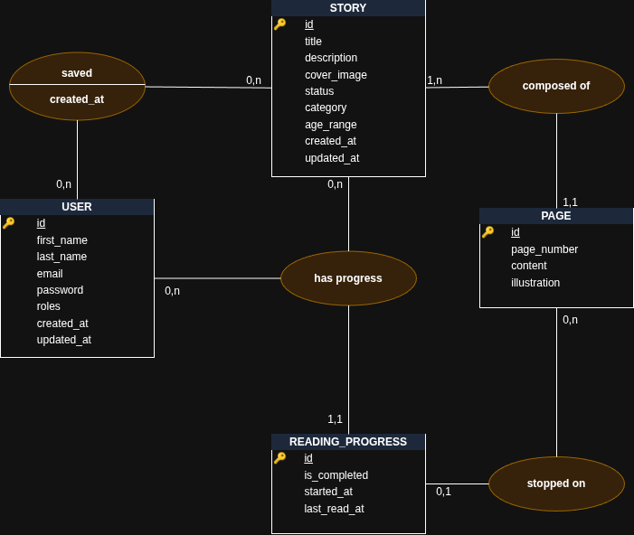{ width=100% }

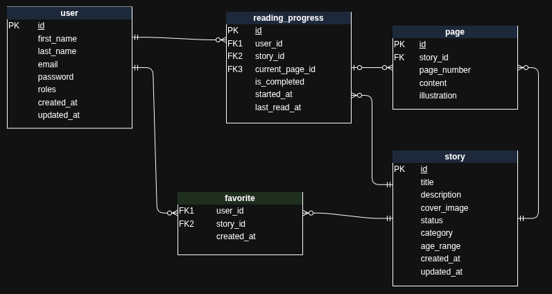{ width=85% }

Le MLD formalise les tables `user`, `story`, `page`, `favorite`, `reading_progress` avec contraintes d'unicité et clés étrangères.

**Notes sur les transformations** :

- **Favorite** : association N,N matérialisée par table de liaison ; clé primaire composée `(user_id, story_id)`.
- **ReadingProgress** : unicité composite `(user_id, story_id)` ; clé primaire technique `id` conservée pour l'ORM.
- **Catégorie** : ENUM dans `story` (liste fermée, intégrité côté BDD).

### Adéquation aux besoins fonctionnels

+--------+----------------------------------+----------------------------------------------------+
| CDCF   | Besoin                           | Couverture                                         |
+========+==================================+====================================================+
| F1     | Compte, authentification, rôles  | Table `user`                                       |
+--------+----------------------------------+----------------------------------------------------+
| F2     | Catalogue, filtres               | Table `story` et jointure `page`                   |
+--------+----------------------------------+----------------------------------------------------+
| F3     | Lecture page par page            | Table `page`                                       |
+--------+----------------------------------+----------------------------------------------------+
| F4     | Favoris, reprise, historique     | Tables `favorite` et `reading_progress`            |
+--------+----------------------------------+----------------------------------------------------+
| F5     | Administration des contenus      | `story.status`, pages rattachées                   |
+--------+----------------------------------+----------------------------------------------------+
| F6     | Synthèse vocale                  | Contenu source `page.content`, sans stockage audio |
+--------+----------------------------------+----------------------------------------------------+

Le modèle respecte la **3NF** ; la catégorie en ENUM constitue une légère dénormalisation volontaire (liste stable).

### MPD final (version réelle)

Le schéma Doctrine reprend le MPD du jalon 3 avec **un ajustement** sur la progression de lecture :

| Élément            | Conception jalon 3               | Implémentation finale       |
| ------------------ | -------------------------------- | --------------------------- |
| Reprise de lecture | `current_page_id` (FK -> `page`) | `last_page_number` (entier) |

**Justification** : simplification côté API et front (numéro de page séquentiel), écart tracé par la migration Doctrine `Version20260522140000`. Les autres tables restent alignées sur le modèle jalon 3.

Attributs effectifs de `reading_progress` : `last_page_number`, `started_at`, `last_read_at`, `is_completed`.

Pas de mise à jour du diagramme MCD/MLD d'origine : l'écart est documenté ici ; l'impact fonctionnel (reprise, historique) est identique.

**Choix techniques conservés** : `ON DELETE CASCADE` sur les dépendances fortes ; index sur `story.status` et `story.category` ; `roles` en JSON (convention Symfony).

Le modèle décrit ce que l'application conserve. Restait à décrire ce qu'elle fait : qui
déclenche quoi, dans quel ordre, et avec quelles conséquences. C'est le rôle des diagrammes
UML du chapitre suivant.

---

\newpage

## 8. Conception de l'application (UML)

### Cas d'utilisation

Les cas d'utilisation couvrent l'ensemble des exigences fonctionnelles du CDCF.

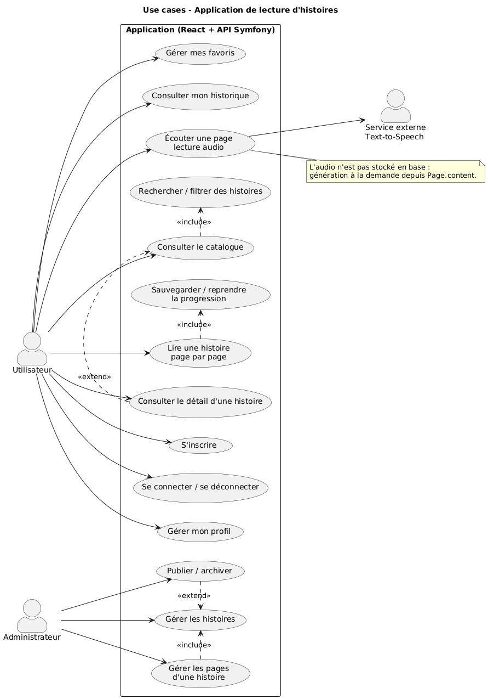{ width=85% }

**Acteurs** :

- **Utilisateur** : catalogue, lecture, favoris, progression, audio
- **Administrateur** : gestion des contenus (histoires, pages, publication)
- **Service externe TTS** : synthèse vocale appelée par le back-end

### Diagrammes de séquence

**Lecture + progression** : affichage d'une page, enregistrement de la progression (reprise).

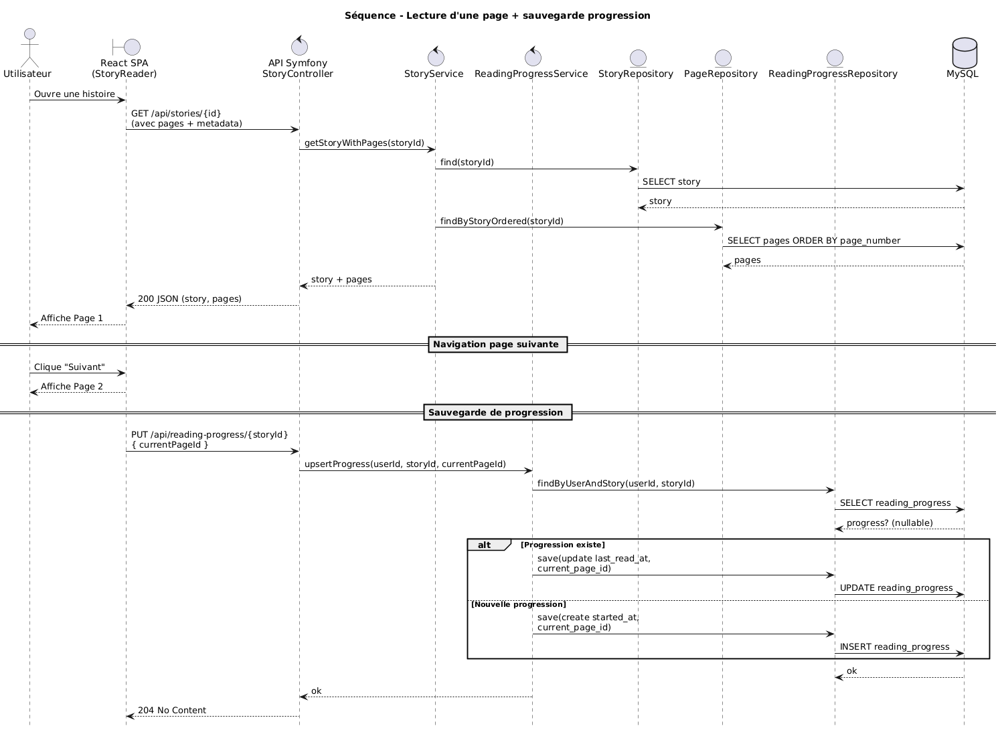{ width=98% }

**Toggle favori** : ajout/retrait depuis le catalogue ou la page d'histoire.

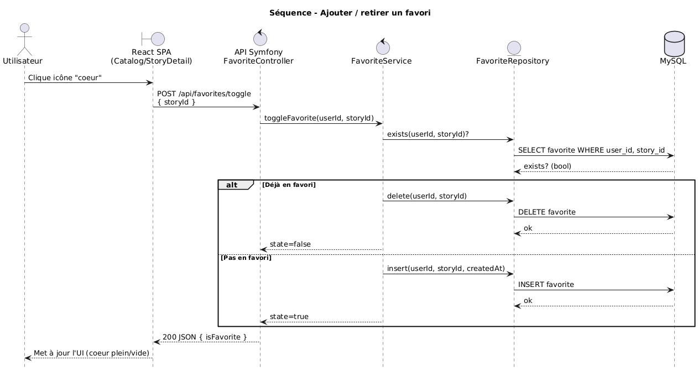{ width=98% }

**Lecture audio (TTS)** : synthèse vocale pour une page (sans stockage audio en base).

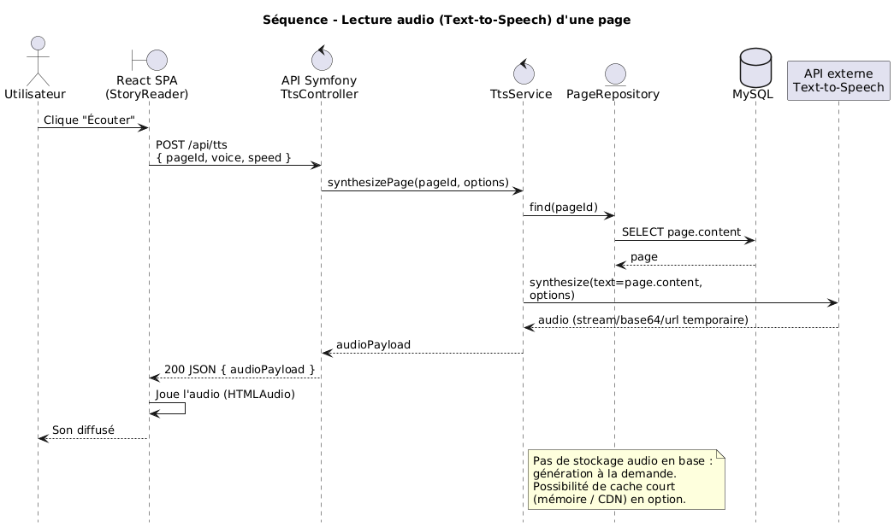{ width=98% }

### Diagramme d'entités métier

Le diagramme représente le domaine métier tel que formalisé au jalon 3 (entités et associations).

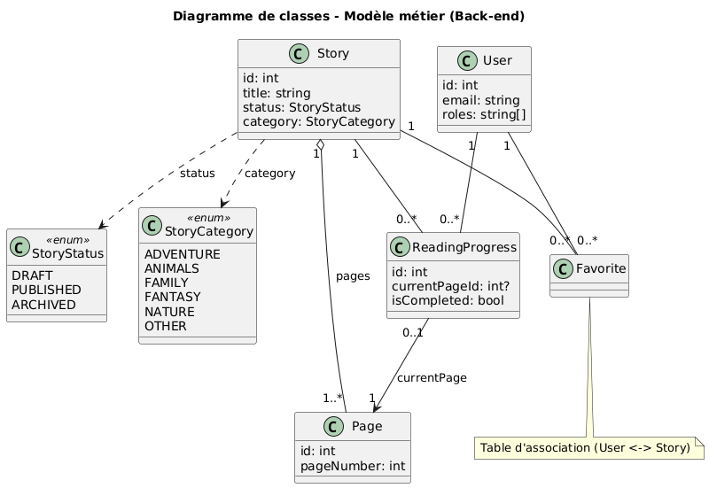{ width=98% }

**Nature des relations** : le diagramme distingue deux types d'associations, et cette
distinction n'est pas décorative : elle détermine ce qui se passe lorsqu'on supprime un
objet.

Entre `Story` et `Page`, la relation est une **composition**. Une page n'a aucune existence
en dehors de l'histoire à laquelle elle appartient : elle n'est pas partagée, elle n'est pas
réutilisable ailleurs, et supprimer l'histoire doit supprimer ses pages. Cette sémantique se
traduit directement dans le schéma par un `ON DELETE CASCADE` sur la clé étrangère
`page.story_id`.

Entre `User` et `Story`, la relation via `Favorite` est une **agrégation**. Les deux objets
existent indépendamment l'un de l'autre : une histoire retirée des favoris continue
d'exister au catalogue, et un compte supprimé ne fait pas disparaître les histoires qu'il
avait mises en favori. Seul le lien disparaît. La même logique vaut pour `ReadingProgress`,
qui associe un compte et une histoire sans qu'aucun des deux ne dépende de l'autre.

Concrètement, la suppression d'un compte parent efface ses favoris et sa progression, mais
laisse le catalogue intact ; la suppression d'une histoire efface ses pages, ainsi que les
favoris et les progressions qui la référencent, puisque ces liens n'ont plus d'objet.

**Couches Symfony** (non figurées sur le diagramme entités) :

- **Controllers** : points d'entrée HTTP, validation DTO, réponses JSON
- **Services métier** : `ReadingProgressService`, `FavoriteService`, `StoryService`…
- **Repositories Doctrine** : requêtes typées, transactions via l'ORM

Enchaînement : **SPA (fetch)** -> **controller** -> **service** -> **repository** -> **entités / MySQL**.

### Compléments post-conception (routes compte et RGPD)

Conformément au RGPD et au périmètre final, les routes suivantes ont été ajoutées sans modification des diagrammes UML (périmètre restreint, pas de nouvelle entité) :

| Route            | Rôle                                       |
| ---------------- | ------------------------------------------ |
| `PATCH /api/me`  | Rectification e-mail / mot de passe        |
| `DELETE /api/me` | Suppression du compte et données associées |
| Page `/privacy`  | Politique de confidentialité (front)       |

Ces ajouts relèvent du **contrôleur compte** et de la **couche présentation** ; le modèle entités jalon 3–4 reste valide.

### Cycle de publication d'une histoire

- `DRAFT` : visible uniquement en admin
- `PUBLISHED` : visible dans le catalogue public
- `ARCHIVED` : retirée du catalogue (conservée pour historique)

Implémenté par `Story.status` (cf. MPD jalon 3).

Ces diagrammes décrivent des comportements sans dire où le code qui les réalise doit vivre.
C'est la question de l'architecture, que j'aborde maintenant.

---

\newpage

## 9. Architecture multi-couches

### Architecture logique (3-tiers)

- **Tier 1, client** : navigateur (React/TypeScript)
- **Tier 2, serveur applicatif** : API Symfony (PHP 8.4), REST JSON, JWT
- **Tier 3, données** : MySQL

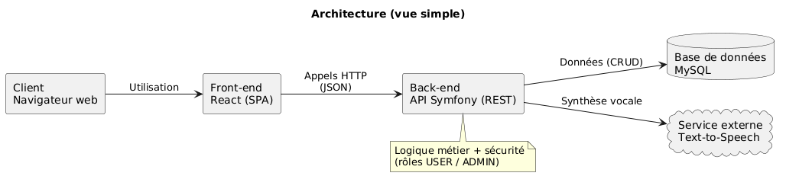{ width=98% }

### Ne pas confondre couches logiques et tiers physiques

C'est la confusion la plus fréquente sur ce sujet, et elle mérite qu'on s'y arrête, parce
que les deux notions décrivent deux choses différentes.

L'**architecture n-tiers** est une répartition **physique**. Elle répond à la question :
sur quelles machines, ou dans quels processus, le travail est-il réparti ? Ici, trois tiers.
Le navigateur du parent exécute l'interface. Le serveur applicatif exécute l'API. Le serveur
de base de données conserve les données. Chacun peut être déplacé, dupliqué ou dimensionné
indépendamment des autres.

Le **modèle MVC** est une organisation **logique** du code à l'intérieur d'un seul de ces
tiers, en l'occurrence le tier applicatif. Il répond à une autre question : comment le code
est-il découpé pour que chaque fichier n'ait qu'une seule raison de changer ? Le contrôleur
reçoit la requête HTTP, valide les données entrantes et rend une réponse JSON. Le service
porte la règle métier. Le dépôt Doctrine parle à la base. L'entité représente la donnée.

Les deux découpages sont indépendants. Mes trois couches logiques
(contrôleur, service, dépôt) vivent toutes dans le **même** conteneur PHP, donc dans le
même tier physique, et pourtant la séparation des responsabilités y est complète. À
l'inverse, on pourrait très bien déployer un code parfaitement monolithique sur trois
machines : on aurait trois tiers et aucune couche.

Une précision sur le M de MVC dans une architecture d'API : la vue au sens classique
n'existe pas côté serveur, puisque le serveur ne produit pas de HTML. C'est la SPA React qui
tient ce rôle, dans le tier client. Côté API, le triplet effectif est donc plutôt
contrôleur, service et modèle.

Principes appliqués :

| Principe         | Illustration                                        |
| ---------------- | --------------------------------------------------- |
| SRP              | `ReadingProgressService`, `FavoriteService` séparés |
| DTO / validation | Corps JSON validés avant passage au service         |
| Secrets          | `.env`, clés JWT hors dépôt                         |
| Doctrine         | Requêtes paramétrées, pas de SQL brut               |
| Tests            | PHPUnit + Vitest                                    |

**Composants** : Doctrine ORM, Symfony Security, Lexik JWT, Edge TTS (externe), React + Vite.

### Architecture déployée (Docker Compose)

| Composant      | Rôle                                                              |
| -------------- | ----------------------------------------------------------------- |
| **nginx**      | Fichiers statiques React (build Vite) + proxy `/api` et `/images` |
| **php**        | API REST (JWT, Doctrine, TTS)                                     |
| **app-init**   | One-shot : Composer, migrations, fixtures, clés JWT               |
| **mysql**      | Volume `mysql_data`                                               |
| **phpmyadmin** | Administration BDD (port `8081`)                                  |

Un seul `docker compose up -d --build` démarre l'application complète sur le port `8080`.

Fichiers d'infrastructure : `docker-compose.yml` à la racine, puis les dossiers
`docker/nginx/`, `docker/php/` et le script `docker/init/bootstrap.sh`.

Une architecture bien découpée facilite la sécurisation, mais ne la remplace pas. Le chapitre
suivant reprend chaque risque connu et confronte l'application à ce risque, y compris lorsque
la réponse est qu'aucune mesure n'a été prise.

---

\newpage

## 10. Sécurité

### Mesures OWASP

| Risque           | Mesure                                                                            |
| ---------------- | --------------------------------------------------------------------------------- |
| Injection SQL    | Doctrine ORM, requêtes paramétrées                                                |
| XSS              | Échappement React ; pas de `dangerouslySetInnerHTML` sur le contenu des histoires |
| Authentification | JWT, mots de passe hachés (algorithme Symfony)                                    |
| Autorisation     | `ROLE_USER` / `ROLE_ADMIN` ; routes `/api/admin/*` réservées admin                |
| Secrets          | `.env` et clés JWT (`config/jwt/*.pem`) hors dépôt (gitignore)                    |
| CORS             | Nelmio, `CORS_ALLOW_ORIGIN` configurable                                          |
| Upload fichiers  | Types MIME autorisés, taille max 5 Mo, noms aléatoires                            |

### Falsification de requête (CSRF) : un risque neutralisé par l'architecture

La faille CSRF consiste à faire exécuter au navigateur d'une victime déjà authentifiée une
requête qu'elle n'a pas demandée, depuis un site tiers. Elle repose sur un mécanisme précis :
le navigateur joint **automatiquement** le cookie de session à toute requête destinée au
domaine concerné, y compris lorsque cette requête est déclenchée par une page malveillante.

Storybook Kids n'est pas exposé à ce scénario, et c'est une conséquence directe d'un choix
d'architecture. Les pare-feux Symfony de l'application sont déclarés `stateless` : il n'y a
ni session serveur, ni cookie d'authentification. Le jeton JWT est stocké côté navigateur et
transmis explicitement par le code de la SPA dans un en-tête `Authorization: Bearer`. Or un
navigateur ne remplit jamais cet en-tête de lui-même. Une requête forgée depuis un site
tiers arrive donc au serveur **sans jeton**, et se voit refusée comme n'importe quelle
requête anonyme.

```yaml
# backend/config/packages/security.yaml
firewalls:
  login:
    pattern: ^/api/auth/login
    stateless: true
  api:
    pattern: ^/api
    stateless: true
    jwt: ~
```

Ce choix a une contrepartie que je tiens à énoncer, parce qu'elle constitue le vrai
arbitrage : en stockant le jeton dans le stockage local du navigateur, je le rends lisible
par du code JavaScript. Le risque se déplace donc du CSRF vers le XSS : si un attaquant
parvient à injecter du script dans la page, il peut lire le jeton. C'est précisément pour
cette raison que le traitement du XSS décrit plus haut est ici la mesure critique : le
contenu des histoires est rendu par React, qui échappe automatiquement les chaînes, et
`dangerouslySetInnerHTML` n'est utilisé nulle part.

L'alternative serait de placer le jeton dans un cookie `HttpOnly` et `SameSite=Strict`,
inaccessible au JavaScript, et de rétablir alors une protection CSRF par jeton
anti-rejeu. C'est la configuration que je retiendrais pour une exposition publique de
l'application ; elle n'a pas été mise en place ici parce que l'application reste déployée en
local et que le stockage par jeton simplifiait le développement de la SPA.

### Attaques par force brute

Le formulaire de connexion **n'est pas protégé contre les tentatives répétées**. Rien
n'empêche aujourd'hui un script d'enchaîner des essais de mots de passe sur
`POST /api/auth/login`.

Contrairement aux autres arbitrages de ce chapitre, celui-ci n'en est pas un. Je n'ai pas
pesé le pour et le contre avant d'écarter la mesure : je n'y ai tout simplement pas pensé au
moment de construire l'authentification, et je ne l'ai découverte qu'en relisant
l'application au regard de l'OWASP, une fois la version 1 terminée. C'est d'ailleurs ce que
la revue systématique d'un référentiel apporte de plus utile, faire apparaître ce à quoi on
n'a pas songé plutôt que confirmer ce qu'on a déjà traité.

La correction est simple et documentée. Symfony fournit un composant `login_throttling`
qui se déclare directement dans le pare-feu et limite le nombre de tentatives par adresse
IP et par identifiant sur une fenêtre glissante.

```yaml
firewalls:
  login:
    login_throttling:
      max_attempts: 5
      interval: '15 minutes'
```

C'est la première mesure que j'ajouterais avant toute ouverture publique du service, avec
la journalisation des échecs d'authentification.

### Checklist qualité

| Point                                            | Statut                    |
| ------------------------------------------------ | ------------------------- |
| Nommage conforme (`code-standard.md`)            | Validé                    |
| Pas de secret ni `console.log` de debug          | Validé                    |
| PHPDoc / TSDoc sur API publiques                 | Validé                    |
| Texte UI en français (`frontend/src/i18n/fr.ts`) | Validé                    |
| Lint PHP / ESLint                                | Validé (CI)               |
| Tests pour logique touchée                       | Validé (PHPUnit + Vitest) |
| Migrations Doctrine versionnées                  | Validé                    |
| Isolation données utilisateur                    | Validé                    |
| Routes admin inaccessibles au parent             | Validé                    |

### Conformité RGPD

| Droit / obligation    | Implémentation                                         |
| --------------------- | ------------------------------------------------------ |
| Transparence          | Page `/privacy` (politique de confidentialité)         |
| Accès / rectification | Profil ; `PATCH /api/me`                               |
| Effacement            | `DELETE /api/me` (suppression compte et données liées) |

Pas d'écran de modération utilisateurs in-app : phpMyAdmin permet la consultation BDD si nécessaire.

Affirmer qu'une mesure est en place n'engage à rien tant qu'on ne l'a pas vérifiée. C'est
précisément ce que font les tests décrits au chapitre suivant.

---

\newpage

## 11. Tests

### Périmètre bêta (mai 2026)

| Suite            | Outil                | Couverture bêta                |
| ---------------- | -------------------- | ------------------------------ |
| Backend unitaire | PHPUnit              | Entité `ReadingProgress`       |
| Backend API      | WebTestCase          | `GET /api/health`              |
| Frontend         | Vitest               | Libellés i18n français         |
| Lint             | PHP-CS-Fixer, ESLint | Conventions `code-standard.md` |
| CI               | GitHub Actions       | lint + tests + build front     |

### Extension livraison finale (juin 2026)

| Suite       | Ajout                                                                        |
| ----------- | ---------------------------------------------------------------------------- |
| Backend API | `AuthApiTest`, `AccountApiTest`, `FavoriteApiTest`, `ReadingProgressApiTest` |

Classes : `backend/tests/Controller/`, bootstrap SQLite (`backend/.env.test`), schéma créé en test.

### Bilan, exécution et CI

**Local (identique à la CI)** :

```bash
cd backend
cp .env.test .env
composer install --no-interaction --prefer-dist
composer lint:php
JWT_PASSPHRASE=ci_test_passphrase php bin/console lexik:jwt:generate-keypair --overwrite --no-interaction
APP_ENV=test composer test

cd frontend
npm ci && npm run lint && npm test && npm run build
```

> **Note** : `docker compose exec php composer test` charge le `.env` racine (prod/dev), pas l'environnement test SQLite. La CI et les commandes ci-dessus sont la référence.

**Pipeline** (`.github/workflows/ci.yml`) :

- **Déclencheur** : push et pull request sur `main`, `develop`, `dev/beta_usable`
- **Backend** : PHP 8.4, PHP-CS-Fixer, génération clés JWT test, PHPUnit
- **Frontend** : Node 20, ESLint, Vitest, build Vite

**Bilan final** : **100 % des tests automatisés passent en CI** (lint PHP, PHPUnit, ESLint, Vitest, build Vite). Aucun taux de couverture `%` n'a été mesuré formellement (pas de rapport PHPUnit `--coverage` généré) ; le périmètre couvre les parcours critiques : auth, compte, favoris, progression, health.

Run GitHub Actions, jobs Backend (lint + tests) et Frontend (lint + test + build) au vert, rapport Vitest 7/7 tests passés.

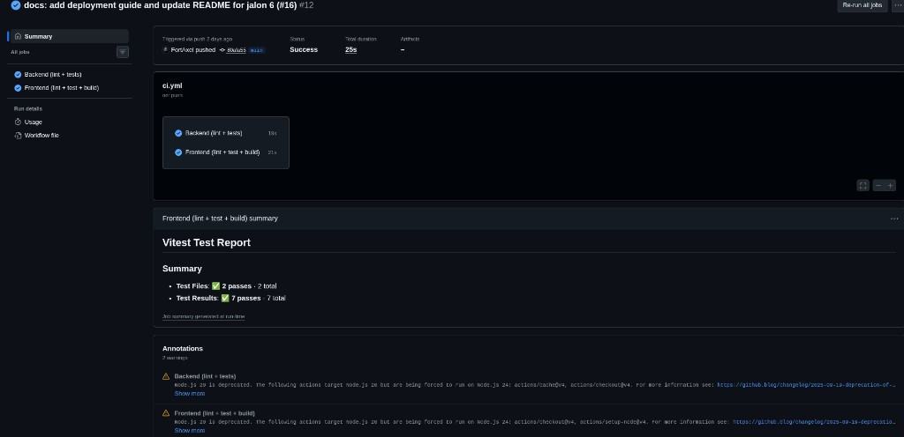{ width=78% }

---

\newpage

## 12. Extraits de code significatifs

Les trois extraits qui suivent ont été retenus parce qu'ils illustrent chacun une couche
différente de l'application, et parce qu'ils portent une décision que je peux justifier.
Ils sont commentés dans cet esprit : ce qui compte n'est pas la syntaxe, mais le
raisonnement qui a conduit à écrire ces lignes-là plutôt que d'autres.

### Extrait 1 : la règle métier de la progression de lecture

Cette méthode appartient à l'entité `ReadingProgress`. C'est le cœur de la fonctionnalité la
plus représentative du projet.

```php
// backend/src/Entity/ReadingProgress.php
public function updateProgress(int $lastPageNumber, int $pageCount): void
{
    $this->lastPageNumber = max(1, min($lastPageNumber, max(1, $pageCount)));
    $this->isCompleted = $this->lastPageNumber >= max(1, $pageCount);
    $this->lastReadAt = new DateTimeImmutable();
}
```

Trois choses s'y jouent.

D'abord, la valeur reçue est **bornée** entre la première et la dernière page. Le client
envoie un numéro de page, mais un client n'est jamais digne de confiance : un appel direct à
l'API pourrait annoncer la page 900 d'une histoire qui en compte quatorze, ou la page zéro.
Plutôt que de rejeter la requête par une erreur, je ramène la valeur dans l'intervalle
valide. Le choix est délibéré : il s'agit d'une position de lecture, pas d'une opération
sensible, et une valeur aberrante ne doit pas casser l'expérience du parent.

Ensuite, l'achèvement de l'histoire n'est **pas une donnée transmise par le client** mais une
conséquence calculée sur le serveur. Personne ne peut déclarer une histoire terminée sans
être arrivé à la dernière page.

### Extrait 2 : l'isolation des données entre comptes

Cet extrait vient du contrôleur, dans la couche qui reçoit les requêtes HTTP.

```php
// backend/src/Controller/ReadingProgressController.php
#[Route('/{storyId}', requirements: ['storyId' => '\d+'], methods: ['PUT'])]
public function save(int $storyId, #[MapRequestPayload] ReadingProgressInput $input): JsonResponse
{
    $user = $this->requireUser();
    $story = $this->storyRepository->findPublishedWithPages($storyId);
    if ($story === null) {
        return $this->json(['error' => 'not_found', ...], Response::HTTP_NOT_FOUND);
    }

    $progress = $this->progressRepository->findOneByUserAndStory($user, $story);
    if ($progress === null) {
        $progress = (new ReadingProgress())->setUser($user)->setStory($story);
        $this->entityManager->persist($progress);
    }

    $progress->updateProgress($page, $pageCount);
    $this->entityManager->flush();
    // ...
}
```

Le point important est l'absence d'identifiant d'utilisateur dans l'URL. La route ne reçoit
que l'identifiant de l'histoire ; le compte concerné est déduit du jeton d'authentification
par `requireUser()`, jamais des données envoyées par le client. Il n'existe donc aucun moyen,
depuis l'extérieur, de désigner la progression d'un autre parent : la question ne se pose
pas, parce que le paramètre n'existe pas.

C'est une application concrète du principe selon lequel une autorisation ne se vérifie pas,
elle se rend impossible à contourner par construction. La contrainte d'unicité
`uniq_progress_user_story` déclarée sur le couple `(user_id, story_id)` verrouille la même
règle au niveau de la base : un compte ne peut avoir qu'une seule position par histoire.

On notera également que la recherche de l'histoire passe par `findPublishedWithPages()` : une
histoire en brouillon ou archivée est introuvable par cette route, même pour un compte
authentifié. Le filtrage sur le statut se fait dans le dépôt, pas dans le contrôleur.

### Extrait 3 : le point d'entrée unique des appels réseau côté client

Côté React, tous les appels à l'API passent par une seule fonction.

```ts
// frontend/src/services/apiClient.ts
export async function apiFetch<T>(
  path: string,
  options: RequestInit = {},
  auth = true,
): Promise<T> {
  const headers = new Headers(options.headers);
  if (!headers.has('Content-Type') && options.body && !(options.body instanceof FormData)) {
    headers.set('Content-Type', 'application/json');
  }

  if (auth) {
    const token = getToken();
    if (token) {
      headers.set('Authorization', `Bearer ${token}`);
    }
  }

  const response = await fetch(path, { ...options, headers });
  // ... normalisation de la réponse et des erreurs
}
```

Ce choix de centralisation répond à un problème que j'ai rencontré dès les premiers écrans :
en appelant `fetch` directement depuis chaque composant, j'ai commencé à dupliquer la même séquence : poser l'en-tête d'authentification, poser le type de contenu, décoder le JSON,
distinguer une réponse vide d'une erreur. Chaque duplication est une occasion d'oublier un
morceau, et l'oubli le plus probable est justement l'en-tête `Authorization`.

En passant par un point unique, l'injection du jeton devient le comportement par défaut, et
son absence un cas explicite : le troisième paramètre `auth` permet de désactiver
l'authentification pour les deux seules routes publiques, la connexion et l'inscription.
La normalisation des erreurs dans une classe `ApiRequestError` typée permet ensuite aux
composants de réagir sur un code HTTP sans réinterpréter chacun le corps de la réponse.

C'est le même raisonnement que pour l'extrait précédent, appliqué à l'autre bout de la
chaîne : rendre le comportement correct plus facile à obtenir que le comportement incorrect.

Ces trois extraits montrent l'intention. Le chapitre suivant montre le résultat, en déroulant
pas à pas le comportement observé sur la fonctionnalité qu'ils servent.

---

\newpage

## 13. Jeu d'essai

Le jeu d'essai porte sur la **reprise de lecture**, la fonctionnalité la plus représentative
du projet : c'est celle qui traverse toutes les couches, du geste du parent jusqu'à la ligne
en base, et c'est celle qui répond au besoin d'usage le plus concret exprimé au cahier des charges, car une histoire se lit rarement d'une traite avec un enfant.

### Objectif

Vérifier qu'une position de lecture est correctement enregistrée, qu'elle est correctement
restituée à la réouverture de l'histoire, et que les cas limites ne produisent ni erreur ni
donnée incohérente.

### Données en entrée

L'environnement de test est reconstruit à chaque exécution sur une base SQLite dédiée,
déclarée dans le fichier `.env.test` du back-end, ce qui garantit que le jeu d'essai part
toujours du même état.

+------------------------+------------------------------------------------------+
| Élément                | Valeur                                               |
+========================+======================================================+
| Compte de test         | `progress@demo.local`, créé par la requête           |
|                        | d'inscription                                        |
+------------------------+------------------------------------------------------+
| Mot de passe           | `testpass123`                                        |
+------------------------+------------------------------------------------------+
| Histoire               | Première histoire publiée du catalogue, chargée par  |
|                        | les fixtures                                         |
+------------------------+------------------------------------------------------+
| Authentification       | Jeton JWT obtenu par `POST /api/auth/login`          |
+------------------------+------------------------------------------------------+

### Scénario nominal et résultats

Les trois étapes portent toutes sur le même point d'entrée,
`/api/reading-progress/{storyId}`, appelé successivement en lecture et en écriture.

+-----+------------------------+---------------------------------+------------+
| \#  | Requête                | Résultat attendu                | Obtenu     |
+=====+========================+=================================+============+
| 1   | `GET`, sur une         | HTTP 200, `lastPageNumber` à 1, | Conforme   |
|     | histoire jamais        | `isCompleted` à faux            |            |
|     | ouverte                |                                 |            |
+-----+------------------------+---------------------------------+------------+
| 2   | `PUT`, avec            | HTTP 200, valeur enregistrée,   | Conforme   |
|     | `lastPageNumber` à 3   | `isCompleted` à faux            |            |
+-----+------------------------+---------------------------------+------------+
| 3   | `GET`, à nouveau       | HTTP 200, `lastPageNumber` à 3, | Conforme   |
|     |                        | `startedAt` et `lastReadAt`     |            |
|     |                        | renseignés                      |            |
+-----+------------------------+---------------------------------+------------+

Le point 1 mérite un commentaire. Une histoire jamais ouverte n'a **aucune ligne** en base :
le dépôt renvoie `null`. Plutôt que de répondre par une erreur 404 que le client aurait dû
interpréter, l'API renvoie une progression par défaut à la page 1. Du point de vue de
l'interface, une histoire jamais commencée et une histoire commencée à la page 1 se
comportent donc de la même façon, ce qui supprime un cas particulier côté React.

Le point 3 vérifie la **persistance réelle** et non le simple écho de la requête précédente :
la seconde lecture provoque une nouvelle requête en base, et les horodatages `startedAt` et
`lastReadAt` doivent être présents, le premier ayant été posé à la création de la ligne.

### Cas limites

+--------------------------+----------------------------+---------------------------+
| Cas                      | Comportement attendu       | Comportement observé      |
+==========================+============================+===========================+
| Page supérieure au       | Valeur ramenée à la        | Conforme, par le bornage  |
| nombre de pages          | dernière page,             | dans `updateProgress`     |
|                          | `isCompleted` à vrai       |                           |
+--------------------------+----------------------------+---------------------------+
| Page inférieure à 1      | Valeur ramenée à 1         | Conforme                  |
| ou nulle                 |                            |                           |
+--------------------------+----------------------------+---------------------------+
| Requête sans jeton       | HTTP 401, aucune écriture  | Conforme, par le pare-feu |
| d'authentification       |                            | et le rôle `ROLE_USER`    |
+--------------------------+----------------------------+---------------------------+
| Histoire en brouillon    | HTTP 404                   | Conforme, par             |
| ou archivée              |                            | `findPublishedWithPages`  |
+--------------------------+----------------------------+---------------------------+
| Seconde sauvegarde sur   | Mise à jour de la ligne    | Conforme, par la          |
| la même histoire         | existante, pas de doublon  | contrainte d'unicité      |
+--------------------------+----------------------------+---------------------------+

### Analyse des écarts

Aucun écart entre les résultats attendus et les résultats obtenus sur ce périmètre.

Un écart existe en revanche entre la **conception initiale et l'implémentation**, et il est
assumé. Le modèle du jalon 3 prévoyait de stocker une clé étrangère `current_page_id`
pointant vers la page en cours. L'implémentation retient un simple entier
`last_page_number`. La raison est qu'un numéro de page séquentiel est ce que manipulent déjà
le lecteur React et l'API, alors qu'une clé étrangère aurait imposé une jointure
supplémentaire à chaque affichage pour retrouver un rang que l'on connaissait déjà. Le comportement fonctionnel, reprendre au bon endroit, est strictement identique. Cet écart
est tracé par la migration Doctrine `Version20260522140000` et documenté au chapitre 7.

### Exécution automatisée

Ce scénario n'est pas rejoué à la main. Il est écrit dans la classe
`ReadingProgressApiTest`, sous `backend/tests/Controller/`, et exécuté à chaque poussée de
code par l'intégration continue, au même titre que les tests d'authentification, de compte et
de favoris.

L'application est écrite, sécurisée et vérifiée. Il restait à la rendre installable ailleurs
que sur ma machine, ce qui s'est révélé être un chantier à part entière.

---

\newpage

## 14. Déploiement et mise en production

### Variables d'environnement

Fichier `.env` à la racine (copie de `.env.example`, monté dans le conteneur PHP).

| Variable                | Rôle                                                    |
| ----------------------- | ------------------------------------------------------- |
| `APP_ENV` / `APP_DEBUG` | Environnement Symfony                                   |
| `APP_PORT`              | Port HTTP (défaut `8080`)                               |
| `APP_SECRET`            | Secret Symfony (≥ 32 caractères en prod)                |
| `DATABASE_URL`          | Doctrine, mot de passe = `MYSQL_PASSWORD`, hôte `mysql` |
| `JWT_PASSPHRASE`        | Clé privée JWT                                          |
| `CORS_ALLOW_ORIGIN`     | Origines autorisées                                     |
| `TTS_*`                 | Synthèse vocale Edge (`TTS_ENABLED=1` par défaut)       |

Le mot de passe dans `DATABASE_URL` doit correspondre à `MYSQL_PASSWORD`. `DEFAULT_URI` reflète l'URL publique.

### Environnements

+-----------------+---------------------------+----------------------------------+------------------+
|                 | Docker production         | Docker développement             | Tests CI         |
+=================+===========================+==================================+==================+
| Configuration   | `APP_ENV=prod`            | `APP_ENV=dev`                    | `APP_ENV=test`   |
+-----------------+---------------------------+----------------------------------+------------------+
| Front-end       | Build nginx sur `:8080`   | nginx ou `npm run dev` sur       | Vitest           |
|                 |                           | `:5173`                          |                  |
+-----------------+---------------------------+----------------------------------+------------------+
| Back-end        | Composer `--no-dev`       | Avec les dépendances de          | SQLite           |
|                 |                           | développement                    |                  |
+-----------------+---------------------------+----------------------------------+------------------+
| Base de données | MySQL (volume             | MySQL                            | SQLite           |
|                 | `mysql_data`)             |                                  |                  |
+-----------------+---------------------------+----------------------------------+------------------+
| phpMyAdmin      | Oui, sur `8081`           | Oui                              | Aucun            |
+-----------------+---------------------------+----------------------------------+------------------+

### Procédure de déploiement

**Prérequis** : Git 2.x, Docker 24+, Docker Compose v2.

```bash
git clone https://github.com/FortAxel/ipssi_project.git
cd ipssi_project
cp .env.example .env
docker compose up -d --build
curl -s http://127.0.0.1:8080/api/health
```

Au premier démarrage, `app-init` installe les dépendances PHP, applique les migrations et charge les fixtures si la base est vide.

| Service                 | URL par défaut        |
| ----------------------- | --------------------- |
| Application (SPA + API) | http://127.0.0.1:8080 |
| phpMyAdmin              | http://127.0.0.1:8081 |

**Serveur** : cloner le dépôt, personnaliser `.env`, ouvrir `APP_PORT`, `docker compose up -d --build`, vérifier health, reverse proxy HTTPS recommandé.

**Mise à jour** : `git pull` puis `docker compose up -d --build`.

Pas de dump SQL : migrations + fixtures au premier boot via `app-init`.

Rester à jour est une condition pour que ce qui précède ne se périme pas. Le chapitre suivant
décrit comment je m'y prends.

---

\newpage

## 15. Veille technologique et veille sécurité

### Comment je m'informe

Je préfère décrire ma pratique réelle plutôt qu'une routine idéale. Elle n'est pas
formalisée, et elle fonctionne sur deux régimes.

Le premier est **passif et quotidien**. Je suis les annonces des plateformes dont dépendent les
applications que je développe. Shopify en pousse par trois canaux : son journal des
modifications, qui étiquette explicitement les annonces de dépréciation et celles qui
appellent une action ; des courriels adressés aux développeurs pour les prévenir des
changements à venir ; et des alertes affichées dans le tableau de bord partenaire, celui
depuis lequel on administre ses applications. S'y ajoutent les publications d'OpenAI, les
communications d'Apple aux développeurs, et une veille plus diffuse sur les réseaux sociaux,
où circulent vite les annonces de nouveaux modèles d'intelligence artificielle.

Un exemple récent montre à quoi sert ce dispositif. Un courriel de Shopify, reproduit en
annexe H, nous avertissait qu'une de nos applications utilisait encore une version
d'interface qui cesserait d'être acceptée au 1er octobre 2026, sous peine de blocage de tout
nouveau déploiement. Elle ne concernait pas HyperSearchX, mais je ne pouvais le savoir
qu'après vérification : j'ai donc contrôlé la version utilisée par chacune de nos
applications avant de conclure. C'est le cœur du travail de veille : convertir une annonce
générale en vérification sur son propre périmètre, plutôt que d'attendre la panne pour
découvrir qu'on était concerné.

Le second est **actif et déclenché par un besoin**. Quand une fonctionnalité à construire
soulève une question que je ne sais pas trancher, je consulte la documentation officielle,
les dépôts publics et les discussions techniques jusqu'à pouvoir décider.

Le tri, lui, se fait par la conversation : j'analyse immédiatement ce que je trouve, puis je
transmets au dirigeant de l'entreprise ce qui a un impact sur nos produits et nous en
discutons. Cette veille à deux confronte une lecture technique et une lecture commerciale du
même signal, ce qui est efficace dans une structure de notre taille.

### Trois informations qui ont changé le travail

Une veille ne vaut que par ce qu'elle produit. Voici trois cas où une information a modifié
une décision déjà prise, ou en a imposé une nouvelle.

**Shopify bascule sa plateforme sur GraphQL.** Depuis le 1er octobre 2024, l'interface
historique de Shopify, de style REST, est déclarée héritée et ne reçoit plus de nouveautés ;
depuis Shopify remplace cette API REST par un seul point d'entrée GraphQL.
Le point important est que cette bascule ne s'est pas jouée à une date unique :
Shopify publie quatre versions d'interface par an et retire les points d'entrée au fil de ces versions.
La migration s'est donc faite par vagues, au rythme des annonces, ce qui suppose de les suivre
pour ne pas découvrir une rupture en production.

La conséquence a dépassé la traduction d'appels. GraphQL permet de demander en une seule
requête exactement les champs voulus, là où l'ancienne interface imposait un aller-retour par
ressource. J'ai revu la récupération du catalogue en conséquence : les produits sont importés
d'un côté, et leurs attributs personnalisés sont récupérés séparément, par lots, dans un
traitement différé. Cette séparation raccourcit nettement l'import initial d'un catalogue,
qui est le premier contact du commerçant avec le produit. La migration n'est d'ailleurs pas
terminée : l'essentiel du volume passe par GraphQL, mais quelques appels unitaires et peu
fréquents utilisent encore l'ancienne interface. J'ai traité en priorité ce qui portait le
volume et ce qui était explicitement déprécié, plutôt que de tout réécrire d'un bloc.

**Les jetons d'accès des applications Shopify vont expirer.** Shopify a annoncé que toutes les
applications publiques devront, au 1er janvier 2027, utiliser des jetons d'accès à durée
limitée : le jeton d'accès vaut soixante minutes, accompagné d'un jeton de renouvellement
valable quatre-vingt-dix jours, à charge pour l'application de renouveler seule avant
expiration. Passé cette date, les jetons perpétuels sont invalidés et les appels échouent.
Le motif invoqué par Shopify est exactement celui qui m'avait conduit à chiffrer ces jetons en
base : un jeton perpétuel qui fuit reste valable indéfiniment. C'est une échéance que j'ai
inscrite au calendrier plutôt que de la découvrir en panne, et une illustration nette de ce
que la veille sert à faire : transformer une contrainte future en travail planifié.

**Les modèles de génération d'images ont franchi un palier.** GoStoriesAI avait été mis en
sommeil, la qualité des illustrations n'étant pas au niveau attendu pour un livre destiné à
des enfants. C'est en suivant les publications des fournisseurs de modèles que nous avons
constaté un progrès net sur la précision et la lisibilité des images générées, ce qui a
justifié de reprendre le projet. Le même canal, une annonce repérée sur les réseaux sociaux, nous a fait identifier plus tard un modèle qui répond précisément à un besoin resté sans
solution jusque-là, et qui conditionne une évolution majeure du produit prévue pour la
prochaine version.

### Veille sécurité

**L'état des lieux, sans embellissement.** Je n'ai pas aujourd'hui de veille sécurité
organisée : pas de bulletin de vulnérabilités suivi, pas d'abonnement à un flux d'avis. La
sécurité m'arrive par deux canaux.

**Premier canal, un référentiel consulté volontairement.** L'OWASP Top 10 recense les
catégories de risques les plus répandues sur les applications web, et structure le chapitre 10.
C'est aussi par sa documentation sur le stockage des jetons dans le navigateur que j'ai compris
qu'une authentification par jeton dans un en-tête HTTP neutralise la falsification de requête
mais déplace le risque vers l'injection de script, une lecture croisée que je n'aurais pas
faite seul.

**Second canal, les exigences des plateformes.** Sur les projets d'entreprise, une part
importante des mesures de sécurité ne vient pas de moi : elle est imposée, documentée et
vérifiée par Shopify et par Apple. L'authentification des notifications entrantes par
signature, les points d'entrée obligatoires de protection des données personnelles, la
déclaration des données collectées par l'application mobile, et demain les jetons à durée
limitée, sont autant de mesures que la plateforme impose et dont elle publie les modalités.
Suivre ces exigences est une forme de veille sécurité, subie plutôt que choisie mais bien réelle,
et qui a l'avantage d'être opposable : le non-respect se traduit par un rejet ou une panne.

Suivre l'état de l'art permet d'éviter certaines erreurs. Il n'évite pas toutes celles qu'on
commet en chemin, et le chapitre suivant revient sur celles qui m'ont coûté du temps.

---

\newpage

## 16. Difficultés rencontrées

Je préfère décrire ici un petit nombre de difficultés réelles, avec ce que j'ai essayé et ce
que j'en ai retenu, plutôt que de dresser une liste artificielle. Le projet s'est globalement
déroulé conformément au planning ; les points ci-dessous sont ceux qui m'ont réellement
coûté du temps ou fait changer d'avis.

### Trouver une identité visuelle adaptée à un public enfantin

C'est la difficulté qui m'a le plus occupé, et elle n'est pas technique.

Une interface destinée à des enfants semble facile à dessiner tant qu'on n'a pas commencé :
en pratique, elle est prise entre deux exigences contradictoires. Trop sobre, elle n'accroche
pas et ressemble à un outil d'adulte. Trop colorée, elle devient agressive, fatigante à
regarder et pose des problèmes de lisibilité : un texte à faible contraste sur un fond vif
est difficile à lire, et c'est précisément le texte que le parent doit lire à voix haute. Il
fallait par ailleurs que l'interface reste utilisable par le parent, qui est l'utilisateur
authentifié et le vrai destinataire des écrans de gestion.

Mes premiers essais tombaient dans le second travers. J'ai repris le problème par la charte
graphique plutôt que par les écrans : palette restreinte, couleurs douces employées en
aplats larges, réservées aux zones décoratives, et texte systématiquement posé sur un fond
neutre à fort contraste. Les éléments interactifs sont volontairement surdimensionnés par
rapport à une interface classique. Le résultat figure au chapitre 6.

Ce que j'en retiens : sur une interface, une contrainte de lisibilité est une contrainte
technique comme une autre, et elle se traite en amont, dans la charte, pas écran par écran.

### Un modèle de données qui ne survit pas au développement

La conception du jalon 3 prévoyait de mémoriser la page en cours par une clé étrangère vers
la page concernée. À l'usage, ce choix s'est révélé coûteux : le lecteur React et l'API
raisonnent tous deux en numéro de page, et retrouver ce numéro à partir d'une clé étrangère
imposait une jointure à chaque affichage pour reconstituer une information que l'on avait
déjà sous la main.

J'ai remplacé la clé étrangère par un entier `last_page_number`, via une migration Doctrine
versionnée, et documenté l'écart.

Ce que j'en retiens : un modèle conceptuel est une hypothèse, pas un contrat. Le confronter
au code le fait bouger, et c'est normal. Ce qui compte est de tracer l'écart et de savoir
l'expliquer.

### Faire tenir la production et le développement dans une seule configuration

La mise en place de la stack Docker a concentré la majeure partie des difficultés
techniques du jalon 6, et elles se sont enchaînées.

L'installation des dépendances PHP en mode production, avec `composer install --no-dev`,
échouait parce que certaines bibliothèques nécessaires à l'exécution étaient déclarées comme
dépendances de développement. Il a fallu reprendre la déclaration du `composer.json`.

L'application refusait ensuite de démarrer sur une machine vierge, faute de clés JWT : ces
clés étant volontairement exclues du dépôt pour des raisons de sécurité, elles n'existaient
nulle part au premier lancement. J'ai résolu le problème par un script d'initialisation qui
génère la paire de clés, applique les migrations et charge les données de démonstration si la
base est vide.

Enfin, servir l'application React sans installer Node sur le serveur supposait de construire
les fichiers statiques pendant la construction de l'image, puis de les copier dans l'image
nginx qui les distribue.

Ce que j'en retiens : un environnement de développement qui fonctionne ne dit rien de la
capacité d'un projet à démarrer ailleurs. Le seul test valable est de partir d'une machine
vierge, et il vaut mieux le faire tôt.

### Ce que le travail en solo change

Travailler seul supprime la coordination, mais supprime aussi le regard extérieur : pas de
relecture de code, pas de pull request, personne pour signaler une piste douteuse avant
qu'elle ne coûte une journée. J'ai compensé par une auto-revue systématique avant chaque
fusion et par la limite de trois tâches simultanées sur le tableau Kanban, qui évite de
laisser plusieurs chantiers ouverts.

C'est un contraste net avec mon travail chez LICENCESINFO, où le dirigeant joue ce rôle de
contradicteur sur les choix fonctionnels. La confrontation d'une idée à quelqu'un d'autre,
même non technique, reste le moyen le plus rapide de repérer qu'on s'est engagé dans une
mauvaise direction.

Cette comparaison mérite d'être développée, car les deux projets menés dans l'entreprise
éclairent sous un autre angle les compétences décrites jusqu'ici. C'est l'objet du chapitre
suivant.

---

\newpage

## 17. Projets réalisés en entreprise

Les deux projets décrits ici ont été menés chez LICENCESINFO pendant mon alternance. Ils ne
sont pas le sujet principal de ce dossier, et le lecteur n'a pas besoin de ce chapitre pour
comprendre les précédents. Ils y figurent pour une raison simple : ce sont eux qui m'ont
confronté aux contraintes qu'un projet de formation ne peut pas reproduire : des utilisateurs qui ne sont pas moi, une plateforme tierce qui impose son calendrier, un serveur qui doit
rester debout, et un coût d'exploitation.

J'ai été le seul développeur sur ces deux produits. Le fondateur apporte le besoin et
l'arbitrage commercial ; la conception technique et la réalisation me reviennent.

### 17.1 HyperSearchX

#### Le besoin

Le moteur de recherche natif de Shopify fonctionne par correspondance de mots : il retrouve un
produit si l'acheteur tape un mot présent dans son titre ou sa description. Un acheteur qui
cherche « cadeau pour un enfant de 5 ans » n'obtient donc rien d'utile, alors que la boutique
vend peut-être exactement cela. HyperSearchX remplace cette barre de recherche par un moteur
capable de comprendre l'intention derrière la requête. Le produit s'adresse à des commerçants,
pas à des développeurs : l'installation se fait en quelques clics depuis leur tableau de bord.

#### Une application découpée en couches et en processus

Le découpage répond à une contrainte précise : certaines opérations se mesurent en
millisecondes, d'autres en heures.

**En façade, deux interfaces.** Un bloc inséré dans le thème de la boutique, écrit en Liquid,
le langage propre à Shopify : c'est la barre de recherche que voient les acheteurs.
Et un portail marchand, hébergé de notre côté, où le commerçant souscrit son abonnement,
configure sa barre de recherche et suit l'indexation de son catalogue. Il s'y connecte par un
lien à usage unique reçu par courriel ou directement par le systeme shopify avec app bridge,
un paquet développé par shopify pour authentifier un marchand par sa boutique sans mots de passe.
Ce systeme permet de ne pas avoir à gérer de mots de passe de notre coté pour faciliter
l'utilisation de l'application, le développement et être certain de ne pas exposer
les données de nos clients par une faille de sécurité?

**Au centre, une API** qui reçoit les recherches des acheteurs, les actions des commerçants et
les notifications envoyées par Shopify lorsqu'un produit, un stock ou une boutique change.
C'est ici que se joue l'arbitrage central : une recherche doit répondre immédiatement, mais
l'import complet d'un catalogue de plusieurs milliers de produits peut durer des heures. L'API
traite donc directement ce qui est court et **enregistre en base une tâche** pour tout le reste.

**En arrière-plan, six programmes de fond** consomment cette file, chacun spécialisé : la file
générale, qui distribue les travaux par type ; la synchronisation des attributs produits avec
Shopify ; la reconstruction complète d'un index ; le nettoyage des données obsolètes ; le suivi
des quotas d'indexation selon la formule souscrite ; et l'envoi des courriels d'alerte quand un
commerçant approche de sa limite.

Sous ces trois ensembles, une couche de services partagée regroupe les accès extérieurs : base
MySQL, moteur Elasticsearch, API Shopify, service de vectorisation, envoi de courriels. Aucun
accès direct à la base n'est autorisé depuis l'API ni depuis les programmes de fond, ce qui
garantit qu'une règle écrite une fois s'applique partout.

#### La recherche : un arbitrage entre pertinence, coût et rapidité

C'est la partie du projet dont je suis le plus satisfait, parce que la solution technique y est
indissociable d'une contrainte économique.

Comprendre l'intention d'une requête suppose de la transformer en vecteur numérique, ce qui
impose un appel à un fournisseur extérieur. Cet appel coûte de l'argent, facturé à l'usage,
mais il coûte aussi du temps : quelques centaines de millisecondes d'aller-retour réseau
viennent s'ajouter au temps de la recherche elle-même. Sur une barre de recherche qui affiche
des résultats au fil de la frappe, ce délai se voit. Appliquer systématiquement ce traitement à
chaque requête de chaque visiteur de chaque boutique donnerait d'excellents résultats, pour une
facture et une latence toutes deux injustifiables sur une recherche basique.

J'ai donc conçu un fonctionnement en deux temps. La recherche lexicale, gratuite et locale,
est tentée en premier, et le passage au vectoriel n'intervient que si elle ne suffit pas.
La grande majorité des requêtes ne coûte donc rien de plus que le serveur qui tourne et
répond immédiatement. L'argent et l'attente se concentrent sur les requêtes formulées en
langage naturel, c'est-à-dire précisément celles où le moteur natif de Shopify échoue et où
l'acheteur accepte volontiers d'attendre un instant de plus, puisque c'est le seul moyen
d'obtenir une réponse pertinente.

#### La sécurité d'un produit qui manipule les données d'autrui

Ce projet m'a mis face à une responsabilité absente du projet scolaire : les données manipulées
ne sont ni les miennes ni celles de mes utilisateurs, mais le catalogue commercial de boutiques
tierces, accessible grâce à un jeton qui donne des droits étendus sur leur compte Shopify.

Ces jetons sont **chiffrés avant d'être enregistrés**, avec un algorithme de chiffrement
authentifié (AES-256-GCM), à partir d'une clé conservée hors de la base et hors du dépôt. Les
valeurs stockées portent un préfixe de version, ce qui permet de faire cohabiter plusieurs
générations de chiffrement.

Les notifications envoyées par Shopify sont authentifiées par vérification de leur signature,
sans quoi n'importe qui pourrait appeler nos points d'entrée en se faisant passer pour la
plateforme. Les obligations en matière de protection des données personnelles sont
implémentées : consultation des données d'un client, suppression de ces données, et effacement
complet des données d'une boutique qui désinstalle l'application.

Enfin, et c'est le contrepoint direct de la limite reconnue au chapitre 10, **les points
d'entrée sont soumis à une limitation de débit**, réglée par famille de routes. Une boutique
très fréquentée doit pouvoir enchaîner les recherches, mais personne n'a de raison légitime
d'appeler trente fois par minute la demande de lien de connexion.

#### Le déploiement : deux cibles, deux logiques

La partie serveur est installée sur un serveur privé virtuel. Après avoir estimé les besoins,
j'ai dimensionné la machine ; l'entreprise en a souscrit la location et m'en a confié les
accès. Je l'ai configurée, installée et mise en service.

J'y ai réparti les composants en deux ensembles. Les **services d'infrastructure**, à savoir la base de données et le moteur de recherche, sont décrits dans des fichiers Docker, parce qu'ils sont
standards et qu'on gagne à les installer à l'identique partout. L'**application**, en revanche,
n'est pas conteneurisée : elle tourne directement sur la machine, pilotée par un gestionnaire
de processus qui la relance automatiquement en cas d'arrêt.

Ce n'est pas la solution la plus simple, et je l'ai retenue en connaissance de cause. Elle est
plus longue à installer et plus difficile à transporter qu'un déploiement entièrement
conteneurisé. En échange, elle me permet d'arrêter, de mettre à jour et de redémarrer chaque
partie indépendamment : je peux relancer la synchronisation des catalogues pendant que les
recherches continuent d'être servies. Dans le même esprit, j'ai écrit des scripts de
déploiement par cas d'usage (l'interface seule, l'API seule, l'ensemble, ou les seules migrations) plutôt qu'une procédure unique qui bloquerait tout le service.

La seconde cible obéit à une logique inverse. Le bloc de recherche inséré dans le thème du
commerçant **n'est pas hébergé par nous** : il est transféré vers les serveurs de Shopify, qui
le distribuent aux boutiques. Je le publie directement depuis mon poste avec les outils de la
plateforme, sans passer par le serveur.

La notice d'installation destinée aux commerçants m'a demandé un travail particulier : l'ajout
de la barre de recherche est immédiat sur les thèmes récents, mais demande une manipulation
supplémentaire sur les thèmes anciens ou faits sur mesure. J'ai rédigé un guide par cas de
figure après avoir constaté que ça serait le premier motif de demande d'assistance.

### 17.2 GoStoriesAI

#### Le besoin

GoStoriesAI est une application mobile qui propose aux enfants des histoires illustrées
produites à l'aide de l'intelligence artificielle. Le parent choisit un thème et une tranche
d'âge ; l'application fournit une histoire complète, illustrée page par page, lisible sur
iPhone.

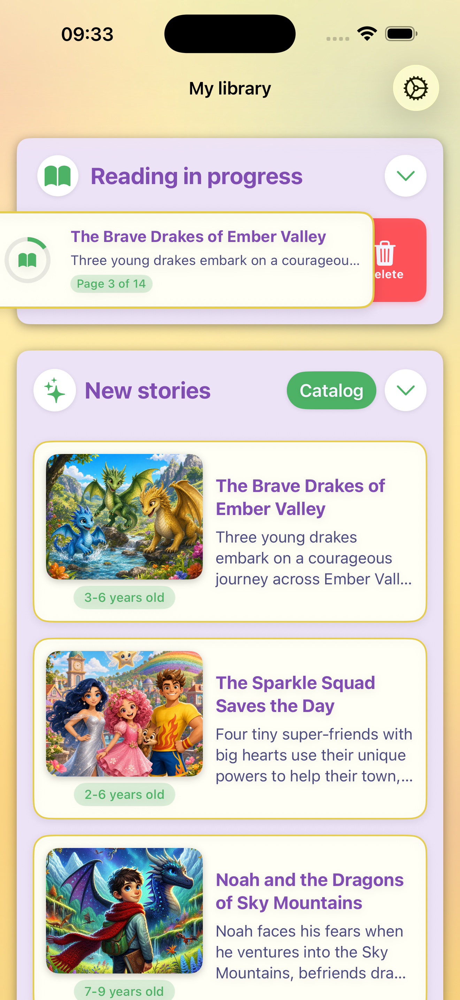{ width=27% }
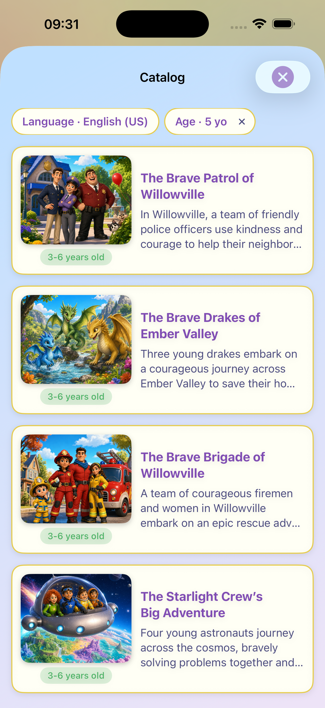{ width=27% }
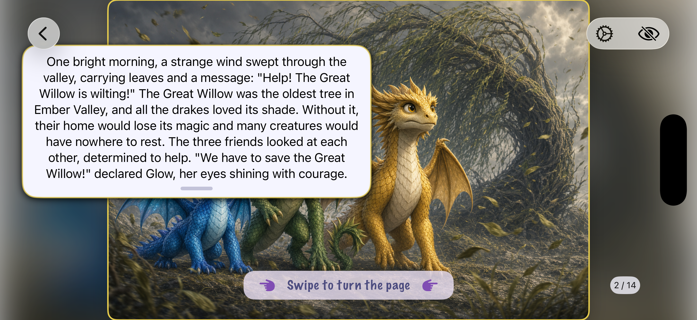{ width=42% }

#### Une architecture dictée par le temps de fabrication

Deux contraintes ont commandé la conception, et elles se contredisent. D'un côté, la lecture
doit fonctionner sans connexion : un enfant lit dans une voiture ou dans un lit, pas
nécessairement à portée de réseau. De l'autre, fabriquer une histoire prend plusieurs minutes : quelques instants pour le texte, mais plusieurs dizaines de secondes par illustration, et une
histoire compte une dizaine de pages.

**Deux interfaces.** L'application iPhone, écrite en SwiftUI, embarque sa propre base de
données locale : la bibliothèque de l'enfant et sa progression y sont stockées, ce qui rend la
lecture possible hors connexion. Et une interface d'administration web, qui est bien plus qu'un
outil de relecture : on y lance la génération d'une ou plusieurs histoires en faisant varier
âges, thèmes, styles et langues, on y suit l'avancement des traitements, et on y reprend une histoire, texte comme images, à la main ou en sollicitant à nouveau un modèle.

**Une API commune** aux deux interfaces, qui expose d'un côté les histoires publiées à
l'application mobile et de l'autre les fonctions d'administration.

**Une couche de services** sous cette API, qui regroupe les accès extérieurs : base de données,
fournisseur de génération de texte et d'images, prestataire d'abonnements. L'objectif est de
pouvoir changer de fournisseur sans réécrire la logique métier. Sur un marché où les modèles
et leurs tarifs changent tous les trimestres, ce n'est pas une précaution théorique.

**Des processus de fond.** Puisqu'une génération dure plusieurs minutes, l'API ne la réalise
pas : elle enregistre une tâche en base et rend immédiatement la main. Un processus séparé
récupère cette tâche et fabrique l'histoire, en s'appuyant sur la même couche de services. Il
met à jour au passage un pourcentage d'avancement et un message d'état, ce qui permet à
l'interface d'administration d'afficher une progression réelle plutôt qu'un sablier.

L'application iOS suit en interne le même principe de séparation : la vue ne parle qu'à un
magasin d'état, lequel s'adresse à des services qui seuls accèdent à la base locale.

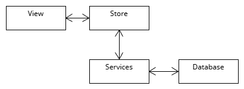{ width=45% }

#### Le vrai problème technique : des personnages qui restent les mêmes

C'est la difficulté qui m'a coûté le plus de temps sur ce projet, et elle mérite d'être
détaillée parce que la première solution évidente ne fonctionne pas.

Un modèle de génération d'images n'a aucune mémoire d'un appel à l'autre. Demander dix
illustrations pour les dix pages d'une histoire produit dix images correctes prises isolément,
mais dans lesquelles le héros change de visage, de couleur de cheveux et de vêtements à chaque
page. Pour un livre destiné à des enfants, le résultat est inexploitable. Enrichir la
description textuelle du personnage dans chaque requête ne suffit pas : deux descriptions
identiques donnent deux dessins différents.

La solution que j'ai mise en place introduit une étape intermédiaire. À partir du texte complet
de l'histoire, je fais d'abord produire une **fiche visuelle** décrivant tous les éléments récurrents : non seulement le héros, mais chaque personnage, véhicule ou objet qui réapparaît
au moins deux fois, avec ses couleurs et ses traits exacts. Je génère ensuite **une seule image
de référence** à partir de cette fiche, présentant ces éléments côte à côte sur fond neutre.
Enfin, la couverture et chaque page ne sont pas générées à partir de rien : elles sont produites
comme des **modifications de cette image de référence**, qui sert d'ancre pour les formes et
les couleurs.

Deux garde-fous complètent le dispositif. Des consignes de sécurité sont ajoutées **par le
code**, et non par le modèle, à chaque requête d'image : pas de texte ni de logo dans
l'illustration, pas de ressemblance avec des personnages protégés par le droit d'auteur. Le
fait qu'elles soient posées en dur garantit qu'elles s'appliquent quoi qu'ait produit l'étape
précédente. Et si une génération conditionnée par la référence échoue (limite de débit, erreur passagère, refus du filtre de sécurité), le traitement réessaie une fois puis se rabat sur une
génération simple : la page reçoit une illustration imparfaite plutôt qu'aucune illustration.

Cette solution impose une famille de modèles précise, celle qui accepte une image en entrée.
C'est une dépendance que j'ai documentée, parce qu'elle contraint les évolutions futures.

#### Contrôle des contenus et abonnements

Le risque principal de ce produit porte sur le contenu, pas sur les données : il faut garantir
qu'aucune histoire inadaptée n'arrive devant un enfant. **Aucune histoire n'est publiée
automatiquement.** Une histoire fraîchement générée est invisible pour l'application mobile
tant qu'un administrateur ne l'a pas relue et publiée explicitement, la visibilité publique
est conditionnée par un indicateur qui vaut « non » par défaut. Les garde-fous décrits plus
haut réduisent le nombre de cas à écarter, ils ne remplacent pas la relecture.

Pour les abonnements, j'ai choisi de ne pas manipuler moi-même les paiements et de passer par
un prestataire spécialisé. Ce choix nous prémunit contre les achats frauduleux et simplifiera
l'ouverture à d'autres plateformes. Techniquement, le prestataire notifie directement notre
serveur des achats, renouvellements, incidents de paiement et expirations ; le serveur en
déduit l'état du droit d'accès et le conserve. Deux détails d'implémentation méritent d'être
signalés parce qu'ils viennent de cas réels : chaque notification est enregistrée de manière
**idempotente**, de sorte qu'une notification renvoyée deux fois par le prestataire ne soit
pas traitée deux fois ; et une résiliation ne coupe pas l'accès immédiatement, mais à la fin
de la période déjà payée.

#### Mise en production et gestion des versions de données

La mise en ligne comporte deux livrables de nature différente, et c'est ce que le lecteur doit
retenir : **le serveur, que j'héberge, et l'application iPhone, que je n'héberge pas.**

Pour le serveur, j'ai décrit chaque composant dans des fichiers Docker, ce qui permet d'obtenir
un environnement identique sur mon poste et sur la machine distante. J'ai dimensionné puis
configuré cette machine, installé un serveur web en façade, enregistré le nom de domaine et
créé les enregistrements DNS associant domaines et sous-domaines à l'adresse de la machine,
puis importé, configuré et déployé le projet. J'ai rédigé la procédure de mise en production
ainsi que les contrôles à effectuer avant chaque mise à jour.

L'application iPhone suit un tout autre chemin : elle est soumise à l'examen d'Apple, puis
distribuée par l'App Store. J'ai préparé le dossier de publication (fiche descriptive, captures d'écran, déclaration des achats intégrés et des données collectées) et procédé au dépôt. Apple exige par ailleurs que l'éditeur mette en ligne une page d'assistance et une
politique de confidentialité accessibles publiquement : j'ai donc déployé, sur le même serveur,
un site de présentation qui porte ces deux pages. Une contrainte de plateforme se traduit ici
directement en composant à héberger.

C'est cette seconde cible qui m'a conduit au travail le plus intéressant du projet en matière
de déploiement. **Une fois l'application installée sur un téléphone, je n'ai plus aucun moyen
d'agir sur les données qu'elle y a enregistrées.** Si une mise à jour ajoute un champ ou change
la forme des histoires stockées localement, les installations existantes doivent pouvoir
s'adapter seules, sans que l'utilisateur ait à réinstaller ou à perdre sa bibliothèque.

J'ai donc conçu un mécanisme de versions des données locales. Un numéro de version unique est
conservé sur l'appareil. Au démarrage, l'application le compare à celui qu'attend la version
installée et, tant qu'il est inférieur, applique les migrations une par une jusqu'à
rattraper l'écart. Trois règles rendent le dispositif sûr : le numéro n'est incrémenté
qu'**après** le succès d'une étape, si bien qu'une migration interrompue est rejouée au
démarrage suivant plutôt qu'ignorée ; chaque étape est écrite pour pouvoir être rejouée sans
dommage ; et une migration déjà livrée n'est jamais supprimée, puisqu'un appareil resté en
arrière devra la traverser un jour.

Ce mécanisme couvre trois types d'évolutions : les changements de structure de la base locale,
le remplacement des histoires livrées avec l'application, et le remplissage de nouveaux champs
sur des données déjà présentes.

Plus largement, j'ai conçu cette première version comme un produit minimum mais évolutif. Les
données sont enregistrées de manière à accueillir de nouvelles fonctions sans reprendre le
modèle : l'identité de l'utilisateur, aujourd'hui rattachée à un identifiant anonyme fourni
par le prestataire d'abonnements, pourra être associée à un compte complet sans migration
douloureuse.

### 17.3 Ce que ces projets apportent au dossier

Storybook Kids reste le projet où j'ai pu dérouler la démarche complète, avec le temps de
formaliser chaque étape. Ces deux-là apportent ce qu'une formation ne peut pas simuler. Leur
architecture est contrainte par le réel : certaines opérations ne tiennent pas dans le temps
d'une requête HTTP, ce qui impose une file de tâches et des processus séparés, soit la même compétence qu'au chapitre 9, poussée par une nécessité plus forte. Leur sécurité a un enjeu
financier : le chiffrement au repos, la rotation de clé et la limitation de débit sont des
mesures que je n'aurais pas eu de raison d'implémenter sur un projet d'école. Leur mise en
production est réelle, sur un serveur loué, avec un nom de domaine et des utilisateurs qui
s'aperçoivent d'un arrêt de service. Et ils dépendent de plateformes tierces qui imposent leurs
règles, leur calendrier de dépréciation et leurs délais d'examen : composer avec un acteur qui
ne négocie pas est une compétence en soi.

---

\newpage

## 18. Conclusion et perspectives

### Bilan du projet

Storybook Kids a parcouru l'intégralité du cycle de vie d'une application, du cahier des
charges fonctionnel à la mise en service : conception d'interface, modélisation de la base
selon la démarche MERISE, conception technique en UML, architecture en couches,
développement, sécurisation, mise en conformité RGPD, tests automatisés et déploiement
reproductible.

L'application est fonctionnelle de bout en bout. On peut cloner le dépôt, configurer et
lancer une seule commande pour disposer d'une instance complète (serveur web, API, base de données, jeu d'histoires de démonstration) sur laquelle dérouler les parcours parent et administrateur.

Toutes les fonctionnalités du cahier des charges initial ont été livrées, y compris celles
classées en seconde priorité. Deux écarts subsistent par rapport aux intentions de départ, et
ils sont assumés : le déploiement est resté une procédure manuelle documentée plutôt qu'une
chaîne automatisée, et le modèle de la progression de lecture a été simplifié en cours de
développement.

### Compétences acquises

**Sur la conception.** J'ai appris à ne pas traiter la modélisation comme une formalité
administrative à produire avant de coder. Le passage par MERISE et par l'UML a réellement
servi : le dictionnaire des données a fait apparaître des attributs oubliés, les diagrammes
de séquence ont révélé des allers-retours réseau inutiles. J'ai appris en même temps qu'un
modèle se révise, et qu'un écart documenté vaut mieux qu'un diagramme retouché après coup
pour donner l'illusion d'une conception parfaite.

**Sur la sécurité.** Je suis passé d'une liste de mesures à appliquer à une lecture par le
risque. Comprendre _pourquoi_ le CSRF ne s'applique pas à une API sans session, et quel
risque ce choix fait apparaître en contrepartie.

**Sur le déploiement.** J'ai mesuré l'écart entre « ça marche chez moi » et « ça démarre
ailleurs ». La containerisation, la gestion des secrets hors du dépôt et l'initialisation
automatique d'une instance vierge sont les compétences que je réutilise le plus directement
dans mon travail en entreprise.

**Sur la conduite d'un projet.** Six jalons mensuels tenus seul, avec une réserve de temps
prévue pour les imprévus, m'ont appris à découper un travail en tâches de quelques heures.

### Perspectives d'évolution

Si le projet devait être poursuivi, quatre chantiers viendraient dans cet ordre.

**Avant toute exposition publique** : la limitation des tentatives de connexion et la
journalisation des échecs d'authentification, identifiées au chapitre 15 comme le point
faible principal.

**Pour l'usage** : un verrouillage par code pendant la lecture, afin qu'un enfant laissé seul
avec la tablette ne puisse pas sortir de l'histoire en cours, et un écran de modération des
comptes accessible depuis l'administration.

---

\newpage

## 19. Remerciements

Je remercie **David Abitbol**, fondateur de LICENCESINFO, de m'avoir confié seul le
développement de deux produits destinés à des utilisateurs réels. La confiance accordée à un
alternant sur des projets de cette portée n'allait pas de soi, et les échanges réguliers sur
le besoin et sur le marché m'ont appris à défendre un choix technique autrement que par des
arguments techniques.

Je remercie **Hugo Liegeard**, qui a encadré le projet fil rouge, pour son accompagnement sur
les livrables et pour le suivi apporté tout au long des six jalons.

Je remercie **Carole Boudy**, coordinatrice pédagogique, et **Nathalie Torres**, directrice
du campus IPSSI de Bordeaux, pour leur disponibilité et pour l'organisation de l'année.

Je remercie enfin l'ensemble des intervenants de l'IPSSI Bordeaux, dont les enseignements
constituent le socle sur lequel ce projet a été construit.

---

\newpage

## Annexes

### A. Dépôt et livrables du projet principal

| Élément              | Référence                                   |
| -------------------- | ------------------------------------------- |
| Dépôt Git            | <https://github.com/FortAxel/ipssi_project> |
| Version livrée       | Tag `v1.0.0`, branche `main`                |
| Intégration continue | `.github/workflows/ci.yml`                  |
| Conventions de code  | `docs/code-standard.md`                     |

### B. Livrables des six jalons

L'ensemble des documents produits pendant la formation reste consultable dans le dépôt, sous
`docs/`.

+--------+--------------------------------------+----------------------------------------------+
| Jalon  | Livrable                             | Emplacement dans `docs/`                     |
+========+======================================+==============================================+
| 1      | Cahier des charges fonctionnel       | `jalon-1-cdcf/`                              |
|        | (français et anglais)                |                                              |
+--------+--------------------------------------+----------------------------------------------+
| 2      | Méthodologie et organisation         | `jalon-2-methodologie/`                      |
+--------+--------------------------------------+----------------------------------------------+
| 2      | Conception UI/UX                     | `jalon-2-conception-ui-ux/`                  |
+--------+--------------------------------------+----------------------------------------------+
| 3      | Modélisation de la base de données   | `jalon-3-conception-bdd/`                    |
+--------+--------------------------------------+----------------------------------------------+
| 4      | Conception technique et diagrammes   | `jalon-4-conception-technique/`              |
|        | UML                                  |                                              |
+--------+--------------------------------------+----------------------------------------------+
| 5      | Version bêta                         | `jalon-5-beta/`                              |
+--------+--------------------------------------+----------------------------------------------+
| 6      | Déploiement et rapport final         | `jalon-6-deploiement-production/`            |
+--------+--------------------------------------+----------------------------------------------+

### C. Code source significatif

Les trois extraits commentés au chapitre 12 sont issus des fichiers suivants, consultables
dans leur intégralité dans le dépôt.

- Règle métier de la progression :\
  `backend/src/Entity/ReadingProgress.php`
- Isolation des données par compte :\
  `backend/src/Controller/ReadingProgressController.php`
- Point d'entrée des appels réseau :\
  `frontend/src/services/apiClient.ts`
- Accès aux données de progression :\
  `backend/src/Repository/ReadingProgressRepository.php`
- Configuration de sécurité :\
  `backend/config/packages/security.yaml`

### D. Guide utilisateur et scénario de démonstration

Parcours proposé sur une instance installée selon la procédure du chapitre 14, en une dizaine
de minutes. Deux comptes sont chargés par les données de démonstration.

| Rôle           | Adresse             | Mot de passe |
| -------------- | ------------------- | ------------ |
| Parent         | `parent@demo.local` | `parent123`  |
| Administrateur | `admin@demo.local`  | `admin123`   |

**Parcours parent.** Connexion, puis catalogue avec la recherche et les filtres. Ouverture
d'une histoire et lecture page à page, en utilisant le bouton **Écouter** pour la synthèse
vocale. Fermeture puis réouverture de l'histoire, qui doit reprendre à la dernière page lue.
Mise en favori et vérification dans la page **Favoris**. Page **Profil** pour consulter
l'historique de lecture, modifier l'adresse ou le mot de passe et supprimer le compte. Enfin
la page `/privacy` pour la politique de confidentialité.

**Parcours administrateur** : création d'une histoire publiée et de ses pages, puis
vérification de son apparition dans le catalogue côté parent.

L'application est accessible sur `http://127.0.0.1:8080` après `docker compose up -d --build`.

\besoindeplace{470pt}

### E. Maquettes de conception (jalon 2)

**Plan de navigation.** La connexion est le point d'entrée obligatoire, puis le catalogue
sert de pivot vers tous les autres écrans. L'écran « Détail d'une histoire » qui figure ici
n'a finalement pas été développé, pour les raisons exposées au chapitre 6.

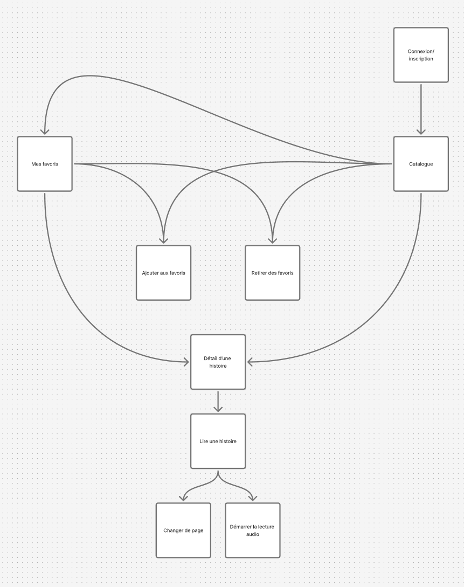{ width=68% }

\besoindeplace{400pt}

**Zoning** de la trame en trois zones, sur ordinateur et sur mobile.

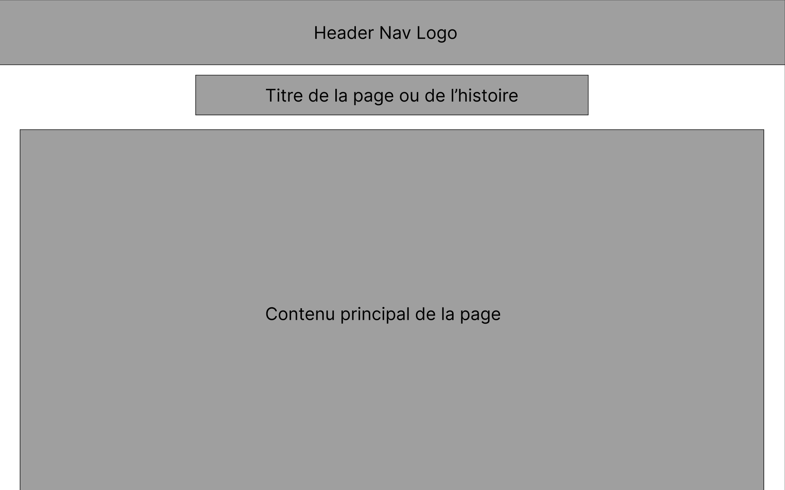{ width=55% }
{ width=25% }

\besoindeplace{400pt}

**Wireframes du catalogue**

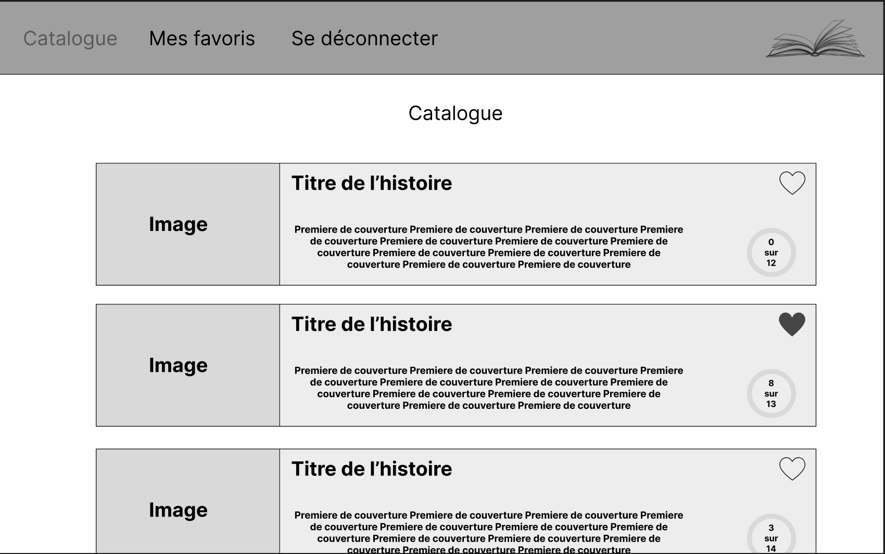{ width=55% }
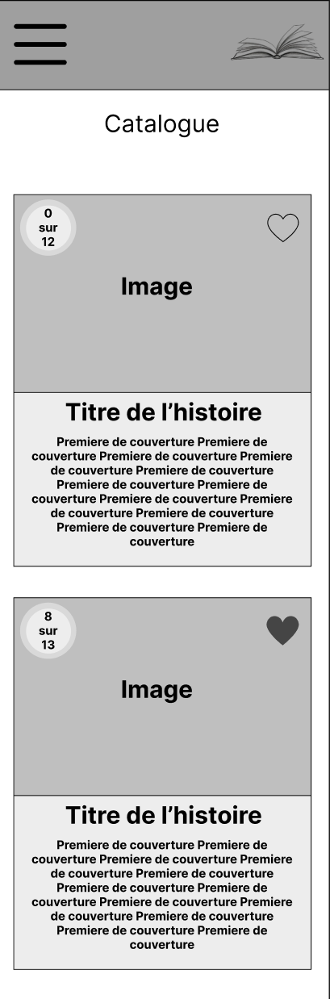{ width=25% }

\besoindeplace{400pt}

**Wireframes de la lecture**

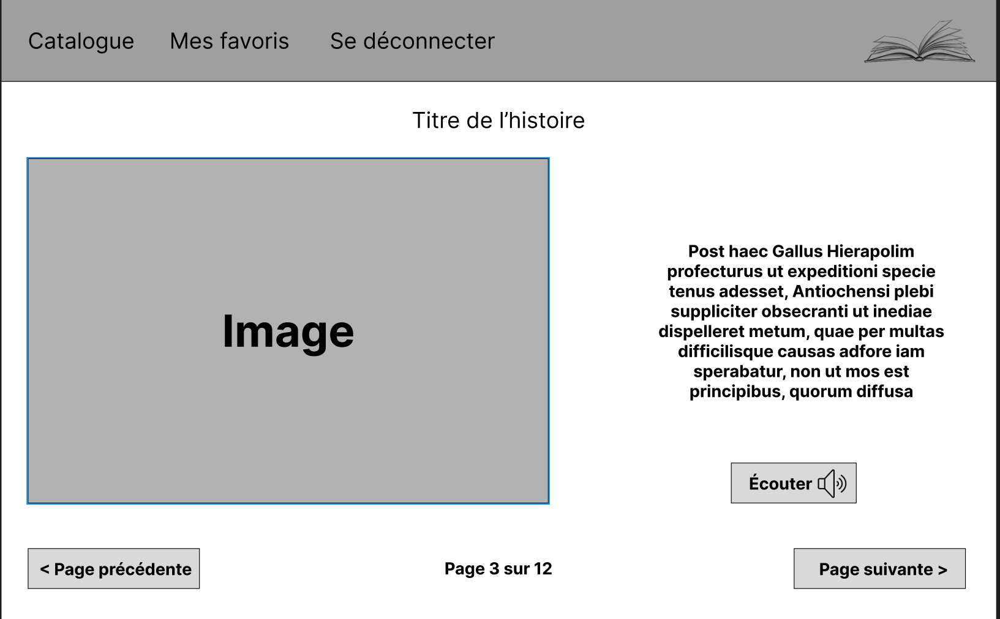{ width=55% }
{ width=25% }

\besoindeplace{200pt}

**Bibliothèque de composants**

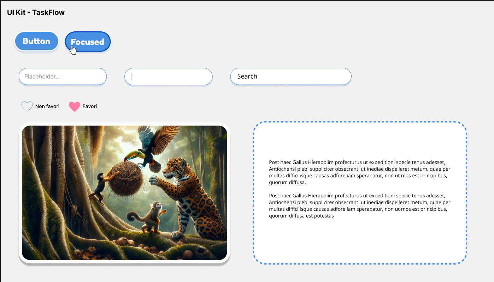{ width=52% }

### F. Suites de tests

| Suite           | Emplacement                 | Outil                 |
| --------------- | --------------------------- | --------------------- |
| Tests unitaires | `backend/tests/Entity/`     | PHPUnit               |
| Tests d'API     | `backend/tests/Controller/` | PHPUnit / WebTestCase |
| Tests front-end | `frontend/src/**/*.test.ts` | Vitest                |

### G. Infrastructure de déploiement

| Élément                      | Emplacement                |
| ---------------------------- | -------------------------- |
| Orchestration des conteneurs | `docker-compose.yml`       |
| Configuration du serveur web | `docker/nginx/`            |
| Image applicative PHP        | `docker/php/`              |
| Script d'initialisation      | `docker/init/bootstrap.sh` |
| Variables d'environnement    | `.env.example`             |

### H. Sources de veille

Deux exemples de ce qui alimente concrètement la veille décrite au chapitre 15.

**Le journal des modifications développeur de Shopify.** L'annonce du 20 mai 2026 sur les
jetons d'accès à durée limitée, citée au chapitre 15. Les étiquettes « Breaking API Change »
et « Action required », à droite, signalent qu'une intervention est nécessaire ; la section
« Why we're making this change » expose le motif de sécurité.

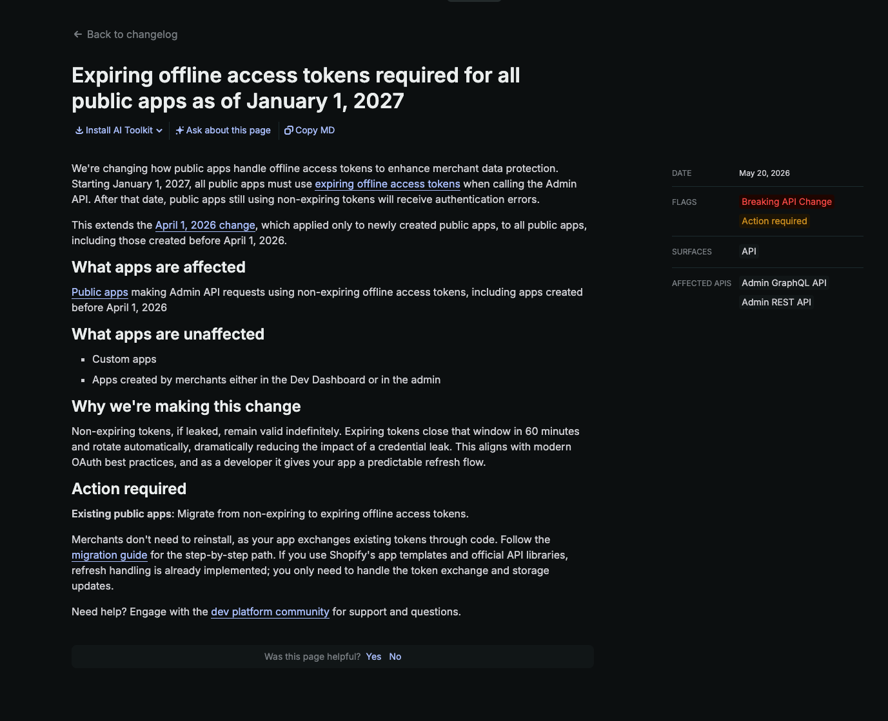{ width=88% }

**Un courriel adressé aux développeurs concernés.** Shopify ne se contente pas de publier :
il notifie les éditeurs dont les applications sont touchées, en indiquant la version
d'interface en cause et l'échéance. Celui-ci visait une autre application de l'entreprise,
et non HyperSearchX ; il a néanmoins déclenché une vérification de l'ensemble de nos
applications, décrite au chapitre 15.

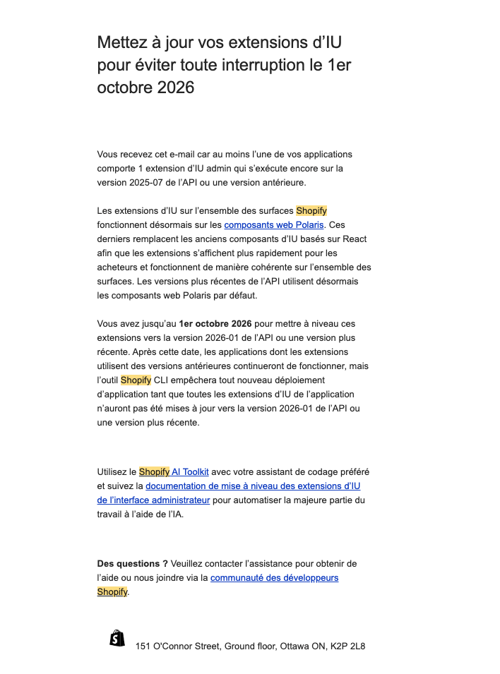{ width=50% }
