**Dépôt Git** : https://github.com/FortAxel/ipssi_project — **Tag release** : `v1.0.0` (branche `main`).

---

## 1. Cahier des charges

### Contexte métier

Le projet s'inscrit dans le domaine des applications numériques destinées au jeune public, plus précisément dans le secteur de la lecture et du divertissement éducatif pour enfants. La lecture d'histoires joue un rôle fondamental dans le développement de l'imaginaire, du langage et de la concentration chez les enfants. Toutefois, les supports numériques existants sont souvent peu adaptés à un usage encadré, trop complexes ou insuffisamment structurés pour répondre aux besoins spécifiques de ce public.

L'application proposée vise à répondre à ce constat en offrant une plateforme dédiée à la lecture d'histoires pour enfants, reposant sur des contenus narratifs illustrés. Chaque histoire est structurée en pages successives, chaque page correspondant à un paragraphe court accompagné d'une illustration. Cette structuration permet une lecture dynamique, adaptée aux capacités d'attention des enfants.

L'application est conçue pour accompagner l'enfant dans son évolution et son autonomie progressive face à la lecture. **Trois modes d'utilisation complémentaires** sont prévus :

1. **Pour les plus jeunes** — Les parents lisent les histoires à l'enfant ; l'application sert de support visuel (texte et illustrations).
2. **En phase d'apprentissage** — L'enfant peut s'appuyer sur la synthèse vocale pour écouter les histoires de façon plus autonome.
3. **Pour les lecteurs confirmés** — L'enfant lit seul les histoires ; l'application sert d'outil d'entraînement à la lecture.

\newpage

| Profil                          | Rôle                                                                    | Usage principal                                                                 |
| ------------------------------- | ----------------------------------------------------------------------- | ------------------------------------------------------------------------------- |
| **Parent (compte utilisateur)** | Crée le compte, s'authentifie, configure l'usage (favoris, historique). | Utilisateur principal au sens compte et données personnelles (RGPD).            |
| **Enfant**                      | Bénéficiaire des histoires ; pas de compte obligatoire.                 | Usage principal des écrans de lecture (navigation, audio, lecture silencieuse). |
| **Administrateur**              | Gestion et modération des contenus.                                     | Interface d'administration réservée.                                            |

Ce projet fil rouge est réalisé dans le cadre du titre professionnel **Concepteur Développeur d'Applications (CDA)**. Le commanditaire pédagogique est l'organisme de formation ; le cahier des charges correspond à un besoin métier fictif à visée pédagogique.

### Objectifs du projet

L'objectif principal est de concevoir et développer une application web permettant la consultation d'histoires pour enfants dans un cadre sécurisé et structuré.

Les objectifs fonctionnels principaux :

- Compte utilisateur sécurisé (inscription, authentification, profil).
- Catalogue d'histoires illustrées, structurées en pages.
- Lecture page par page (texte + illustration, navigation, progression).
- Modes de consultation adaptés au niveau de l'enfant (parent, audio, lecture seule).
- Favoris et historique de lecture.
- Interface d'administration pour la gestion des contenus.
- Synthèse vocale via un service externe.

\newpage

### Périmètre fonctionnel

| ID  | Thème                           | Priorité |
| --- | ------------------------------- | -------- |
| F1  | Gestion des utilisateurs        | **P1**   |
| F2  | Catalogue d'histoires           | **P1**   |
| F3  | Lecture page par page           | **P1**   |
| F4  | Favoris et suivi de progression | **P2**   |
| F5  | Interface d'administration      | **P1**   |
| F6  | Lecture audio (TTS)             | **P2**   |

**F1** — Création de compte, authentification, déconnexion, gestion du profil, rôles USER/ADMIN.

**F2** — Liste des histoires, détail (titre, description, couverture), filtrage et recherche selon des critères simples.

**F3** — Lecture page par page, texte + illustration, navigation, indicateur de progression.

**F4** — Favoris (toggle), reprise au dernier point d'arrêt, historique des lectures.

**F5** — CRUD histoires et pages, cohérence et qualité des contenus.

**F6** — Lecture audio via service de synthèse vocale externe (page ou histoire).

**Hors périmètre** : génération automatique d'histoires par intelligence artificielle.

\newpage

### Exigences techniques

Architecture **API REST** Symfony + **SPA React/TypeScript**, MySQL, Doctrine, Docker, Git, GitHub Actions, tests automatisés, bonnes pratiques OWASP.

**Choix d'architecture retenu** : séparation front/back pour une interface réactive (SPA), transitions fluides en lecture, évolutivité vers une app mobile consommant la même API.

| Composant            | Technologie retenue                           |
| -------------------- | --------------------------------------------- |
| Back-end             | Symfony 7.2, PHP 8.4                          |
| Front-end            | React 19, TypeScript, Vite                    |
| Base de données      | MySQL 8, Doctrine ORM                         |
| Conteneurisation     | Docker Compose                                |
| CI                   | GitHub Actions                                |
| TTS                  | Microsoft Edge TTS (+ secours Web Speech API) |
| Tests front          | Vitest                                        |
| Authentification API | JWT stateless (Lexik)                         |

### Contraintes et enjeux

**Contraintes temporelles** — Projet sur six mois (janvier–juin 2026), six jalons mensuels, réalisé en alternance avec priorisation MVP (P1 puis P2). Vingt pour cent du temps mensuel réservé aux imprévus.

**Contraintes réglementaires (RGPD)** — Transparence, consultation/modification/suppression des données, mots de passe hachés, politique de confidentialité accessible, pas de collecte de données enfant sans cadre parental.

**Risques et atténuation** — Priorisation MVP, tests réguliers, API TTS documentée, périmètre maîtrisé.

\newpage

### Réalisation par rapport au CDCF initial

| Critère CDCF           | Statut final | Remarque                                     |
| ---------------------- | ------------ | -------------------------------------------- |
| F1–F3, F5 (P1)         | Livré        | MVP + enrichissements profil (jalon 6)       |
| F4, F6 (P2)            | Livré        | Favoris, historique, Edge TTS                |
| Recherche / filtres F2 | Livré        | UI + API                                     |
| RGPD (§5 CDCF)         | Livré        | Politique, rectification, suppression compte |
| TTS externe            | Livré        | Edge TTS — API externe gratuite              |
| Tests front            | Livré        | Vitest                                       |
| Docker déployable      | Livré        | Stack unifiée jalon 6                        |
| CI automatisée         | Livré        | GitHub Actions (lint, tests, build)          |
| Déploiement continu    | Manuel       | Procédure `docker compose` documentée        |

### Critères de succès

**Fonctionnels** — Fonctionnalités P1 et P2 implémentées ; modes lecture parent, enfant et audio opérationnels ; interface intuitive pour parents et enfants.

**Techniques** — Application stable, OWASP de base, containerisée, CI fonctionnelle, responsive desktop/mobile.

**Qualité** — Code structuré (`docs/code-standard.md`), documentation technique à jour.

\newpage

### Évolution du périmètre (bêta → livraison finale)

Au **jalon 5 (mai 2026)**, l’application était en version bêta : MVP (F1–F3, F5), TTS Edge, favoris et progression livrés ; profil en consultation seule, pas de RGPD, recherche/filtres API sans UI, tests API limités au health check.

Au **jalon 6 (juin 2026)**, les compléments suivants ont été intégrés :

| Domaine      | Ajout final                                       |
| ------------ | ------------------------------------------------- |
| F1 Profil    | `PATCH /api/me`, `DELETE /api/me`, modales profil |
| F2 Catalogue | Recherche textuelle et filtres catégorie (UI)     |
| RGPD         | Page `/privacy`                                   |
| Tests API    | Auth, compte, favoris, progression                |
| Docker       | Stack unifiée SPA + API + MySQL + phpMyAdmin      |

| ID    | Statut final |
| ----- | ------------ |
| F1–F6 | Livré        |
| RGPD  | Livré        |

Cinq histoires en français sont chargées via fixtures Doctrine au premier démarrage Docker si la base est vide.

---

\newpage

## 2. Méthodologie et organisation

### Méthode de gestion de projet

J'ai choisi une **approche Kanban simplifiée** pour ce projet solo.

**Justification** :

- **Flexibilité** : Pas besoin de sprints rigides en travaillant seul
- **Adaptabilité** : Ajustement continu des priorités
- **Visibilité** : Vue claire de l'avancement
- **Cohérence** : Les 6 jalons sont des points de validation naturels

**Organisation** : tâches de 2–4 heures, max 3 tâches simultanées, revue hebdomadaire (dimanche), auto-revue du code avant merge.

Conformément aux bonnes pratiques, le code source, les commits Git et les issues sont en **anglais** ; les documents projet et l'interface utilisateur sont en **français**.

### Jalons et calendrier prévisionnel

| Jalon | Mois | Date  | Livrable                |
| ----- | ---- | ----- | ----------------------- |
| 1     | Jan  | 31/01 | CDCF                    |
| 2     | Fév  | 28/02 | Méthodologie + UI/UX    |
| 3     | Mar  | 31/03 | Modélisation BDD        |
| 4     | Avr  | 30/04 | Conception + début dev  |
| 5     | Mai  | 30/05 | Bêta + tests + sécurité |
| 6     | Juin | 30/06 | Version finale          |

\newpage

**Planning détaillé (extrait)** :

- **Février** : setup Git, planification CI ; conception UI/UX complète
- **Mars** : dictionnaire, MCD, MLD, MPD, scripts SQL
- **Avril** : UML, architecture, dev backend (Symfony, Docker, auth, CRUD)
- **Mai** : API (lecture, favoris, TTS), frontend React, tests, sécurité, CI
- **Juin** : finalisations, déploiement Docker, documentation, présentation

### Planning réel vs prévisionnel

Les jalons 1 à 4 ont suivi le calendrier prévisionnel (conception puis démarrage du développement backend en avril). Le jalon 5 a livré la bêta (front React, API, TTS, favoris). Le jalon 6 a concentré le durcissement RGPD, l’extension des tests API, la stack Docker unifiée (SPA buildée dans nginx) et la documentation de déploiement.

| Phase               | Prévision (jalon 2)                     | Réalisation                                                                                                           |
| ------------------- | --------------------------------------- | --------------------------------------------------------------------------------------------------------------------- |
| CI GitHub Actions   | Avril–mai (lint, PHPUnit, build Docker) | Pipeline opérationnelle en mai — lint PHP, PHPUnit (SQLite), ESLint, Vitest, build Vite ; **sans** build Docker en CI |
| Docker opérationnel | Mi-avril                                | Environnement dev dès avril ; **stack prod unifiée** (SPA + API) finalisée en juin                                    |
| Déploiement         | Automatisation juin                     | Procédure **manuelle** reproductible (`docker compose up -d --build`)                                                 |
| RGPD / profil       | Non planifié en détail au jalon 2       | Livré en juin (`/privacy`, `PATCH/DELETE /api/me`)                                                                    |

La réserve de 20 % du temps mensuel a permis d’absorber ces ajustements sans décaler la livraison finale.

### Retour d'expérience sur la méthode de projet

L’approche **Kanban simplifiée** s’est avérée adaptée au projet solo : les six jalons mensuels ont servi de points de validation naturels, le board GitHub Projects a maintenu la visibilité sur les priorités, et la limite de trois tâches simultanées a évité la dispersion. La revue hebdomadaire (dimanche) a permis d’ajuster le planning sans formalisme excessif. En solo, l’absence de pull requests a été compensée par une auto-revue systématique avant chaque merge.

### Outils de suivi

**GitHub Projects (Kanban)** — six colonnes :

| Colonne       | Signification         |
| ------------- | --------------------- |
| Backlog       | Tâches en attente     |
| To Do         | À faire cette semaine |
| In Progress   | En cours (max 3)      |
| Done          | Terminé               |
| Bugs          | Anomalies à corriger  |
| Documentation | Rédaction             |

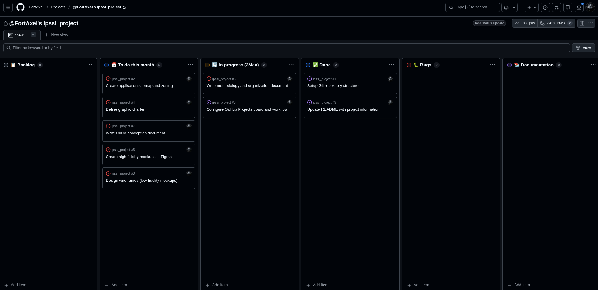

\newpage

Chaque issue GitHub contient une description structurée, des labels, et une assignation au milestone correspondant :

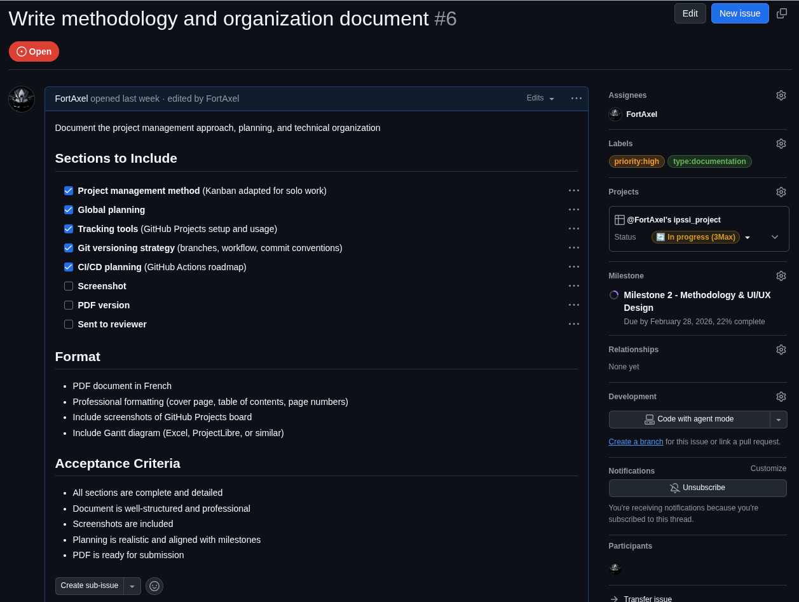

**Milestones** : un milestone GitHub par jalon (1 à 6).

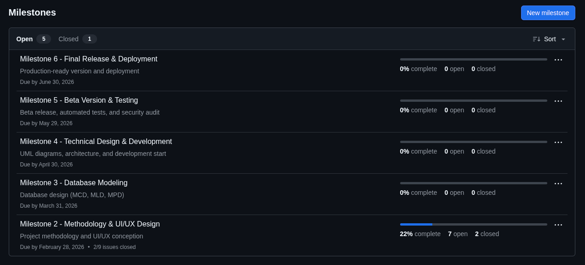

Mise à jour quotidienne du board, revue hebdomadaire (dimanche), bilan mensuel par jalon.

### Gestion du code source (Git)

- **Plateforme** : GitHub — https://github.com/FortAxel/ipssi_project
- **Branches** : `main` (stable), `develop` (intégration)
- **Commits** : format `<type>: <description>` en anglais (`feat`, `fix`, `docs`, `test`, `refactor`)
- **Revue** : auto-revue systématique avant merge (projet solo, pas de pull request obligatoire)

**Workflow type** :

```bash
git checkout develop
git checkout -b feature/story-catalog
# développement + commits
git checkout develop && git merge feature/story-catalog
git push origin develop
```

### Intégration continue et déploiement

**Intégration continue (CI)** — **GitHub Actions** (`.github/workflows/ci.yml`).

À chaque push ou pull request sur `develop`, `main` ou `dev/beta_usable` :

1. **Backend** — PHP 8.4, PHP-CS-Fixer, PHPUnit (SQLite, clés JWT test)
2. **Frontend** — Node 20, ESLint, Vitest, build production Vite

La CI valide le code et les tests automatisés ; le **build et le lancement Docker** restent une étape manuelle (`docker compose up -d --build`), reproductible sur poste ou serveur.

**Déploiement** : procédure **manuelle** depuis le dépôt Git et les fichiers Docker du projet — cloner, configurer `.env`, lancer `docker compose up -d --build`, vérifier `/api/health`.

**Stratégie de release** : tag Git `v1.0.0` sur `main` après validation CI et merge depuis `develop`.

---

\newpage

## 3. Conception UI/UX

### Sitemap et structure

L'application est organisée autour des écrans principaux suivants :

- Page d'accueil (Catalogue)
- Page de lecture d'une histoire
- Page des favoris
- Page de connexion / inscription
- Page profil utilisateur
- Interface d'administration

{ width=100% }

**À noter :** sitemap de conception (jalon 2) — il prévoit un écran « Détail d'une histoire » entre le catalogue et la lecture.

**Écart implémentation finale** : l'écran intermédiaire de détail n'a pas été développé. Depuis le catalogue (ou la page Favoris), **un clic sur une carte ouvre directement la lecture** de l'histoire (reprise à la dernière page mémorisée, ou page 1). Le titre, la couverture et la progression restent visibles sur la carte ; ce choix supprime une étape pour un public jeune.

```
Conception jalon 2              Application finale
──────────────────              ──────────────────
Catalogue                       Catalogue
    │                               │
    ▼                               ▼  (clic carte)
Détail histoire                 Lecture
    │
    ▼
Lecture
```

**Parcours principal (final)** : Connexion → Catalogue → Lecture page par page.

**Depuis le catalogue** : favoris, profil, déconnexion, ajout/retrait favori.

**Depuis la lecture** : retour catalogue, favoris (menu), navigation, lecture audio.

La page **Favoris** reprend la même grille que le catalogue : seules les histoires marquées favori y figurent.

### Zoning des écrans principaux

Structure en trois zones : **Header** (logo, navigation), **Titre**, **Contenu principal**.

Ce zoning permet une séparation claire entre contenu visuel et contenu textuel, une normalisation de l'affichage entre les pages et une identification rapide de l'écran courant (catalogue vs favoris).

### Sur desktop

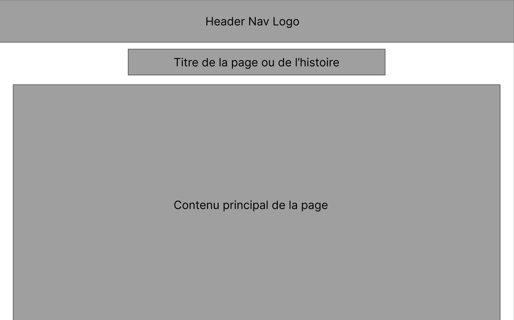

### Sur mobile

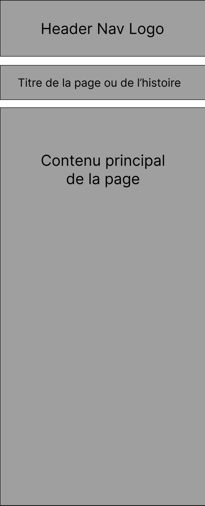

\newpage

### Wireframes (maquettes basse fidélité)

Objectifs : hiérarchie des informations, positionnement des éléments interactifs, validation de la structure.

**Catalogue desktop** — carte large cliquable, favori en haut à droite, progression visible (anneau), séparation image/texte.


\newpage

**Catalogue mobile** — même structure, grille adaptée au petit écran.

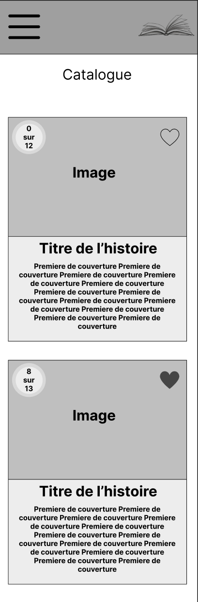

\newpage

**Lecture desktop** — deux colonnes (image à gauche, texte à droite), bouton « Écouter » centré sous le texte, navigation bas de page (Page X sur Y).


\newpage

**Lecture mobile** — colonne unique, menu hamburger, navigation compacte.

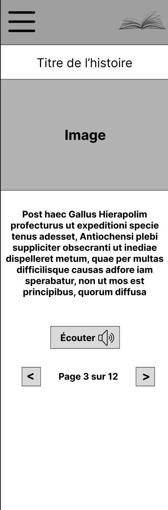

\newpage

### Charte graphique


| Usage                   | Couleur        | Code    |
| ----------------------- | -------------- | ------- |
| Primary                 | Bleu principal | #4A90E2 |
| Secondary               | Jaune doux     | #F5D76E |
| Success (lecture audio) | Vert           | #7ED957 |
| Favoris                 | Rose           | #FF7BA5 |
| Blanc neutre            | Blanc          | #FFFFFF |
| Gris clair              | Light Grey     | #F2F2F2 |
| Gris foncé              | Dark Grey      | #333333 |

**Typographie** — Titres et boutons : Fredoka One 28px ; texte courant : Open Sans 16px ; sous-titres : Open Sans 18px.

**Composants** — Border-radius 32px, ombres légères, effets hover/pressed, états normal/hover/actif/focus.


L'ensemble crée une ambiance **ludique, rassurante, douce et adaptée au jeune public**.

### Maquettes haute fidélité


Le catalogue et les favoris reprennent la structure des wireframes (§3) et la charte graphique ; le rendu final applique cette charte au wireframe (grille de cartes, couverture, progression, cœur).

**Responsivité** — passage desktop paysage → mobile vertical ; zones tactiles larges ; sur tablette paysage, version desktop adaptée.

### Considérations UX

Les **trois modes de lecture** du CDCF (parent, audio, enfant seul) sont supportés par une **même interface de page** : bouton TTS, zones tactiles larges, hiérarchie visuelle adaptée.

Principes appliqués :

- Peu d'actions simultanées à l'écran, boutons larges et explicites
- Couleurs douces, formes arrondies, espacements généreux
- Contraste suffisant, structure claire et répétitive
- Feedback : animation favori, changement visuel bouton audio, conservation automatique de la progression

Parcours type : Connexion → Catalogue → Clic sur une histoire → Lecture → Reprise automatique au dernier point.

### Captures d'écran — application finale

Les captures ci-dessous montrent le rendu réel de l'application. Les compléments jalon 6 (recherche, filtres, profil éditable, page `/privacy`) reprennent la charte du jalon 2.

### Catalogue desktop

Barre de recherche textuelle, filtres par catégorie, cartes histoires avec anneau de progression.

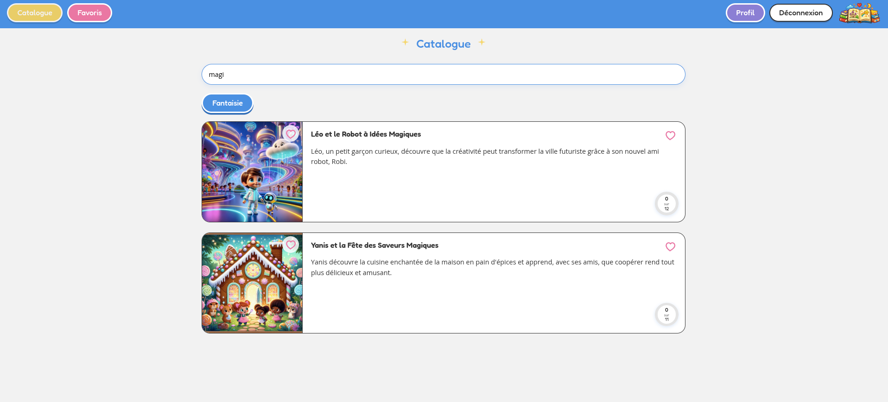

\newpage

### Lecture desktop

Illustration et texte, navigation page par page, bouton **Écouter** (TTS Edge), indicateur X/Y.

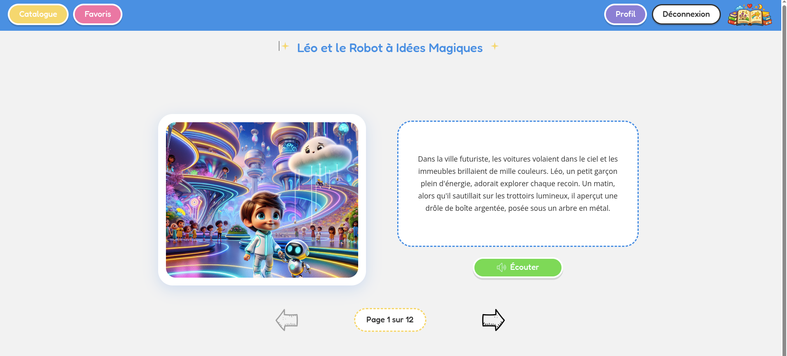

### Profil utilisateur

Onglets profil et historique, accès aux modales de modification e-mail et mot de passe.

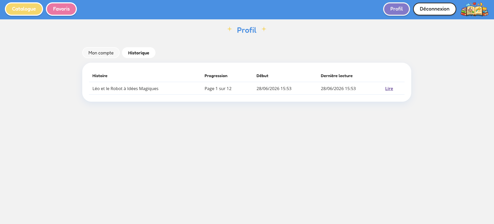

\newpage

### Politique de confidentialité

Page `/privacy` — politique RGPD accessible depuis le menu.

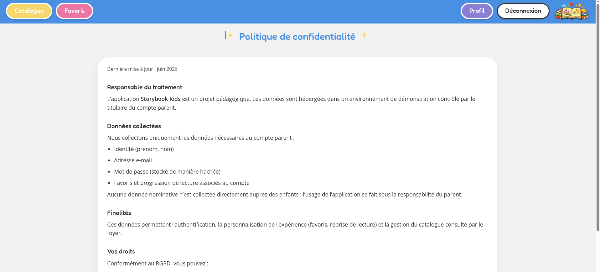

\newpage

### Catalogue mobile

Vue responsive — grille catalogue et navigation adaptée au petit écran.

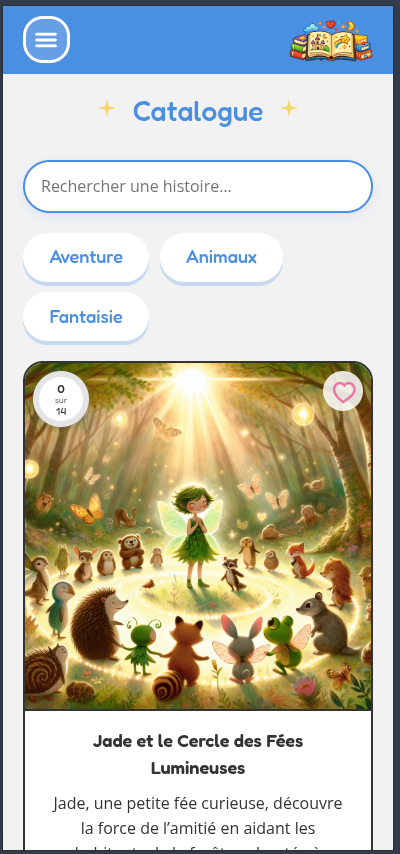

---

\newpage

## 4. Modélisation de la base de données

### Démarche MERISE

Modélisation en trois niveaux : **MCD**, **MLD**, **MPD**, cohérente avec le CDCF. SGBD cible : **MySQL** (InnoDB).

Entités principales : `User`, `Story`, `Page`, `Favorite`, `ReadingProgress`.

### Dictionnaire des données

**User** — parent : `id`, `first_name`, `last_name`, `email` (unique), `password` (haché), `roles` (JSON), `created_at`, `updated_at`.

**Story** — `title`, `description`, `cover_image`, `status` (DRAFT/PUBLISHED/ARCHIVED), `category`, `age_range`, timestamps.

**Page** — `page_number`, `content`, `illustration`, `story_id`.

**Favorite** — association N,N `(user_id, story_id)`, `created_at`.

**ReadingProgress** — progression par `(user_id, story_id)` : reprise, historique, complétion.

### MCD et MLD

{ width=100% }

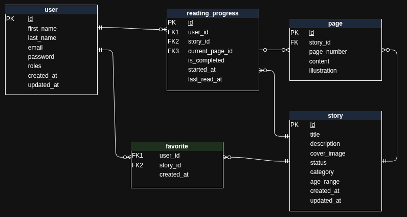

Le MLD formalise les tables `user`, `story`, `page`, `favorite`, `reading_progress` avec contraintes d'unicité et clés étrangères.

**Notes sur les transformations** :

- **Favorite** — association N,N matérialisée par table de liaison ; clé primaire composée `(user_id, story_id)`.
- **ReadingProgress** — unicité composite `(user_id, story_id)` ; clé primaire technique `id` conservée pour l'ORM.
- **Catégorie** — ENUM dans `story` (liste fermée, intégrité côté BDD).

\newpage

### Adéquation aux besoins fonctionnels

| CDCF | Besoin                       | Couverture                                            |
| ---- | ---------------------------- | ----------------------------------------------------- |
| F1   | Compte, auth, rôles          | Table `user`                                          |
| F2   | Catalogue, filtres           | Table `story` + jointure `page`                       |
| F3   | Lecture page par page        | Table `page`                                          |
| F4   | Favoris, reprise, historique | Tables `favorite`, `reading_progress`                 |
| F5   | Admin CRUD                   | `story.status`, pages rattachées                      |
| F6   | TTS                          | Contenu source `page.content` ; pas de stockage audio |

Le modèle respecte la **3NF** ; la catégorie en ENUM constitue une légère dénormalisation volontaire (liste stable).

### MPD final (version réelle)

Le schéma Doctrine reprend le MPD du jalon 3 avec **un ajustement** sur la progression de lecture :

| Élément            | Conception jalon 3              | Implémentation finale       |
| ------------------ | ------------------------------- | --------------------------- |
| Reprise de lecture | `current_page_id` (FK → `page`) | `last_page_number` (entier) |

**Justification** : simplification côté API et front (numéro de page séquentiel) ; migration Doctrine `Version20260522140000`. Les autres tables restent alignées sur le modèle jalon 3.

Attributs effectifs de `reading_progress` : `last_page_number`, `started_at`, `last_read_at`, `is_completed`.

Pas de mise à jour du diagramme MCD/MLD d'origine : l'écart est documenté ici ; l'impact fonctionnel (reprise, historique) est identique.

**Choix techniques conservés** : `ON DELETE CASCADE` sur les dépendances fortes ; index sur `story.status` et `story.category` ; `roles` en JSON (convention Symfony).

---

\newpage

## 5. Conception de l'application (UML)

### Cas d'utilisation

Les cas d'utilisation couvrent l'ensemble des exigences fonctionnelles du CDCF.

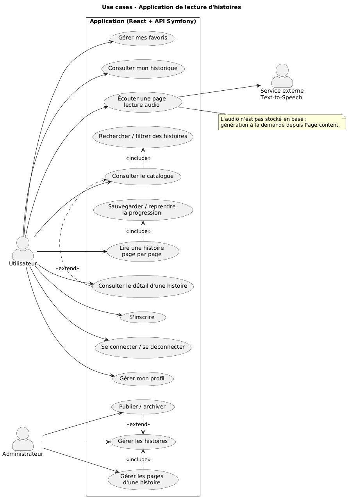{ width=85% }

**Acteurs** :

- **Utilisateur** : catalogue, lecture, favoris, progression, audio
- **Administrateur** : gestion des contenus (histoires, pages, publication)
- **Service externe TTS** : synthèse vocale appelée par le back-end

### Diagrammes de séquence

**Lecture + progression** — affichage d'une page, enregistrement de la progression (reprise).

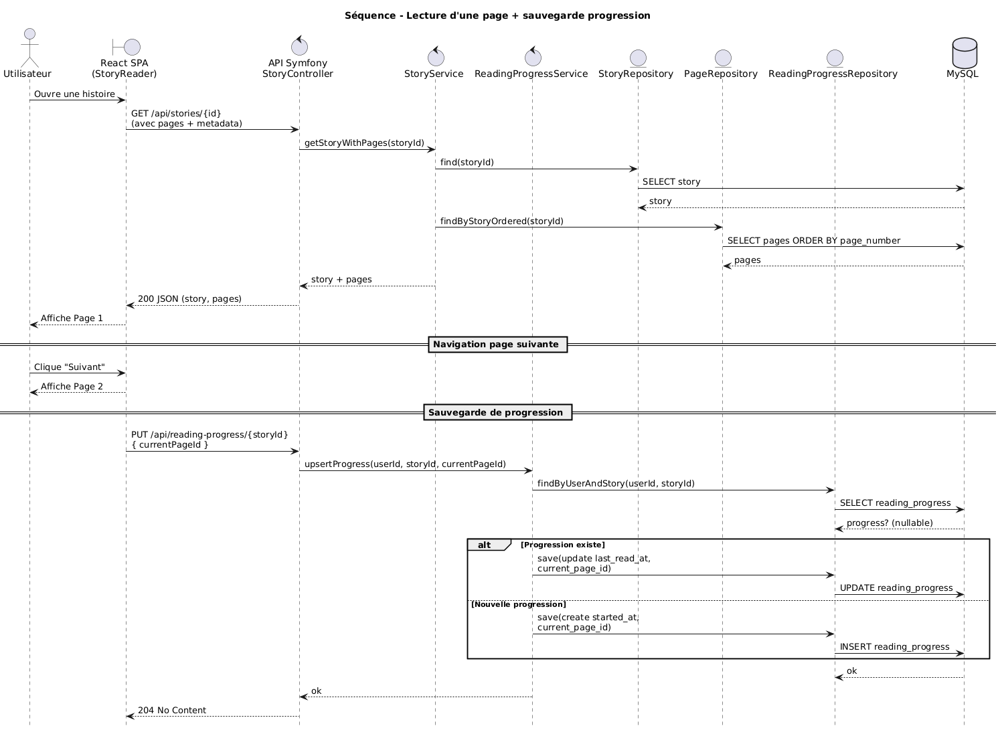{ width=98% }

\newpage

**Toggle favori** — ajout/retrait depuis le catalogue ou la page d'histoire.

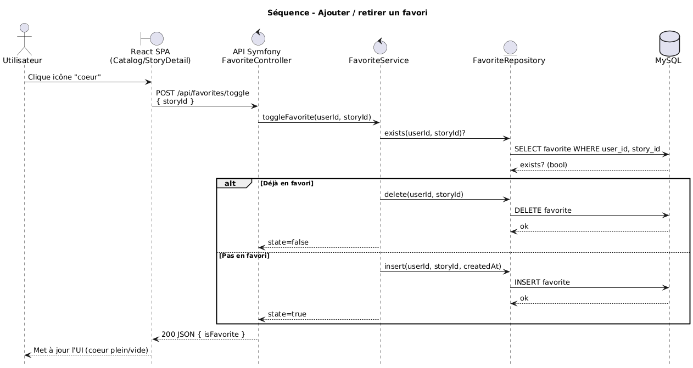{ width=98% }

**Lecture audio (TTS)** — synthèse vocale pour une page (sans stockage audio en base).

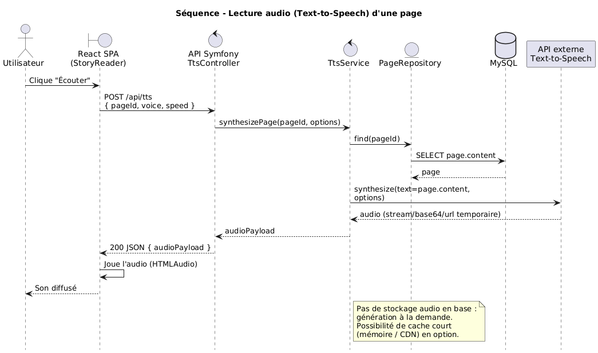{ width=98% }

\newpage

### Diagramme d'entités métier

Le diagramme représente le domaine métier tel que formalisé au jalon 3 (entités et associations).

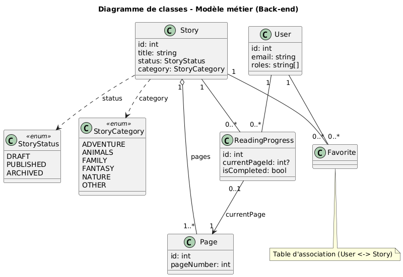{ width=98% }

**Couches Symfony** (non figurées sur le diagramme entités) :

- **Controllers** : points d'entrée HTTP, validation DTO, réponses JSON
- **Services métier** : `ReadingProgressService`, `FavoriteService`, `StoryService`…
- **Repositories Doctrine** : requêtes typées, transactions via l'ORM

Enchaînement : **SPA (fetch)** → **controller** → **service** → **repository** → **entités / MySQL**.

\newpage

### Compléments post-conception (routes compte et RGPD)

Conformément au RGPD et au périmètre final, les routes suivantes ont été ajoutées sans modification des diagrammes UML (périmètre restreint, pas de nouvelle entité) :

| Route            | Rôle                                       |
| ---------------- | ------------------------------------------ |
| `PATCH /api/me`  | Rectification e-mail / mot de passe        |
| `DELETE /api/me` | Suppression du compte et données associées |
| Page `/privacy`  | Politique de confidentialité (front)       |

Ces ajouts relèvent du **contrôleur compte** et de la **couche présentation** ; le modèle entités jalon 3–4 reste valide.

### Cycle de publication d'une histoire

- `DRAFT` : visible uniquement en admin
- `PUBLISHED` : visible dans le catalogue public
- `ARCHIVED` : retirée du catalogue (conservée pour historique)

Implémenté par `Story.status` (cf. MPD jalon 3).

---

\newpage

## 6. Architecture multi-couches

### Architecture logique (3-tiers)

- **Tier 1 — Client** : navigateur (React/TypeScript)
- **Tier 2 — Serveur applicatif** : API Symfony (PHP 8.4), REST JSON, JWT
- **Tier 3 — Données** : MySQL

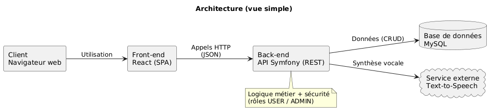{ width=98% }

**Pattern MVC côté API** : Controllers → Services métier → Repositories Doctrine. La SPA React constitue la couche présentation.

Important : **couches logiques** (controller/service/repository) ≠ **tiers physiques** (conteneurs). Plusieurs couches logiques peuvent cohabiter dans un même conteneur tout en conservant la séparation dans le code.

Principes appliqués :

| Principe         | Illustration                                        |
| ---------------- | --------------------------------------------------- |
| SRP              | `ReadingProgressService`, `FavoriteService` séparés |
| DTO / validation | Corps JSON validés avant passage au service         |
| Secrets          | `.env`, clés JWT hors dépôt                         |
| Doctrine         | Requêtes paramétrées, pas de SQL brut               |
| Tests            | PHPUnit + Vitest                                    |

**Composants** : Doctrine ORM, Symfony Security, Lexik JWT, Edge TTS (externe), React + Vite.

\newpage

### Architecture déployée (Docker Compose)

| Composant      | Rôle                                                              |
| -------------- | ----------------------------------------------------------------- |
| **nginx**      | Fichiers statiques React (build Vite) + proxy `/api` et `/images` |
| **php**        | API REST (JWT, Doctrine, TTS)                                     |
| **app-init**   | One-shot : Composer, migrations, fixtures, clés JWT               |
| **mysql**      | Volume `mysql_data`                                               |
| **phpmyadmin** | Administration BDD (port `8081`)                                  |

Un seul `docker compose up -d --build` démarre l'application complète sur le port `8080`.

Fichiers d'infrastructure : `docker-compose.yml`, `docker/nginx/`, `docker/php/`, `docker/init/bootstrap.sh`.

---

\newpage

## 7. Sécurité

### Mesures OWASP

| Risque           | Mesure                                                                            |
| ---------------- | --------------------------------------------------------------------------------- |
| Injection SQL    | Doctrine ORM, requêtes paramétrées                                                |
| XSS              | Échappement React ; pas de `dangerouslySetInnerHTML` sur le contenu des histoires |
| Authentification | JWT, mots de passe hachés (algorithme Symfony)                                    |
| Autorisation     | `ROLE_USER` / `ROLE_ADMIN` ; routes `/api/admin/*` réservées admin                |
| Secrets          | `.env` et clés JWT (`config/jwt/*.pem`) hors dépôt (gitignore)                    |
| CORS             | Nelmio — `CORS_ALLOW_ORIGIN` configurable                                         |
| Upload fichiers  | Types MIME autorisés, taille max 5 Mo, noms aléatoires                            |

### Checklist qualité

| Point                                            | Statut                    |
| ------------------------------------------------ | ------------------------- |
| Nommage conforme (`code-standard.md`)            | Validé                    |
| Pas de secret ni `console.log` de debug          | Validé                    |
| PHPDoc / TSDoc sur API publiques                 | Validé                    |
| Texte UI en français (`frontend/src/i18n/fr.ts`) | Validé                    |
| Lint PHP / ESLint                                | Validé (CI)               |
| Tests pour logique touchée                       | Validé (PHPUnit + Vitest) |
| Migrations Doctrine versionnées                  | Validé                    |
| Isolation données utilisateur                    | Validé                    |
| Routes admin inaccessibles au parent             | Validé                    |

\newpage

### Conformité RGPD

| Droit / obligation    | Implémentation                                         |
| --------------------- | ------------------------------------------------------ |
| Transparence          | Page `/privacy` (politique de confidentialité)         |
| Accès / rectification | Profil ; `PATCH /api/me`                               |
| Effacement            | `DELETE /api/me` (suppression compte et données liées) |

Pas d'écran de modération utilisateurs in-app ; phpMyAdmin permet la consultation BDD si nécessaire.

---

\newpage

## 8. Tests

### Périmètre bêta (mai 2026)

| Suite            | Outil                | Couverture bêta                |
| ---------------- | -------------------- | ------------------------------ |
| Backend unitaire | PHPUnit              | Entité `ReadingProgress`       |
| Backend API      | WebTestCase          | `GET /api/health`              |
| Frontend         | Vitest               | Libellés i18n français         |
| Lint             | PHP-CS-Fixer, ESLint | Conventions `code-standard.md` |
| CI               | GitHub Actions       | lint + tests + build front     |

### Extension livraison finale (juin 2026)

| Suite       | Ajout                                                                        |
| ----------- | ---------------------------------------------------------------------------- |
| Backend API | `AuthApiTest`, `AccountApiTest`, `FavoriteApiTest`, `ReadingProgressApiTest` |

Classes : `backend/tests/Controller/` — bootstrap SQLite (`backend/.env.test`), schéma créé en test.

### Bilan, exécution et CI

**Local (identique à la CI)** :

```bash
cd backend
cp .env.test .env
composer install --no-interaction --prefer-dist
composer lint:php
JWT_PASSPHRASE=ci_test_passphrase php bin/console lexik:jwt:generate-keypair --overwrite --no-interaction
APP_ENV=test composer test

cd frontend
npm ci && npm run lint && npm test && npm run build
```

> **Note** : `docker compose exec php composer test` charge le `.env` racine (prod/dev), pas l'environnement test SQLite. La CI et les commandes ci-dessus sont la référence.

**Pipeline** (`.github/workflows/ci.yml`) :

- **Déclencheur** : push et pull request sur `main`, `develop`, `dev/beta_usable`
- **Backend** : PHP 8.4, PHP-CS-Fixer, génération clés JWT test, PHPUnit
- **Frontend** : Node 20, ESLint, Vitest, build Vite

**Bilan final** : **100 % des tests automatisés passent en CI** (lint PHP, PHPUnit, ESLint, Vitest, build Vite). Aucun taux de couverture `%` n'a été mesuré formellement (pas de rapport PHPUnit `--coverage` généré) ; le périmètre couvre les parcours critiques : auth, compte, favoris, progression, health.

Run GitHub Actions — jobs Backend (lint + tests) et Frontend (lint + test + build) au vert ; rapport Vitest 7/7 tests passés.

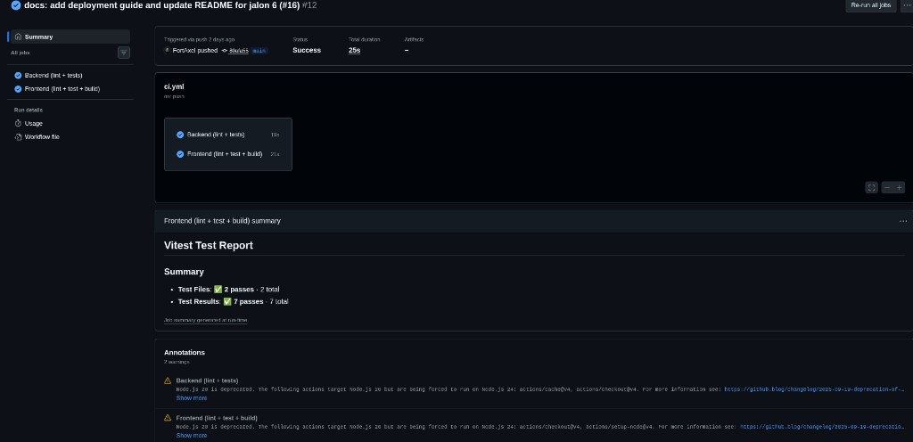

---

\newpage

## 9. Déploiement et mise en production

### Variables d'environnement

Fichier `.env` à la racine (copie de `.env.example`, monté dans le conteneur PHP).

| Variable                | Rôle                                                     |
| ----------------------- | -------------------------------------------------------- |
| `APP_ENV` / `APP_DEBUG` | Environnement Symfony                                    |
| `APP_PORT`              | Port HTTP (défaut `8080`)                                |
| `APP_SECRET`            | Secret Symfony (≥ 32 caractères en prod)                 |
| `DATABASE_URL`          | Doctrine — mot de passe = `MYSQL_PASSWORD`, hôte `mysql` |
| `JWT_PASSPHRASE`        | Clé privée JWT                                           |
| `CORS_ALLOW_ORIGIN`     | Origines autorisées                                      |
| `TTS_*`                 | Synthèse vocale Edge (`TTS_ENABLED=1` par défaut)        |

Le mot de passe dans `DATABASE_URL` doit correspondre à `MYSQL_PASSWORD`. `DEFAULT_URI` reflète l'URL publique.

### Environnements

|            | Docker prod                 | Docker dev                     | Tests CI       |
| ---------- | --------------------------- | ------------------------------ | -------------- |
| Config     | `APP_ENV=prod`              | `APP_ENV=dev`                  | `APP_ENV=test` |
| Frontend   | Build nginx `:8080`         | nginx ou `npm run dev` `:5173` | Vitest         |
| Backend    | Composer `--no-dev`         | + dev dependencies             | SQLite         |
| BDD        | MySQL (volume `mysql_data`) | MySQL                          | SQLite         |
| phpMyAdmin | Oui (`8081`)                | Oui                            | —              |

\newpage

### Procédure de déploiement

**Prérequis** : Git 2.x, Docker 24+, Docker Compose v2.

```bash
git clone https://github.com/FortAxel/ipssi_project.git
cd ipssi_project
cp .env.example .env
docker compose up -d --build
curl -s http://127.0.0.1:8080/api/health
```

Au premier démarrage, `app-init` installe les dépendances PHP, applique les migrations et charge les fixtures si la base est vide.

| Service                 | URL par défaut        |
| ----------------------- | --------------------- |
| Application (SPA + API) | http://127.0.0.1:8080 |
| phpMyAdmin              | http://127.0.0.1:8081 |

**Serveur** : cloner le dépôt, personnaliser `.env`, ouvrir `APP_PORT`, `docker compose up -d --build`, vérifier health, reverse proxy HTTPS recommandé.

**Mise à jour** : `git pull` puis `docker compose up -d --build`.

Pas de dump SQL : migrations + fixtures au premier boot via `app-init`.

### Stratégie de mise en production

Stratégie retenue : **recreate** en fenêtre de maintenance — arrêt, pull, rebuild, healthcheck.

| Stratégie               | Principe                            |
| ----------------------- | ----------------------------------- |
| **Recreate** _(actuel)_ | Arrêt → rebuild → redémarrage       |
| **Blue/Green**          | Double stack, bascule routage       |
| **Rolling update**      | Mise à jour conteneur par conteneur |

\newpage

### Retour d'expérience DevOps

| Sujet                 | Solution                                |
| --------------------- | --------------------------------------- |
| `composer --no-dev`   | Dépendances runtime en `require`        |
| JWT / passphrase      | Régénération auto dans `bootstrap.sh`   |
| Seed initial          | Fixtures au premier boot                |
| Prod + dev            | Un seul `docker-compose.yml`, `APP_ENV` |
| SPA sans Node serveur | Build React dans l'image nginx          |
| Réinitialisation BDD  | `docker compose down -v` puis rebuild   |

---

\newpage

## 10. Guide utilisateur et scénario de démonstration

Le jury joue le rôle d'un utilisateur durant la démo. Durée indicative : ~10 min.

**Comptes démo** :

| Rôle   | E-mail              | Mot de passe |
| ------ | ------------------- | ------------ |
| Parent | `parent@demo.local` | `parent123`  |
| Admin  | `admin@demo.local`  | `admin123`   |

**Parcours parent** (~10 min) :

1. Connexion → catalogue (recherche, filtres).
2. Lecture → navigation, bouton **Écouter** (TTS).
3. Reprise à la dernière page.
4. Favori → page **Favoris**.
5. **Profil** → historique, modification e-mail/mot de passe, suppression compte.
6. **Confidentialité** → `/privacy`.

**Parcours admin** :

1. Créer une histoire (PUBLISHED) + pages.
2. Vérifier dans le catalogue parent.

**Prérequis démo** :

```bash
cp .env.example .env
docker compose up -d --build
```

Application : http://127.0.0.1:8080

---

\newpage

## 11. Conclusion et perspectives

### Bilan

Le projet **Storybook Kids** couvre l'intégralité du parcours fil rouge CDA : CDCF, conception UI/UX, modélisation BDD, architecture, développement bêta, durcissement RGPD, tests API, déploiement Docker reproductible. L'application est **fonctionnelle de bout en bout** : un jury peut cloner le dépôt, configurer `.env`, lancer `docker compose up -d --build` et démontrer les parcours parent et administrateur.

**Apports principaux** : architecture API + SPA, JWT stateless, Edge TTS, pipeline CI, containerisation unifiée prod/dev.

**Difficultés surmontées** : alignement Composer prod/dev, bootstrap JWT et fixtures, containerisation avec frontend buildé sans Node sur le serveur.

### Perspectives d'évolution

- Export des données personnelles (portabilité RGPD)
- Écran de modération utilisateurs in-app
- Tests E2E (Playwright), scan OWASP ZAP
- Génération des histoires depuis le compte admin
- Blocage pin pendant la lecture d'histoire (contrôle parentale)

---
